# Composants Angular — Gaslands Manager

> Source unique de vérité pour l'architecture frontend. Mettre à jour après tout ajout ou suppression de composant.

---

## Conventions

### Smart vs Dumb

- **Smart** : connaît les services, gère les appels HTTP et l'état d'affichage (Signals d'état, computed, subscriptions). Exemples : `Teams`, `SeasonDetail`, `EquipmentManager`.
- **Dumb** : reçoit des données via `input()`, émet des événements via `output()`. Ne connaît aucun service. Exemples : `TeamCard`, `SponsorCarousel`, `ConfirmModal`.

### Pattern `locked`

Un composant dumb peut recevoir un input booléen `locked` pour appliquer une contrainte métier sans en connaître la raison. Le parent seul décide quand et pourquoi verrouiller (ex : sponsor immutable dès qu'un véhicule existe dans `SponsorCarousel`).

### Signals et zoneless

Zone.js est absent — tout changement d'état doit passer par un Signal (`signal()`, `computed()`). Utiliser `effect()` dans le constructeur pour réagir aux changements d'un `input()` Signal (ex : pré-remplissage de formulaire quand l'entité à éditer change).

---

## Composants réutilisables

Ces trois composants sont indépendants de tout domaine métier et utilisables partout.

### `SlotGauge` — `shared/slot-gauge/`

Jauge visuelle représentant des emplacements occupés/disponibles (grille de carrés plein/vide).

| | |
|---|---|
| **Sélecteur** | `app-slot-gauge` |
| **Type** | Dumb |

**Inputs**

| Nom | Type | Défaut | Description |
|-----|------|--------|-------------|
| `used` | `number` | — | Emplacements occupés |
| `total` | `number` | — | Capacité totale |
| `size` | `'sm' \| 'md' \| 'lg'` | `'sm'` | Taille des carrés |

Utilisé par : `TeamCard`, `VehicleChoiceCard`, `VehicleSummaryCard`, `VehicleCostSummary`.

---

### `ConfirmModal` — `shared/confirm-modal/`

Dialog de confirmation générique. Le parent contrôle la visibilité via `@if`.

| | |
|---|---|
| **Sélecteur** | `app-confirm-modal` |
| **Type** | Dumb |

**Inputs**

| Nom | Type | Défaut | Description |
|-----|------|--------|-------------|
| `message` | `string` | — | Question posée à l'utilisateur |
| `confirmLabel` | `string` | `'Confirmer'` | Label du bouton de validation |
| `cancelLabel` | `string` | `'Annuler'` | Label du bouton d'annulation |
| `variant` | `'danger' \| 'primary'` | `'danger'` | Style du bouton de validation |

**Outputs**

| Nom | Type | Description |
|-----|------|-------------|
| `confirmed` | `void` | L'utilisateur a confirmé |
| `cancelled` | `void` | L'utilisateur a annulé |

Utilisé par : `TeamEditPage`, `EquipmentManager`, `SeasonDetail`, `AdminUsers`.

---

### `Breadcrumb` — `shared/breadcrumb/`

Fil d'ariane de navigation. Les items avec `route` sont des `RouterLink`, les autres sont du texte brut.

| | |
|---|---|
| **Sélecteur** | `app-breadcrumb` |
| **Type** | Dumb |

**Inputs**

| Nom | Type | Défaut | Description |
|-----|------|--------|-------------|
| `crumbs` | `BreadcrumbItem[]` | — | Liste `{ label: string; route?: string[] }` |

Utilisé par : `VehicleConfiguratorPage`, `SeasonDetail`.

---

## Diagramme de dépendances

```mermaid
graph TD
    subgraph Shared["Shared (réutilisables)"]
        SlotGauge
        ConfirmModal
        Breadcrumb
    end

    subgraph Teams
        TeamsPage["Teams (smart)"]
        TeamCard
        TeamForm
        SponsorCarousel
        TeamEditPage["TeamEditPage (smart)"]
        VehicleSummaryCard
        QuickTeamCreate

        subgraph Configurateur
            VehicleConfiguratorPage["VehicleConfiguratorPage (smart)"]
            VehicleConfigurator["VehicleConfigurator (smart)"]
            VehicleChoiceCard

            subgraph EquipmentManager_group["EquipmentManager"]
                EquipmentManager["EquipmentManager (smart)"]
                EquipmentOption
                EquipmentDetailModal
                MountedEquipment
                TourelleAssignmentModal
                TeamBudget
                VehicleCostSummary
            end
        end
    end

    subgraph Seasons
        SeasonsPage["Seasons (smart)"]
        SeasonCard
        SeasonForm
        SeasonDetail["SeasonDetail (smart)"]
        SeasonJoin["SeasonJoin (smart)"]
        ParticipantList
        InviteLink
        ChangeTeamModal
        SeasonProgram["SeasonProgram (smart)"]
        GameList
        GameForm
    end

    subgraph Admin
        AdminUsers["AdminUsers (smart)"]
    end

    TeamsPage --> TeamCard
    TeamsPage --> TeamForm
    TeamCard --> SlotGauge
    TeamForm --> SponsorCarousel
    TeamEditPage --> VehicleSummaryCard
    TeamEditPage --> SponsorCarousel
    TeamEditPage --> ConfirmModal
    VehicleSummaryCard --> SlotGauge
    VehicleConfiguratorPage --> VehicleConfigurator
    VehicleConfiguratorPage --> Breadcrumb
    VehicleConfigurator --> VehicleChoiceCard
    VehicleConfigurator --> EquipmentManager
    VehicleChoiceCard --> SlotGauge
    EquipmentManager --> EquipmentOption
    EquipmentManager --> MountedEquipment
    EquipmentManager --> TourelleAssignmentModal
    EquipmentManager --> TeamBudget
    EquipmentManager --> VehicleCostSummary
    EquipmentManager --> ConfirmModal
    EquipmentOption --> EquipmentDetailModal
    VehicleCostSummary --> SlotGauge
    SeasonsPage --> SeasonCard
    SeasonsPage --> SeasonForm
    SeasonForm --> QuickTeamCreate
    SeasonJoin --> QuickTeamCreate
    SeasonDetail --> ParticipantList
    SeasonDetail --> InviteLink
    SeasonDetail --> ChangeTeamModal
    SeasonDetail --> ConfirmModal
    SeasonDetail --> Breadcrumb
    SeasonDetail --> SeasonProgram
    SeasonProgram --> GameList
    SeasonProgram --> GameForm
    SeasonProgram --> ConfirmModal
    AdminUsers --> ConfirmModal
```

---

## Domaine Auth

### `Login` — `auth/login/`

Page de connexion (email + mot de passe). Navigue vers `/home` en cas de succès.

| | |
|---|---|
| **Sélecteur** | `app-login` |
| **Type** | Smart |
| **Route** | `/login` |
| **Services** | `AuthService`, `Router` |

---

### `Register` — `auth/register/`

Page d'inscription (prénom, nom, email, mot de passe). Crée le compte et navigue vers `/home`.

| | |
|---|---|
| **Sélecteur** | `app-register` |
| **Type** | Smart |
| **Route** | `/register` |
| **Services** | `AuthService`, `Router` |

---

## Pages publiques

### `Home` — `home/`

Page d'accueil publique avec présentation et liens vers les sections.

| | |
|---|---|
| **Sélecteur** | `app-home` |
| **Type** | Smart |
| **Route** | `/home` |

---

### `Rules` — `rules/`

Charge les règles du jeu depuis `GET /api/content/regles` (Markdown → HTML) et les affiche via `[innerHTML]`.

| | |
|---|---|
| **Sélecteur** | `app-rules` |
| **Type** | Smart |
| **Route** | `/rules` |
| **Services** | `HttpClient` |

---

### `Vehicles` — `vehicles/`

Placeholder — affichera à terme le catalogue dynamique des véhicules depuis `/api/catalog/vehicules`.

| | |
|---|---|
| **Sélecteur** | `app-vehicles` |
| **Type** | — |
| **Route** | `/vehicles` |

---

### `Weapons` — `weapons/`

Placeholder — affichera à terme le catalogue dynamique des armes depuis `/api/catalog/armes`.

| | |
|---|---|
| **Sélecteur** | `app-weapons` |
| **Type** | — |
| **Route** | `/weapons` |

---

## Domaine Teams

### `Teams` — `teams/` 🧠

Page principale listant toutes les équipes de l'utilisateur connecté. Gère la création via une modale inline et charge les résumés de véhicules pour chaque équipe.

| | |
|---|---|
| **Sélecteur** | `app-teams` |
| **Type** | Smart |
| **Route** | `/teams` |
| **Services** | `TeamsService`, `VehicleService`, `CatalogService`, `Router` |
| **Compose** | `TeamCard`, `TeamForm` |

**Signals clés** : `teams`, `loading`, `showForm`, `vehicleSummaries: Map<number, VehicleSummary[]>`.

---

### `TeamCard` — `teams/team-card/`

Carte d'affichage d'une équipe : nom, sponsor, barre de budget, liste des véhicules. Navigue vers la page d'édition au clic.

| | |
|---|---|
| **Sélecteur** | `app-team-card` |
| **Type** | Dumb |
| **Compose** | `SlotGauge` |

**Inputs**

| Nom | Type | Défaut | Description |
|-----|------|--------|-------------|
| `team` | `Team` | — | Équipe à afficher |
| `index` | `number` | `1` | Indice pour l'affichage (numéro formaté) |
| `vehicles` | `VehicleSummary[]` | `[]` | Résumés des véhicules de l'équipe |

**Outputs**

| Nom | Type | Description |
|-----|------|-------------|
| `cardClicked` | `Team` | Clic sur la carte → navigation vers l'édition |

---

### `TeamForm` — `teams/team-form/`

Formulaire de création ou de modification d'une équipe (nom, sponsor, budget, description). Charge le catalogue de sponsors pour le carousel.

| | |
|---|---|
| **Sélecteur** | `app-team-form` |
| **Type** | Dumb |
| **Services** | `CatalogService` |
| **Compose** | `SponsorCarousel` |

**Inputs**

| Nom | Type | Défaut | Description |
|-----|------|--------|-------------|
| `team` | `Team \| null` | `null` | `null` = mode création, sinon pré-remplit le formulaire |
| `saving` | `boolean` | `false` | Désactive les boutons pendant la sauvegarde |
| `hasVehicles` | `boolean` | `false` | Verrouille le choix du sponsor |

**Outputs**

| Nom | Type | Description |
|-----|------|-------------|
| `saved` | `CreateTeamDto` | Formulaire soumis avec les données validées |
| `formCancel` | `void` | Annulation |

---

### `SponsorCarousel` — `teams/sponsor-carousel/`

Carousel interactif pour choisir un sponsor. Navigation ←/→, affichage du nom, de la description et des avantages (Markdown → HTML). Navigation bloquée si `locked`.

| | |
|---|---|
| **Sélecteur** | `app-sponsor-carousel` |
| **Type** | Dumb |
| **Services** | `DomSanitizer` |

**Inputs**

| Nom | Type | Défaut | Description |
|-----|------|--------|-------------|
| `sponsors` | `SponsorInfo[]` | `[]` | Liste des sponsors chargés depuis le catalogue |
| `selectedSponsor` | `string` | `''` | Nom du sponsor actuellement sélectionné |
| `locked` | `boolean` | `false` | Bloque la navigation (équipe avec véhicules) |

**Outputs**

| Nom | Type | Description |
|-----|------|-------------|
| `sponsorChange` | `string` | Nouveau nom de sponsor sélectionné |

---

### `TeamEditPage` — `teams/team-edit-page/` 🧠

Page de gestion d'une équipe (`/teams/:id/edit`). Layout deux panneaux : formulaire d'édition à gauche, liste des véhicules à droite. Gère la modification de l'équipe, l'ajout/suppression de véhicules.

| | |
|---|---|
| **Sélecteur** | `app-team-edit-page` |
| **Type** | Smart |
| **Route** | `/teams/:id/edit` |
| **Services** | `ActivatedRoute`, `Router`, `TeamsService`, `VehicleService`, `CatalogService` |
| **Compose** | `SponsorCarousel`, `VehicleSummaryCard`, `ConfirmModal` |

**Signals clés** : `team`, `vehicles`, `loading`, `saving`, `hasVehicles`, `budgetUtilise`, `budgetRestant`, `pendingDeleteTeam`, `pendingDeleteVehicleId`.

---

### `VehicleSummaryCard` — `teams/vehicle-summary-card/`

Carte affichant le résumé d'un véhicule dans la liste de l'équipe : nom, coût total, emplacements. Émet les actions Gérer et Supprimer.

| | |
|---|---|
| **Sélecteur** | `app-vehicle-summary-card` |
| **Type** | Dumb |
| **Compose** | `SlotGauge` |

**Inputs**

| Nom | Type | Défaut | Description |
|-----|------|--------|-------------|
| `vehicle` | `VehicleSummary` | — | Résumé du véhicule |

**Outputs**

| Nom | Type | Description |
|-----|------|-------------|
| `manageClicked` | `number` | ID du véhicule → navigation vers le configurateur |
| `deleteClicked` | `VehicleSummary` | Demande de suppression du véhicule |

---

### `QuickTeamCreate` — `teams/quick-team-create/`

Widget de création rapide d'équipe (champ nom uniquement). Utilisé dans les formulaires de saison pour créer une équipe à la volée sans quitter le flux.

| | |
|---|---|
| **Sélecteur** | `app-quick-team-create` |
| **Type** | Dumb |

**Inputs**

| Nom | Type | Défaut | Description |
|-----|------|--------|-------------|
| `saving` | `boolean` | `false` | Désactive les boutons pendant la sauvegarde |

**Outputs**

| Nom | Type | Description |
|-----|------|-------------|
| `created` | `CreateTeamDto` | Données de création soumises |

---

### `VehicleConfiguratorPage` — `teams/vehicle-configurator-page/` 🧠

Wrapper de page pour la configuration d'un véhicule. Détermine le mode (création vs édition) depuis la route, charge l'équipe, fournit le fil d'ariane.

| | |
|---|---|
| **Sélecteur** | `app-vehicle-configurator-page` |
| **Type** | Smart |
| **Routes** | `/teams/:teamId/vehicles/new` · `/teams/:teamId/vehicles/:vehicleId` |
| **Services** | `ActivatedRoute`, `Router`, `TeamsService` |
| **Compose** | `VehicleConfigurator`, `Breadcrumb` |

**Signals clés** : `team`, `vehicleId`, `loading`, `error`, `backRoute`, `breadcrumbs`.

---

### `VehicleConfigurator` — `teams/vehicle-configurator/` 🧠

Orchestrateur unifié pour la création et l'édition d'équipement d'un véhicule. En mode création : affiche le choix du véhicule de base. Une fois le véhicule créé ou chargé, affiche `EquipmentManager`.

| | |
|---|---|
| **Sélecteur** | `app-vehicle-configurator` |
| **Type** | Smart |
| **Services** | `CatalogService`, `VehicleService` |
| **Compose** | `VehicleChoiceCard`, `EquipmentManager` |

**Inputs**

| Nom | Type | Défaut | Description |
|-----|------|--------|-------------|
| `team` | `Team` | — | Équipe propriétaire |
| `vehicleId` | `number \| null` | — | `null` = création, sinon ID du véhicule à éditer |

**Outputs**

| Nom | Type | Description |
|-----|------|-------------|
| `done` | `void` | Fin de la session de configuration |

---

### `VehicleChoiceCard` — `teams/vehicle-configurator/vehicle-choice-card/`

Carte de sélection du type de véhicule de base. Affiche les statistiques du véhicule (carrosserie, manoeuvrabilité, vitesse, équipage, emplacements, prix).

| | |
|---|---|
| **Sélecteur** | `app-vehicle-choice-card` |
| **Type** | Dumb |
| **Compose** | `SlotGauge` |

**Inputs**

| Nom | Type | Défaut | Description |
|-----|------|--------|-------------|
| `vehicule` | `Vehicule` | — | Véhicule du catalogue filtré par sponsor |

**Outputs**

| Nom | Type | Description |
|-----|------|-------------|
| `chosen` | `Vehicule` | Le joueur a choisi ce type de véhicule |

---

### `EquipmentManager` — `teams/vehicle-configurator/equipment-manager/` 🧠

Cœur de la gestion d'équipement. Charge les armes et améliorations disponibles (avec verdicts du backend), gère l'ajout/retrait, le cas particulier de la Tourelle, et affiche le budget de l'équipe.

| | |
|---|---|
| **Sélecteur** | `app-equipment-manager` |
| **Type** | Smart |
| **Services** | `VehicleService` |
| **Compose** | `EquipmentOption`, `MountedEquipment`, `TourelleAssignmentModal`, `TeamBudget`, `VehicleCostSummary`, `ConfirmModal` |

**Inputs**

| Nom | Type | Défaut | Description |
|-----|------|--------|-------------|
| `vehicle` | `Vehicle` | — | Entité véhicule brute (avec armes/améliorations montées) |
| `sponsorCatalog` | `Sponsor` | — | Catalogue complet du sponsor (noms, prix, règles) |
| `team` | `Team` | — | Équipe (budget, autres véhicules) |

**Outputs**

| Nom | Type | Description |
|-----|------|-------------|
| `vehicleChanged` | `Vehicle` | Émis après chaque mutation — le parent met à jour son signal |

**Signals computed clés** : `emplacementsUtilises`, `emplacementsTotal`, `coutBase`, `coutEquipement`, `coutTotal`, `budgetRestant`, `budgetDepasse`, `visibleWeapons`, `visibleImprovements`, `armesPourTourelle`.

---

### `EquipmentOption` — `teams/vehicle-configurator/equipment-option/`

Carte d'un équipement disponible dans le catalogue. Si orientable, affiche un sélecteur de direction avant d'émettre le choix. Ouvre `EquipmentDetailModal` au clic sur la carte.

| | |
|---|---|
| **Sélecteur** | `app-equipment-option` |
| **Type** | Dumb |
| **Compose** | `EquipmentDetailModal` |

**Inputs**

| Nom | Type | Défaut | Description |
|-----|------|--------|-------------|
| `option` | `EquipmentOptionDto` | — | Arme ou amélioration avec verdict de disponibilité |
| `requiresOrientation` | `boolean` | `false` | Indique si un arc de tir doit être sélectionné |

**Outputs**

| Nom | Type | Description |
|-----|------|-------------|
| `chosen` | `EquipmentChoice` | `{ nomInterne, orientation? }` — émis seulement quand l'info est complète |

---

### `EquipmentDetailModal` — `teams/vehicle-configurator/equipment-option/equipment-detail-modal/`

Popup d'information sur un équipement : nom, coût, emplacement, description, règles complètes. Purement informative — aucune action d'ajout.

| | |
|---|---|
| **Sélecteur** | `app-equipment-detail-modal` |
| **Type** | Dumb |

**Inputs**

| Nom | Type | Défaut | Description |
|-----|------|--------|-------------|
| `option` | `EquipmentOptionDto` | — | Données de l'équipement |
| `requiresOrientation` | `boolean` | `false` | Affiché dans les métadonnées |

**Outputs**

| Nom | Type | Description |
|-----|------|-------------|
| `closed` | `void` | Fermeture de la popup (bouton ou clic overlay) |

---

### `MountedEquipment` — `teams/vehicle-configurator/equipment-manager/mounted-equipment/`

Affiche les armes et améliorations actuellement montées sur le véhicule, avec leurs boutons de retrait. Gère l'affichage spécial de la Tourelle (orpheline vs assignée).

| | |
|---|---|
| **Sélecteur** | `app-mounted-equipment` |
| **Type** | Dumb |

**Inputs**

| Nom | Type | Défaut | Description |
|-----|------|--------|-------------|
| `weapons` | `Weapon[]` | — | Armes montées |
| `improvements` | `VehicleImprovement[]` | — | Améliorations montées |
| `sponsorCatalog` | `Sponsor` | — | Pour résoudre les noms et emplacements depuis les `nomInterne` |

**Outputs**

| Nom | Type | Description |
|-----|------|-------------|
| `weaponRemoved` | `Weapon` | Demande de retrait d'une arme |
| `improvementRemoved` | `VehicleImprovement` | Demande de retrait d'une amélioration |
| `tourelleAssignRequested` | `VehicleImprovement` | Tourelle orpheline → ouvre la modale d'assignation |
| `tourelleUnassignRequested` | `VehicleImprovement` | Désassigner l'arme d'une Tourelle |

---

### `TourelleAssignmentModal` — `teams/vehicle-configurator/equipment-manager/tourelle-assignment-modal/`

Modale de sélection de l'arme à monter sur une Tourelle orpheline. Affiche chaque arme candidate avec son prix × 3.

| | |
|---|---|
| **Sélecteur** | `app-tourelle-assignment-modal` |
| **Type** | Dumb |

**Inputs**

| Nom | Type | Défaut | Description |
|-----|------|--------|-------------|
| `armes` | `Arme[]` | — | Armes candidates (hors type équipage, dans la limite des emplacements) |

**Outputs**

| Nom | Type | Description |
|-----|------|-------------|
| `weaponChosen` | `string` | `nomInterne` de l'arme choisie |
| `cancelled` | `void` | Annulation |

---

### `TeamBudget` — `teams/vehicle-configurator/equipment-manager/team-budget/`

Bloc d'affichage du budget de l'équipe (tous véhicules confondus) : barre de progression, jerricans utilisés/total, solde ou dépassement. Toutes les valeurs sont pré-calculées par `EquipmentManager`.

| | |
|---|---|
| **Sélecteur** | `app-team-budget` |
| **Type** | Dumb |

**Inputs**

| Nom | Type | Défaut | Description |
|-----|------|--------|-------------|
| `budgetEquipe` | `number` | — | Budget total de l'équipe |
| `coutEquipeTotal` | `number` | — | Coût total de tous les véhicules |
| `budgetRestant` | `number` | — | Solde restant (peut être négatif) |
| `budgetDepasse` | `boolean` | — | Vrai si dépassement |
| `budgetPourcentage` | `number` | — | Pourcentage pour la barre (0–100, plafonné) |

---

### `VehicleCostSummary` — `teams/vehicle-configurator/equipment-manager/vehicle-cost-summary/`

Récapitulatif du coût du véhicule en cours : nom, jauge d'emplacements, décomposition base / équipement / total.

| | |
|---|---|
| **Sélecteur** | `app-vehicle-cost-summary` |
| **Type** | Dumb |
| **Compose** | `SlotGauge` |

**Inputs**

| Nom | Type | Défaut | Description |
|-----|------|--------|-------------|
| `vehicleName` | `string` | — | Nom affiché (déjà résolu depuis le catalogue) |
| `emplacementsUtilises` | `number` | — | Emplacements occupés |
| `emplacementsTotal` | `number` | — | Capacité totale |
| `coutBase` | `number` | — | Prix du châssis |
| `coutEquipement` | `number` | — | Somme des armes et améliorations |
| `coutTotal` | `number` | — | Base + équipement |

---

## Domaine Seasons

### `Seasons` — `seasons/` 🧠

Page principale listant toutes les saisons de l'utilisateur. Gère la création via une modale et affiche les badges de demandes en attente.

| | |
|---|---|
| **Sélecteur** | `app-seasons` |
| **Type** | Smart |
| **Route** | `/seasons` |
| **Services** | `SeasonsService`, `TeamsService`, `Router` |
| **Compose** | `SeasonCard`, `SeasonForm` |

**Signals clés** : `seasons`, `loading`, `showForm`, `userTeams`, `pendingSeasonIds`, `organizedPendingCounts`.

---

### `SeasonCard` — `seasons/season-card/`

Carte d'affichage d'une saison : nom, état, badge de rôle (🏆 Organisateur / ⏳ En attente), alerte de demandes à valider.

| | |
|---|---|
| **Sélecteur** | `app-season-card` |
| **Type** | Dumb |

**Inputs**

| Nom | Type | Défaut | Description |
|-----|------|--------|-------------|
| `season` | `Season` | — | Saison à afficher |
| `isPending` | `boolean` | `false` | Affiche le badge "En attente" |
| `pendingRequestsCount` | `number` | `0` | Nombre de demandes à valider (badge organisateur) |

---

### `SeasonForm` — `seasons/season-form/`

Formulaire de création d'une saison (nom + sélection optionnelle d'une équipe). Propose la création rapide d'équipe via `QuickTeamCreate`. Auto-sélectionne la nouvelle équipe via `effect()`.

| | |
|---|---|
| **Sélecteur** | `app-season-form` |
| **Type** | Dumb |
| **Compose** | `QuickTeamCreate` |

**Inputs**

| Nom | Type | Défaut | Description |
|-----|------|--------|-------------|
| `saving` | `boolean` | `false` | Désactive les boutons pendant la sauvegarde |
| `teams` | `Team[]` | `[]` | Équipes disponibles pour la sélection |
| `creatingTeam` | `boolean` | `false` | Affiche un indicateur pendant la création rapide |

**Outputs**

| Nom | Type | Description |
|-----|------|-------------|
| `saved` | `CreateSeasonDto` | Données de création soumises `{ name, teamId? }` |
| `formCancel` | `void` | Annulation |
| `teamCreated` | `CreateTeamDto` | Relaie la demande de création rapide d'équipe vers le parent |

---

### `SeasonDetail` — `seasons/season-detail/` 🧠

Page de détail d'une saison (`/seasons/:id`). Affiche participants, code d'invitation, transitions d'état. Les sections "En attente" et "Refusé" sont absentes du DOM pour les non-organisateurs.

| | |
|---|---|
| **Sélecteur** | `app-season-detail` |
| **Type** | Smart |
| **Route** | `/seasons/:id` |
| **Services** | `ActivatedRoute`, `Router`, `SeasonsService`, `AuthService`, `TeamsService` |
| **Compose** | `ParticipantList`, `InviteLink`, `ChangeTeamModal`, `ConfirmModal`, `Breadcrumb` |

**Signals clés** : `season`, `participants`, `myTeams`, `loading`, `myParticipant`, `isOrganizer`, `canChangeTeam`, `validatedCount`, `pendingCount`.

---

### `SeasonJoin` — `seasons/season-join/` 🧠

Page de demande d'inscription à une saison via son code d'invitation (`/seasons/join/:code`). Charge le résumé de la saison, propose la création rapide d'équipe.

| | |
|---|---|
| **Sélecteur** | `app-season-join` |
| **Type** | Smart |
| **Route** | `/seasons/join/:code` |
| **Services** | `ActivatedRoute`, `SeasonsService`, `TeamsService` |
| **Compose** | `QuickTeamCreate` |

**Signals clés** : `loading`, `summary`, `userTeams`, `selectedTeamId`, `submitting`, `submitted`.

---

### `ParticipantList` — `seasons/participant-list/`

Liste unifiée des participants d'une saison avec boutons d'action adaptés au statut et au rôle. Encapsule toutes les règles de visibilité (organisateur uniquement, pas de self-reject sur le dernier organisateur, etc.).

| | |
|---|---|
| **Sélecteur** | `app-participant-list` |
| **Type** | Dumb |

**Inputs**

| Nom | Type | Défaut | Description |
|-----|------|--------|-------------|
| `participants` | `SeasonParticipant[]` | — | Tous statuts confondus |
| `isOrganizer` | `boolean` | `false` | Active les boutons d'action organisateur |
| `currentUserId` | `number \| undefined` | `undefined` | Pour masquer les actions sur soi-même |
| `canChangeTeam` | `boolean` | `false` | Affiche le lien "Changer d'équipe" |
| `seasonId` | `number \| undefined` | `undefined` | Pour construire le lien vers l'édition de l'équipe |

**Outputs**

| Nom | Type | Description |
|-----|------|-------------|
| `validate` | `{ pid: number; accept: boolean }` | Couvre PENDING→VALIDATED/REJECTED, VALIDATED→REJECTED, REJECTED→VALIDATED |
| `remove` | `number` | `pid` — suppression définitive (organisateur, EN_CONSTRUCTION) |
| `promote` | `number` | `pid` — promotion co-organisateur |
| `changeTeam` | `void` | Ouvre la modale de changement d'équipe |

---

### `InviteLink` — `seasons/invite-link/`

Affiche le code d'invitation d'une saison avec un bouton "Copier". Feedback visuel temporaire "Copié !" après copie dans le presse-papiers.

| | |
|---|---|
| **Sélecteur** | `app-invite-link` |
| **Type** | Dumb |

**Inputs**

| Nom | Type | Défaut | Description |
|-----|------|--------|-------------|
| `inviteCode` | `string` | — | Code d'invitation à afficher |

---

### `ChangeTeamModal` — `seasons/change-team-modal/`

Overlay de sélection d'une autre équipe à engager dans une saison `EN_CONSTRUCTION`. Le parent contrôle la visibilité.

| | |
|---|---|
| **Sélecteur** | `app-change-team-modal` |
| **Type** | Dumb |

**Inputs**

| Nom | Type | Défaut | Description |
|-----|------|--------|-------------|
| `teams` | `Team[]` | — | Équipes de l'utilisateur |
| `currentTeamId` | `number \| null` | — | Équipe actuellement engagée |
| `isOrganizer` | `boolean` | `false` | Affiche l'option "Aucune équipe" (organisateur peut se désengager) |

**Outputs**

| Nom | Type | Description |
|-----|------|-------------|
| `confirmed` | `number \| null` | `teamId` sélectionné, ou `null` pour se désengager |
| `cancelled` | `void` | Annulation |

---

### `SeasonProgram` — `seasons/season-program/` 🧠

Gère le Programme Télé (mode campagne) dans `SeasonDetail`. Charge les parties et le catalogue de scénarios, gère l'ajout/édition (formulaire inline) et la suppression (confirmation). Toujours affiché par le parent ; la gestion (ajout/édition/suppression) est active en `EN_CONSTRUCTION`/`EN_COURS` et passe en lecture seule en `TERMINEE` (via `canManage`).

| | |
|---|---|
| **Sélecteur** | `app-season-program` |
| **Type** | Smart |
| **Services** | `SeasonsService` |
| **Compose** | `GameList`, `GameForm`, `ConfirmModal` |

**Inputs**

| Nom | Type | Défaut | Description |
|-----|------|--------|-------------|
| `seasonId` | `number` | — | Saison concernée |
| `isOrganizer` | `boolean` | `false` | Rôle organisateur (condition de gestion) |
| `seasonState` | `SeasonState` | — | État de la saison ; `canManage` est faux en `TERMINEE` |

**Signals clés** : `games`, `scenarios`, `loading`, `showForm`, `editingGame`, `saving`, `pendingDeleteGame`, `canManage` (= `isOrganizer && seasonState !== 'TERMINEE'`).

---

### `GameList` — `seasons/game-list/`

Liste ordonnée des parties du programme (numéro, scénario, badges type/statut). Émet les actions Modifier/Supprimer, affichées uniquement pour les parties `PLANIFIE` gérables.

| | |
|---|---|
| **Sélecteur** | `app-game-list` |
| **Type** | Dumb |

**Inputs**

| Nom | Type | Défaut | Description |
|-----|------|--------|-------------|
| `games` | `Game[]` | — | Parties, déjà triées par le backend |
| `canManage` | `boolean` | `false` | Organisateur + saison `EN_COURS` |

**Outputs**

| Nom | Type | Description |
|-----|------|-------------|
| `editGame` | `Game` | Demande d'édition d'une partie |
| `deleteGame` | `Game` | Demande de suppression d'une partie |

---

### `GameForm` — `seasons/game-form/`

Formulaire d'ajout ou d'édition d'une partie. Sélecteur de scénario ; le type est déduit du scénario. `effect()` pré-remplit en mode édition (`game` non nul).

| | |
|---|---|
| **Sélecteur** | `app-game-form` |
| **Type** | Dumb |

**Inputs**

| Nom | Type | Défaut | Description |
|-----|------|--------|-------------|
| `scenarios` | `Scenario[]` | `[]` | Catalogue des scénarios pour le sélecteur |
| `saving` | `boolean` | `false` | Désactive les boutons pendant la sauvegarde |
| `game` | `Game \| null` | `null` | `null` = création, sinon pré-remplit (édition) |

**Outputs**

| Nom | Type | Description |
|-----|------|-------------|
| `saved` | `CreateGameDto` | `{ scenarioId }` validé (création ou édition) |
| `formCancel` | `void` | Annulation |

---

## Domaine Admin

### `AdminUsers` — `admin/users/` 🧠

Page de gestion des utilisateurs, réservée aux administrateurs (`/admin/users`). Liste tous les comptes avec toggle actif/inactif et suppression. Masque les actions sur le compte connecté.

| | |
|---|---|
| **Sélecteur** | `app-admin-users` |
| **Type** | Smart |
| **Route** | `/admin/users` |
| **Services** | `UsersService`, `AuthService` |
| **Compose** | `ConfirmModal` |

**Signals clés** : `users`, `loading`, `error`, `pendingDeleteUser`.
