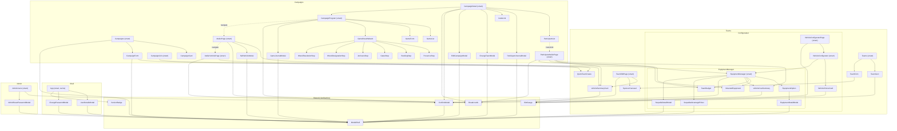

# Composants Angular — Gaslands Manager

> Source unique de vérité pour l'architecture frontend. Mettre à jour après tout ajout ou suppression de composant.

---

## Conventions

### Smart vs Dumb

- **Smart** : connaît les services, gère les appels HTTP et l'état d'affichage (Signals d'état, computed, subscriptions). Exemples : `Teams`, `SeasonDetail`, `EquipmentManager`.
- **Dumb** : reçoit des données via `input()`, émet des événements via `output()`. Ne connaît aucun service. Exemples : `TeamCard`, `SponsorCarousel`, `ConfirmModal`.

### Pattern `locked`

Un composant dumb peut recevoir un input booléen `locked` pour appliquer une contrainte métier sans en connaître la raison. Le parent seul décide quand et pourquoi verrouiller (ex : sponsor immutable dès qu'un véhicule existe dans `SponsorCarousel`).

### Signals et zoneless

Zone.js est absent — tout changement d'état doit passer par un Signal (`signal()`, `computed()`). Utiliser `effect()` dans le constructeur pour réagir aux changements d'un `input()` Signal (ex : pré-remplissage de formulaire quand l'entité à éditer change).

---

## Composants réutilisables

Ces quatre composants sont indépendants de tout domaine métier et utilisables partout.

### `SlotGauge` — `shared/slot-gauge/`

Jauge visuelle représentant des emplacements occupés/disponibles (grille de carrés plein/vide).

| | |
|---|---|
| **Sélecteur** | `app-slot-gauge` |
| **Type** | Dumb |

**Inputs**

| Nom | Type | Défaut | Description |
|-----|------|--------|-------------|
| `used` | `number` | — | Emplacements occupés |
| `total` | `number` | — | Capacité totale |
| `size` | `'sm' \| 'md' \| 'lg'` | `'sm'` | Taille des carrés |

Utilisé par : `TeamCard`, `VehicleChoiceCard`, `VehicleSummaryCard`, `VehicleCostSummary`.

---

### `ModalShell` — `shared/modal-shell/`

Coquille de présentation commune à toutes les modales "standard" du design
system Terres Brûlées (panel métal + coins d'enregistrement + bande
HazardTape). Composant **dumb** malgré la projection de contenu via
`<ng-content>` (première utilisation de ce mécanisme dans le projet) — il ne
détient aucun service, seulement le chrome. Le contenu (titre, message,
formulaire, liste...) est entièrement laissé au consommateur ; les styles du
shell ne s'appliquent qu'à son propre chrome, jamais au contenu projeté
(encapsulation de vue Angular : un nœud projeté garde l'attribut de portée du
composant qui l'a créé, pas celui du shell).

Couvre les **deux familles** de modales de l'application via `mode` :
- `action` : deux boutons (Annuler/Action) — seuls eux ferment la modale,
  aucune fermeture au clic hors de la boîte. Ex. `ConfirmModal`,
  `SellVehicleModal`, `UserDetailsModal`, `ChangePasswordModal`,
  `ChangeTeamModal`, `SequellaAdvantagePicker`.
- `consultation` : un seul bouton (Fermer) — fermeture par ce bouton **ou**
  par un clic hors de la boîte (ou touche Échap). Ex. `EquipmentDetailModal`,
  `SequellaDetailModal`, `GameJournalModal`, `ParticipantJournalModal` — ces
  deux derniers gagnent au passage la fermeture au clic extérieur/Échap
  qu'ils n'avaient pas avant leur migration sur ce shell (lecture seule,
  aucun état non sauvegardé — changement de comportement sans risque).

`.ms-modal` porte `cdkTrapFocus`/`cdkTrapFocusAutoCapture` (Angular CDK) :
`Tab` reste confiné à la boîte de dialogue, et le focus se déplace
automatiquement vers son premier élément focusable à l'ouverture (restauré à
la fermeture) — gratuit pour tous les consommateurs du shell, sans code
supplémentaire de leur côté.

| | |
|---|---|
| **Sélecteur** | `app-modal-shell` |
| **Type** | Dumb |

**Inputs**

| Nom | Type | Défaut | Description |
|-----|------|--------|-------------|
| `ariaLabel` | `string` | — | Libellé accessible du dialog (requis) |
| `mode` | `'action' \| 'consultation'` | `'action'` | Nombre de boutons et mécanisme de fermeture, cf. ci-dessus |
| `variant` | `'danger' \| 'primary'` | `'danger'` | Couleur des coins/bande/bouton d'action (rouille / ambre) |
| `size` | `'md' \| 'lg' \| 'xl'` | `'md'` | Largeur du panel (440px / 480px / 560px — `xl` pour un contenu riche : listes, règles détaillées) |
| `confirmLabel` | `string` | `'Confirmer'` | Ignoré en mode `consultation` |
| `cancelLabel` | `string` | `'Annuler'` | Libellé du bouton de fermeture |
| `confirmDisabled` | `boolean` | `false` | Ignoré en mode `consultation` |

**Outputs**

| Nom | Type | Description |
|-----|------|-------------|
| `confirmed` | `void` | Clic sur le bouton d'action (mode `action` uniquement — le bouton n'existe pas en `consultation`) |
| `cancelled` | `void` | Fermeture — clic bouton dans les deux modes, plus clic/Échap hors de la boîte en mode `consultation` |

**Comportement mobile délibérément simplifié** : `ModalShell` ne rétrécit le
panel que dans une limite `min(…, 96vw)` centrée — pas de bottom-sheet plein
écran ancré en bas ni de footer d'actions sticky. Plusieurs des modales
migrées vers ce shell (`ChangeTeamModal`, `GameJournalModal`,
`ParticipantJournalModal`, `SequellaAdvantagePicker`) implémentaient
auparavant un tel bottom-sheet à la main ; il a été abandonné au profit de ce
comportement uniforme plutôt que d'étendre l'API du shell pour un seul usage.

Utilisé par : `ConfirmModal`, `SellVehicleModal`, `UserDetailsModal`,
`ChangePasswordModal`, `EquipmentDetailModal`, `SequellaDetailModal`,
`GameJournalModal`, `ParticipantJournalModal`, `ChangeTeamModal`,
`SequellaAdvantagePicker`, `CampaignForm`, et directement par `Campaigns`
(modale "Rejoindre via code", markup inline sans composant dédié).

---

### `ConfirmModal` — `shared/confirm-modal/`

Dialog de confirmation générique. Le parent contrôle la visibilité via `@if`.
Compose `ModalShell` (mode `action`) — ne garde en propre que le message
projeté ; API externe inchangée par cette composition.

| | |
|---|---|
| **Sélecteur** | `app-confirm-modal` |
| **Type** | Dumb |
| **Compose** | `ModalShell` |

**Inputs**

| Nom | Type | Défaut | Description |
|-----|------|--------|-------------|
| `message` | `string` | — | Question posée à l'utilisateur |
| `confirmLabel` | `string` | `'Confirmer'` | Label du bouton de validation |
| `cancelLabel` | `string` | `'Annuler'` | Label du bouton d'annulation |
| `variant` | `'danger' \| 'primary'` | `'danger'` | Style du bouton de validation |

**Outputs**

| Nom | Type | Description |
|-----|------|-------------|
| `confirmed` | `void` | L'utilisateur a confirmé |
| `cancelled` | `void` | L'utilisateur a annulé |

Utilisé par : `TeamEditPage`, `EquipmentManager`, `CampaignDetail`, `AdminUsers`.

---

### `Breadcrumb` — `shared/breadcrumb/`

Fil d'ariane de navigation. Les items avec `route` sont des `RouterLink`, les autres sont du texte brut.

| | |
|---|---|
| **Sélecteur** | `app-breadcrumb` |
| **Type** | Dumb |

**Inputs**

| Nom | Type | Défaut | Description |
|-----|------|--------|-------------|
| `crumbs` | `BreadcrumbItem[]` | — | Liste `{ label: string; route?: string[] }` |

Utilisé par : `VehicleConfiguratorPage`, `CampaignDetail`, `AtelierPage`, `AtelierVehiclePage`, `Documentation`, `DocumentationChapter`.

---

### `VersionBadge` — `shared/version-badge/`

Petit badge affichant la version actuellement déployée. Charge lui-même
`GET /api/version` à l'initialisation (`IMAGE_TAG` lu par le backend via
`process.env`, cf. [ARCHITECTURE.md §6](../ARCHITECTURE.md)) — composant
autonome plutôt qu'intégré à `App` (le composant racine, déjà volumineux :
menu utilisateur, modales de compte, aide contextuelle), pour isoler le fetch
et son échec silencieux d'un simple repère cosmétique.

**Pas de valeur par défaut** : si `IMAGE_TAG` est absent/vide côté serveur
(`{ version: null }`) ou si la requête échoue, le badge ne s'affiche
simplement pas — jamais de texte de repli (ex. "latest") qui laisserait
croire à un vrai numéro de version.

| | |
|---|---|
| **Sélecteur** | `app-version-badge` |
| **Type** | Smart (fait son propre appel HTTP) |
| **Services** | `HttpClient` |

Aucun input, aucun output.

Utilisé par : `App` (composant racine, dans `.navbar-brand`, à côté du logo).

---

## Diagramme de dépendances

```mermaid
graph TD
    subgraph Shell
        App["App (smart, racine)"]
        UserDetailsModal
        ChangePasswordModal
    end

    subgraph Shared["Shared (réutilisables)"]
        SlotGauge
        ModalShell
        ConfirmModal
        Breadcrumb
        VersionBadge
    end

    subgraph Teams
        TeamsPage["Teams (smart)"]
        TeamCard
        TeamForm
        SponsorCarousel
        TeamEditPage["TeamEditPage (smart)"]
        VehicleSummaryCard
        QuickTeamCreate

        subgraph Configurateur
            VehicleConfiguratorPage["VehicleConfiguratorPage (smart)"]
            VehicleConfigurator["VehicleConfigurator (smart)"]
            VehicleChoiceCard

            subgraph EquipmentManager_group["EquipmentManager"]
                EquipmentManager["EquipmentManager (smart)"]
                EquipmentOption
                EquipmentDetailModal
                MountedEquipment
                TeamBudget
                VehicleCostSummary
                SequellaAdvantagePicker
                SequellaDetailModal
            end
        end
    end

    subgraph Campaigns
        CampaignsPage["Campaigns (smart)"]
        CampaignCard
        CampaignForm
        CampaignDetail["CampaignDetail (smart)"]
        CampaignJoin["CampaignJoin (smart)"]
        ParticipantList
        ParticipantJournalModal
        InviteLink
        ChangeTeamModal
        EditCampaignModal
        CampaignProgram["CampaignProgram (smart)"]
        GameList
        GameForm
        GameResultWizard
        PresenceStep
        RankingStep
        GatesStep
        JerricansStep
        WreckDesignationStep
        WreckResolutionStep
        GameJournalModal
        AtelierPage["AtelierPage (smart)"]
        SellVehicleModal
        AtelierVehiclePage["AtelierVehiclePage (smart)"]
        ParticipantAtelierPage["ParticipantAtelierPage (smart)"]
    end

    subgraph Admin
        AdminUsers["AdminUsers (smart)"]
        AdminResetPasswordModal
    end

    TeamsPage --> TeamCard
    TeamsPage --> TeamForm
    TeamCard --> SlotGauge
    TeamForm --> SponsorCarousel
    TeamEditPage --> VehicleSummaryCard
    TeamEditPage --> SponsorCarousel
    TeamEditPage --> ConfirmModal
    VehicleSummaryCard --> SlotGauge
    VehicleConfiguratorPage --> VehicleConfigurator
    VehicleConfiguratorPage --> Breadcrumb
    VehicleConfigurator --> VehicleChoiceCard
    VehicleConfigurator --> EquipmentManager
    VehicleChoiceCard --> SlotGauge
    EquipmentManager --> EquipmentOption
    EquipmentManager --> MountedEquipment
    EquipmentManager --> TeamBudget
    EquipmentManager --> VehicleCostSummary
    EquipmentManager --> ConfirmModal
    EquipmentOption --> EquipmentDetailModal
    EquipmentManager --> SequellaAdvantagePicker
    EquipmentManager --> SequellaDetailModal
    VehicleCostSummary --> SlotGauge
    CampaignsPage --> CampaignCard
    CampaignsPage --> CampaignForm
    CampaignForm --> QuickTeamCreate
    CampaignJoin --> QuickTeamCreate
    CampaignDetail --> ParticipantList
    CampaignDetail --> ParticipantJournalModal
    CampaignDetail --> InviteLink
    CampaignDetail --> ChangeTeamModal
    CampaignDetail --> EditCampaignModal
    CampaignDetail --> ConfirmModal
    CampaignDetail --> Breadcrumb
    CampaignDetail --> CampaignProgram
    CampaignProgram --> GameList
    CampaignProgram --> GameForm
    CampaignProgram --> GameResultWizard
    CampaignProgram --> GameJournalModal
    CampaignProgram --> ConfirmModal
    CampaignProgram -.->|navigate| AtelierPage
    AtelierPage --> VehicleSummaryCard
    AtelierPage --> SellVehicleModal
    AtelierPage --> Breadcrumb
    AtelierPage -.->|navigate| AtelierVehiclePage
    AtelierVehiclePage --> EquipmentManager
    AtelierVehiclePage --> Breadcrumb
    ParticipantList -.->|routerLink| ParticipantAtelierPage
    ParticipantAtelierPage --> VehicleSummaryCard
    ParticipantAtelierPage --> VehicleCostSummary
    ParticipantAtelierPage --> MountedEquipment
    ParticipantAtelierPage --> TeamBudget
    ParticipantAtelierPage --> Breadcrumb
    GameResultWizard --> PresenceStep
    GameResultWizard --> RankingStep
    GameResultWizard --> GatesStep
    GameResultWizard --> JerricansStep
    GameResultWizard --> WreckDesignationStep
    GameResultWizard --> WreckResolutionStep
    AdminUsers --> ConfirmModal
    AdminUsers --> AdminResetPasswordModal
    App --> UserDetailsModal
    App --> ChangePasswordModal
    App --> VersionBadge
    ConfirmModal --> ModalShell
    SellVehicleModal --> ModalShell
    UserDetailsModal --> ModalShell
    ChangePasswordModal --> ModalShell
    AdminResetPasswordModal --> ModalShell
    EquipmentDetailModal --> ModalShell
    SequellaDetailModal --> ModalShell
    GameJournalModal --> ModalShell
    ParticipantJournalModal --> ModalShell
    ChangeTeamModal --> ModalShell
    EditCampaignModal --> ModalShell
    SequellaAdvantagePicker --> ModalShell
    CampaignForm --> ModalShell
    CampaignsPage --> ModalShell
```

---

## Domaine Auth

### `Login` — `auth/login/`

Page de connexion (email + mot de passe). Navigue vers `/home` en cas de succès.

| | |
|---|---|
| **Sélecteur** | `app-login` |
| **Type** | Smart |
| **Route** | `/login` |
| **Services** | `AuthService`, `Router` |

---

### `Register` — `auth/register/`

Page d'inscription (prénom, nom, **pseudo**, email, mot de passe). Tous les champs sont obligatoires. Le pseudo est le nom sous lequel le joueur apparaîtra partout dans l'application (cf. [AUTH.md — Nom d'affichage](spec/AUTH.md#nom-daffichage-callname)). Crée le compte et navigue vers `/home`.

| | |
|---|---|
| **Sélecteur** | `app-register` |
| **Type** | Smart |
| **Route** | `/register` |
| **Services** | `AuthService`, `Router` |

---

### `UserDetailsModal` — `auth/user-details-modal/`

Dialog "Détails du compte", ouvert depuis le menu utilisateur de la navbar
(`App`, clic sur le pseudo en haut à droite — même structure trigger/
backdrop/panel que le menu "⋯" de `ParticipantList`). Porte le formulaire
Informations (prénom/nom/pseudo/email), avec son propre état de sauvegarde
et sa propre erreur possédés par le parent (`App`) — même pattern que
`ChangeTeamModal` (pré-remplissage via `effect()` sur l'input `user`,
resynchronisé à chaque ouverture puisque l'instance du composant persiste
entre deux ouvertures). Le rôle n'est pas affiché sur ce dialog (cf.
[AUTH.md](../docs/spec/AUTH.md#auto-édition-du-profil)). Le changement de mot
de passe vit dans sa propre modale, `ChangePasswordModal` (cf. ci-dessous),
ouverte depuis une entrée de menu séparée. Compose `ModalShell` (mode
`action`) — le bouton d'action du shell, hors de tout `<form>`, appelle
directement `onProfileSubmit()` ; un bouton submit invisible reste dans le
`<form>` pour préserver la soumission au clavier (Entrée dans un champ).

| | |
|---|---|
| **Sélecteur** | `app-user-details-modal` |
| **Type** | Dumb |
| **Compose** | `ModalShell` |

**Inputs**

| Nom | Type | Défaut | Description |
|-----|------|--------|-------------|
| `user` | `User` | — | Utilisateur courant (pré-remplissage du formulaire) |
| `profileSaving` | `boolean` | `false` | Sauvegarde du formulaire Informations en cours |
| `profileError` | `string` | `''` | Message d'erreur serveur du formulaire Informations |

**Outputs**

| Nom | Type | Description |
|-----|------|-------------|
| `cancelled` | `void` | Fermeture du dialog (bouton du shell) |
| `profileSubmitted` | `UpdateProfileDto` | Formulaire Informations validé (prénom/nom/pseudo/email non vides). Le champ pseudo est pré-rempli avec `user.pseudo` — la valeur BRUTE, pas `user.callName` qui en dérive côté backend |

Utilisé par : `App` (composant racine).

---

### `ChangePasswordModal` — `auth/change-password-modal/`

Dialog "Changer le mot de passe", ouvert depuis le menu utilisateur de la
navbar (`App`), à côté de "Détails du compte" — extrait de
`UserDetailsModal` pour devenir son propre point d'entrée. Pas d'input
`user` (`ChangePasswordDto` ne référence aucune donnée de profil à
pré-remplir), état de sauvegarde/erreur possédés par le parent (`App`),
même principe que `UserDetailsModal`. Après un changement réussi, le parent
appelle `authService.logout()` (déconnexion forcée, cf.
[AUTH.md](../docs/spec/AUTH.md#auto-édition-du-profil)) — le dialog n'a donc
pas besoin de vider ses propres champs, la redirection vers `/login` le
démonte. Compose `ModalShell` (mode `action`), même traitement du bouton
submit invisible que `UserDetailsModal` ci-dessus.

| | |
|---|---|
| **Sélecteur** | `app-change-password-modal` |
| **Type** | Dumb |
| **Compose** | `ModalShell` |

**Inputs**

| Nom | Type | Défaut | Description |
|-----|------|--------|-------------|
| `saving` | `boolean` | `false` | Sauvegarde en cours |
| `error` | `string` | `''` | Message d'erreur serveur |

**Outputs**

| Nom | Type | Description |
|-----|------|-------------|
| `cancelled` | `void` | Fermeture du dialog (bouton du shell) |
| `submitted` | `ChangePasswordDto` | Formulaire validé (correspondance + longueur ≥ 6 côté client) |

Utilisé par : `App` (composant racine).

---

## Pages publiques

### `Home` — `home/`

Page d'accueil publique avec présentation et liens vers les sections.

| | |
|---|---|
| **Sélecteur** | `app-home` |
| **Type** | Smart |
| **Route** | `/home` |

---

### `Documentation` — `documentation/`

Sommaire de la documentation utilisateur (remplace l'ancien `Rules`, cf. [`docs/plans/2026-07-16-documentation-utilisateur-design.md`](plans/2026-07-16-documentation-utilisateur-design.md)). Charge l'intro (`GET /api/content/docs/index`) et, indépendamment, le sommaire ordonné (`GET /api/content/docs`) pour générer la liste des chapitres programmatiquement — jamais codée en dur dans `index.md`, seule source de vérité pour l'ordre/titres.

| | |
|---|---|
| **Sélecteur** | `app-documentation` |
| **Type** | Smart |
| **Route** | `/documentation` |
| **Services** | `HttpClient` |
| **Compose** | `DocLinksDirective`, `Breadcrumb` |

Fil d'ariane statique (un seul maillon, "Documentation", non cliquable — le sommaire est déjà la racine de la section).

---

### `DocumentationChapter` — `documentation/documentation-chapter/`

Un chapitre de la documentation utilisateur. S'abonne à `route.paramMap` (pas `route.snapshot.params`) : Angular réutilise cette même instance de composant en naviguant d'un chapitre à un autre (même route paramétrée), un snapshot lu une seule fois dans `ngOnInit` ne verrait jamais le changement de `:slug`. Le fil d'ariane ("Documentation" › titre du chapitre, `computed()` sur le titre chargé) remplace l'ancien lien "← Retour au sommaire" — même destination, cohérent avec le reste de l'appli où le fil d'ariane porte seul la navigation de retour.

| | |
|---|---|
| **Sélecteur** | `app-documentation-chapter` |
| **Type** | Smart |
| **Route** | `/documentation/:slug` |
| **Services** | `HttpClient`, `ActivatedRoute` |
| **Compose** | `DocLinksDirective`, `Breadcrumb` |

---

### `DocLinksDirective` — `documentation/doc-links.directive.ts`

Directive attributaire (`appDocLinks`), pas un composant — appliquée au conteneur `[innerHTML]` de `Documentation` et `DocumentationChapter`. Le contenu injecté n'étant jamais compilé par Angular, un `<a>` qu'il contient n'est jamais reconnu par `routerLink` ; cette directive écoute les clics par délégation d'événement sur le conteneur et prend la main uniquement sur les liens internes vers `/documentation/...` (`preventDefault` + `Router.navigateByUrl`), pour une navigation SPA sans rechargement. Les ancres `#section` same-page n'ont besoin d'aucune interception (défilement natif du navigateur).

| | |
|---|---|
| **Sélecteur** | `[appDocLinks]` |
| **Type** | Directive (attributaire) |
| **Services** | `Router` |

---

### `Vehicles` — `vehicles/`

Placeholder — affichera à terme le catalogue dynamique des véhicules depuis `/api/catalog/vehicules`.

| | |
|---|---|
| **Sélecteur** | `app-vehicles` |
| **Type** | — |
| **Route** | `/vehicles` |

---

### `Weapons` — `weapons/`

Placeholder — affichera à terme le catalogue dynamique des armes depuis `/api/catalog/armes`.

| | |
|---|---|
| **Sélecteur** | `app-weapons` |
| **Type** | — |
| **Route** | `/weapons` |

---

## Domaine Teams

### `Teams` — `teams/` 🧠

Page principale listant toutes les équipes de l'utilisateur connecté. Gère la création via une modale inline et charge les résumés de véhicules pour chaque équipe.

| | |
|---|---|
| **Sélecteur** | `app-teams` |
| **Type** | Smart |
| **Route** | `/teams` |
| **Services** | `TeamsService`, `VehicleService`, `CatalogService`, `Router` |
| **Compose** | `TeamCard`, `TeamForm` |

**Signals clés** : `teams`, `loading`, `showForm`, `vehicleSummaries: Map<number, VehicleSummary[]>`.

---

### `TeamCard` — `teams/team-card/`

Carte d'affichage d'une équipe : nom, sponsor, barre de budget, liste des véhicules. Navigue vers la page d'édition au clic.

| | |
|---|---|
| **Sélecteur** | `app-team-card` |
| **Type** | Dumb |
| **Compose** | `SlotGauge` |

**Inputs**

| Nom | Type | Défaut | Description |
|-----|------|--------|-------------|
| `team` | `Team` | — | Équipe à afficher |
| `index` | `number` | `1` | Indice pour l'affichage (numéro formaté) |
| `vehicles` | `VehicleSummary[]` | `[]` | Résumés des véhicules de l'équipe |

**Outputs**

| Nom | Type | Description |
|-----|------|-------------|
| `cardClicked` | `Team` | Clic sur la carte → navigation vers l'édition |

---

### `TeamForm` — `teams/team-form/`

Formulaire de création ou de modification d'une équipe (nom, sponsor, budget, description). Charge le catalogue de sponsors pour le carousel.

| | |
|---|---|
| **Sélecteur** | `app-team-form` |
| **Type** | Dumb |
| **Services** | `CatalogService` |
| **Compose** | `SponsorCarousel` |

**Inputs**

| Nom | Type | Défaut | Description |
|-----|------|--------|-------------|
| `team` | `Team \| null` | `null` | `null` = mode création, sinon pré-remplit le formulaire |
| `saving` | `boolean` | `false` | Désactive les boutons pendant la sauvegarde |
| `hasVehicles` | `boolean` | `false` | Verrouille le choix du sponsor |

**Outputs**

| Nom | Type | Description |
|-----|------|-------------|
| `saved` | `CreateTeamDto` | Formulaire soumis avec les données validées |
| `formCancel` | `void` | Annulation |

---

### `SponsorCarousel` — `teams/sponsor-carousel/`

Carousel interactif pour choisir un sponsor. Navigation ←/→, affichage du nom, de la description et des avantages (Markdown → HTML). Navigation bloquée si `locked`.

| | |
|---|---|
| **Sélecteur** | `app-sponsor-carousel` |
| **Type** | Dumb |
| **Services** | `DomSanitizer` |

**Inputs**

| Nom | Type | Défaut | Description |
|-----|------|--------|-------------|
| `sponsors` | `SponsorInfo[]` | `[]` | Liste des sponsors chargés depuis le catalogue |
| `selectedSponsor` | `string` | `''` | Nom du sponsor actuellement sélectionné |
| `locked` | `boolean` | `false` | Bloque la navigation (équipe avec véhicules) |

**Outputs**

| Nom | Type | Description |
|-----|------|-------------|
| `sponsorChange` | `string` | Nouveau nom de sponsor sélectionné |

---

### `TeamEditPage` — `teams/team-edit-page/` 🧠

Page de gestion d'une équipe (`/teams/:id/edit`). Layout deux panneaux : formulaire d'édition à gauche, liste des véhicules à droite. Gère la modification de l'équipe, l'ajout/suppression de véhicules.

**Export de la fiche d'équipe** : bouton "Exporter la fiche d'équipe" dans l'en-tête du panneau véhicules, visible uniquement si `!isLocked()` (réutilise le même computed que le reste du verrouillage campagne — `Team.isLockedByCampaign`, pas `isEngaged`, cf. [spec/TEAMS.md](../docs/spec/TEAMS.md#fiche-déquipe-exportable)). `onExportSheet()` ouvre une fenêtre de façon SYNCHRONE (`window.open('', '_blank')`) avant l'appel à `TeamsService.getSheet()`, pour éviter qu'elle soit bloquée comme un popup non désiré ; le HTML reçu y est écrit via `openHtmlDocumentInNewTab` (`shared/html-export.util.ts`).

| | |
|---|---|
| **Sélecteur** | `app-team-edit-page` |
| **Type** | Smart |
| **Route** | `/teams/:id/edit` |
| **Services** | `ActivatedRoute`, `Router`, `TeamsService`, `VehicleService`, `CatalogService` |
| **Compose** | `SponsorCarousel`, `VehicleSummaryCard`, `ConfirmModal` |

**Signals clés** : `team`, `vehicles`, `loading`, `saving`, `hasVehicles`, `budgetUtilise`, `budgetRestant`, `pendingDeleteTeam`, `pendingDeleteVehicleId`.

---

### `VehicleSummaryCard` — `teams/vehicle-summary-card/`

Carte affichant le résumé d'un véhicule dans la liste de l'équipe : nom, coût total, emplacements. Toute la carte est cliquable (`cardClicked`, même pattern que `TeamCard`/`CampaignCard` — `role="button"`, `tabindex="0"`, `(keydown.enter)`/`(keydown.space)`) ; le bouton supprimer/vendre reste une action séparée dans un coin de la carte, protégée par `$event.stopPropagation()` (clic ET clavier, pour ne pas déclencher `cardClicked` en même temps).

| | |
|---|---|
| **Sélecteur** | `app-vehicle-summary-card` |
| **Type** | Dumb |
| **Compose** | `SlotGauge` |

**Inputs**

| Nom | Type | Défaut | Description |
|-----|------|--------|-------------|
| `vehicle` | `VehicleSummary` | — | Résumé du véhicule |
| `selected` | `boolean` | `false` | Surbrillance "sélectionné" — utilisée par `ParticipantAtelierPage` (vue maître-détail en lecture seule) pour indiquer le véhicule actuellement consulté |

**Outputs**

| Nom | Type | Description |
|-----|------|-------------|
| `cardClicked` | `number` | ID du véhicule, émis au clic (ou Entrée/Espace) sur la carte — l'action déclenchée dépend de l'écran appelant : navigation vers le configurateur (`AtelierPage`/`TeamEditPage`) ou sélection pour consultation (`ParticipantAtelierPage`) |
| `deleteClicked` | `VehicleSummary` | Demande de suppression/vente du véhicule (bouton dédié, n'émet jamais `cardClicked`) |

---

### `QuickTeamCreate` — `teams/quick-team-create/`

Widget de création rapide d'équipe (champ nom uniquement). Utilisé dans les formulaires de saison pour créer une équipe à la volée sans quitter le flux.

| | |
|---|---|
| **Sélecteur** | `app-quick-team-create` |
| **Type** | Dumb |

**Inputs**

| Nom | Type | Défaut | Description |
|-----|------|--------|-------------|
| `saving` | `boolean` | `false` | Désactive les boutons pendant la sauvegarde |

**Outputs**

| Nom | Type | Description |
|-----|------|-------------|
| `created` | `CreateTeamDto` | Données de création soumises |

---

### `VehicleConfiguratorPage` — `teams/vehicle-configurator-page/` 🧠

Wrapper de page pour la configuration d'un véhicule. Détermine le mode (création vs édition) depuis la route, charge l'équipe, fournit le fil d'ariane.

| | |
|---|---|
| **Sélecteur** | `app-vehicle-configurator-page` |
| **Type** | Smart |
| **Routes** | `/teams/:teamId/vehicles/new` · `/teams/:teamId/vehicles/:vehicleId` |
| **Services** | `ActivatedRoute`, `Router`, `TeamsService` |
| **Compose** | `VehicleConfigurator`, `Breadcrumb` |

**Signals clés** : `team`, `vehicleId`, `loading`, `error`, `backRoute`, `breadcrumbs`.

---

### `VehicleConfigurator` — `teams/vehicle-configurator/` 🧠

Orchestrateur unifié pour la création et l'édition d'équipement d'un véhicule. En mode création : affiche le choix du véhicule de base. Une fois le véhicule créé ou chargé, affiche `EquipmentManager`.

| | |
|---|---|
| **Sélecteur** | `app-vehicle-configurator` |
| **Type** | Smart |
| **Services** | `CatalogService`, `VehicleService` |
| **Compose** | `VehicleChoiceCard`, `EquipmentManager` |

**Inputs**

| Nom | Type | Défaut | Description |
|-----|------|--------|-------------|
| `team` | `Team` | — | Équipe propriétaire |
| `vehicleId` | `number \| null` | — | `null` = création, sinon ID du véhicule à éditer |

**Outputs**

| Nom | Type | Description |
|-----|------|-------------|
| `done` | `void` | Fin de la session de configuration |

---

### `VehicleChoiceCard` — `teams/vehicle-configurator/vehicle-choice-card/`

Carte de sélection du type de véhicule de base. Affiche les statistiques du véhicule (carrosserie, manoeuvrabilité, vitesse, équipage, emplacements, prix).

| | |
|---|---|
| **Sélecteur** | `app-vehicle-choice-card` |
| **Type** | Dumb |
| **Compose** | `SlotGauge` |

**Inputs**

| Nom | Type | Défaut | Description |
|-----|------|--------|-------------|
| `vehicule` | `Vehicule` | — | Véhicule du catalogue filtré par sponsor |

**Outputs**

| Nom | Type | Description |
|-----|------|-------------|
| `chosen` | `Vehicule` | Le joueur a choisi ce type de véhicule |

---

### `EquipmentManager` — `teams/vehicle-configurator/equipment-manager/` 🧠

Cœur de la gestion d'équipement. Charge les armes, améliorations **et avantages** disponibles (avec verdicts du backend), gère l'ajout/retrait — y compris le montage sur Tourelle, simple valeur d'orientation de l'arme (`EquipmentChoice.orientation = 'tourelle'`) choisie au moment de son ajout — et affiche le budget de l'équipe. Les avantages disponibles sont scindés en **2 sous-listes** (`advantagesCategoryA`/`advantagesCategoryB`), une par catégorie du sponsor (`Sponsor.classes_avantage[0]`/`[1]`), chacune sous son propre titre de section — un avantage n'occupe jamais d'emplacement (synthétisé à `0` sur l'option transmise à `EquipmentOption`) et ne demande jamais d'orientation.

**Renommage du véhicule** : `onRenameVehicle(nom)` délègue à `EquipmentDataSource.renameVehicle(vehicleId, nom)` (nouvelle méthode de l'abstraction DI, implémentée différemment par `TeamEquipmentDataSource`/`AtelierEquipmentDataSource` — cf. `AtelierVehiclePage` plus bas), câblé sur le `nameChanged` de `VehicleCostSummary` (`[customName]="vehicle().customName"`, `[typeNom]="chosenVehicule()?.nom ?? vehicle().nomInterne"`, `[disabled]="locked()"`).

**Séquelles — 4ᵉ catégorie, atelier campagne uniquement** : si `campaignId` est renseigné (jamais le cas côté `VehicleConfigurator`, construction d'équipe), `EquipmentManager` charge aussi les séquelles ATELIER disponibles (`CampaignsService.getWorkshopAvailableSequelles`, injecté DIRECTEMENT — pas via `EquipmentDataSource`, qui ne couvre pas la monnaie Chocs) et affiche une section catalogue "Séquelles" au même niveau que Armes/Améliorations/Avantages, réutilisant le toggle "Afficher les indisponibles" existant. Chaque carte (`em-sequella-card`, dédiée — pas `EquipmentOption`, dont les badges supposent jerricans + emplacement) affiche une description courte et s'ouvre au clic sur `SequellaDetailModal` (description + règles complètes), même modèle d'interaction que Armes/Améliorations/Avantages (`EquipmentOption` → `EquipmentDetailModal`) — le bouton "Acquérir" stoppe la propagation du clic pour ne pas ouvrir la modale en même temps. Achat direct en un clic pour la plupart des séquelles ; **Dur à Cuire** ouvre d'abord `SequellaAdvantagePicker` (choix d'un avantage gratuit) avant l'achat (`CampaignsService.changeEquipment`). Retrait : annulation même-session toujours proposée (`purchasedThisSession`) ; revente cross-session gardée par `sequellaResaleUnlocked` (présence active de la séquelle "Légende Vivante" sur le véhicule — mirroir de `Vehicle.canRemoveSequella` côté backend), avec perte totale de Chocs (aucun remboursement, comme un avantage revendu). Les séquelles déjà acquises sont affichées par `MountedEquipment` (4ᵉ groupe, colonne de gauche) et le compteur de Chocs par `VehicleCostSummary` (en-tête, colonne de gauche) — tous deux `null`/absents en construction d'équipe.

| | |
|---|---|
| **Sélecteur** | `app-equipment-manager` |
| **Type** | Smart |
| **Services** | `VehicleService`, `CampaignsService`, `CatalogService` (les deux derniers utilisés uniquement si `campaignId` est renseigné) |
| **Compose** | `EquipmentOption`, `MountedEquipment`, `TeamBudget`, `VehicleCostSummary`, `ConfirmModal`, `SequellaAdvantagePicker`, `SequellaDetailModal` |

**Inputs**

| Nom | Type | Défaut | Description |
|-----|------|--------|-------------|
| `vehicle` | `Vehicle` | — | Entité véhicule brute (avec armes/améliorations montées) |
| `sponsorCatalog` | `Sponsor` | — | Catalogue complet du sponsor (noms, prix, règles) |
| `team` | `Team` | — | Équipe (budget, autres véhicules) |
| `campaignId` | `number \| null` | `null` | Présence ⇒ mode atelier actif (séquelles) — jamais renseigné par `VehicleConfigurator` |
| `chocs` | `number \| null` | `null` | Chocs accumulés par ce véhicule, transmis à `VehicleCostSummary` |
| `sequellas` | `WorkshopSequellaDto[]` | `[]` | Séquelles acquises, transmises à `MountedEquipment` |

**Outputs**

| Nom | Type | Description |
|-----|------|-------------|
| `vehicleChanged` | `Vehicle` | Émis après chaque mutation d'armes/améliorations/avantages — le parent met à jour son signal |
| `sequellaChanged` | `void` | Émis après chaque achat/retrait de séquelle — sans payload (chocs/séquelles vivent hors du modèle `Vehicle`), le parent recharge tout l'état d'atelier |

**Signals computed clés** : `emplacementsUtilises`, `emplacementsTotal`, `coutBase`, `coutEquipement` (inclut désormais les avantages), `coutTotal`, `budgetRestant`, `budgetDepasse`, `visibleWeapons`, `visibleImprovements`, `visibleAdvantages`, `visibleSequellas`, `advantagesCategoryA`/`advantagesCategoryB`, `sequellaResaleUnlocked`.

---

### `EquipmentOption` — `teams/vehicle-configurator/equipment-option/`

Carte d'un équipement disponible dans le catalogue. Si orientable, affiche un sélecteur de direction avant d'émettre le choix. Pour une arme catalogue `montableSurTourelle`, le sélecteur inclut aussi un bouton « Tourelle x3 » (même style que les 4 boutons d'orientation, coût ×3, exclusif avec le choix de direction). Ouvre `EquipmentDetailModal` au clic sur la carte.

| | |
|---|---|
| **Sélecteur** | `app-equipment-option` |
| **Type** | Dumb |
| **Compose** | `EquipmentDetailModal` |

**Inputs**

| Nom | Type | Défaut | Description |
|-----|------|--------|-------------|
| `option` | `EquipmentOptionDto` | — | Arme ou amélioration avec verdict de disponibilité (`montableSurTourelle` pour une arme) |
| `requiresOrientation` | `boolean` | `false` | Indique si un arc de tir doit être sélectionné |

**Outputs**

| Nom | Type | Description |
|-----|------|-------------|
| `chosen` | `EquipmentChoice` | `{ nomInterne, orientation? }` (armes : 5 valeurs possibles dont `'tourelle'`) — émis seulement quand l'info est complète |

---

### `EquipmentDetailModal` — `teams/vehicle-configurator/equipment-option/equipment-detail-modal/`

Popup d'information sur un équipement : nom, coût, emplacement, description, règles complètes. Purement informative — aucune action d'ajout. Chrome délégué à `ModalShell` (mode `consultation`, `size="xl"`).

| | |
|---|---|
| **Sélecteur** | `app-equipment-detail-modal` |
| **Type** | Dumb |
| **Compose** | `ModalShell` |

**Inputs**

| Nom | Type | Défaut | Description |
|-----|------|--------|-------------|
| `option` | `EquipmentOptionDto` | — | Données de l'équipement |
| `requiresOrientation` | `boolean` | `false` | Affiché dans les métadonnées |

**Outputs**

| Nom | Type | Description |
|-----|------|-------------|
| `closed` | `void` | Fermeture de la popup ("Annuler", clic hors de la boîte ou touche Échap) |

---

### `MountedEquipment` — `teams/vehicle-configurator/equipment-manager/mounted-equipment/`

Affiche les armes, améliorations, avantages **et séquelles** actuellement montés/acquis sur le véhicule, avec leurs boutons de retrait. Une arme montée sur Tourelle (`Weapon.orientation === 'tourelle'`) reçoit un badge « (Tourelle) » dans la liste des armes — ce n'est pas une ligne d'amélioration séparée. Un avantage revendu en atelier affiche le même filigrane "Vendu" que les autres équipements, mais son prix affiché **ne change jamais** (perte totale à la revente, contrairement à la moitié-prix des armes/améliorations) — reflet direct d'`Advantage.price`, jamais réduit. Le 4ᵉ groupe "Séquelles" (`showSequellas`, `false` par défaut — actif uniquement côté atelier) suit la même règle de perte totale à la revente, avec une nuance propre : le bouton "Retirer" n'apparaît que si `sequella.purchasedThisSession || sequellaResaleUnlocked()` — sinon une icône 🔒 indique que la revente cross-session est fermée (mirroir de `Vehicle.canRemoveSequella` côté backend).

**Répartition sur plusieurs colonnes** : `showWeapons`/`showImprovements`/`showAdvantages` (mirroir de `showSequellas`, mais `true` par défaut — comportement historique inchangé pour `EquipmentManager`/`AtelierVehiclePage`, qui ne les renseignent jamais) permettent à un consommateur d'instancier le composant plusieurs fois, chacune ne gardant qu'un sous-ensemble des 4 groupes, pour répartir le détail sur plusieurs colonnes visuelles sans dupliquer le template. Utilisé par `ParticipantAtelierPage` (cf. ci-dessous) : une instance Armes+Améliorations, une instance Avantages+Séquelles.

| | |
|---|---|
| **Sélecteur** | `app-mounted-equipment` |
| **Type** | Dumb |

**Inputs**

| Nom | Type | Défaut | Description |
|-----|------|--------|-------------|
| `weapons` | `Weapon[]` | — | Armes montées |
| `showWeapons` | `boolean` | `true` | Affiche le groupe "Armes" — `false` pour l'omettre d'une instance dédiée à d'autres groupes (cf. ci-dessus) |
| `improvements` | `VehicleImprovement[]` | — | Améliorations montées |
| `showImprovements` | `boolean` | `true` | Affiche le groupe "Améliorations" — mirroir de `showWeapons` |
| `advantages` | `VehicleAdvantage[]` | — | Avantages acquis (jamais d'orientation ni d'emplacement) |
| `showAdvantages` | `boolean` | `true` | Affiche le groupe "Avantages" — mirroir de `showWeapons` |
| `sequellas` | `WorkshopSequellaDto[]` | `[]` | Séquelles acquises — atelier uniquement. `nom` déjà résolu côté backend (pas de résolution catalogue nécessaire, contrairement aux 3 autres) |
| `sequellaResaleUnlocked` | `boolean` | `false` | Débloque le retrait des séquelles pré-existantes (calculé par `EquipmentManager` depuis `sequellas`) |
| `showSequellas` | `boolean` | `false` | Affiche le groupe "Séquelles" — gate explicite, jamais activé côté construction d'équipe |
| `sponsorCatalog` | `Sponsor` | — | Pour résoudre les **noms** affichés depuis les `nomInterne` (les emplacements sont lus directement sur le DTO — `weapon.emplacement`/`improvement.emplacement`, résiduel résolu côté backend, `0` une fois l'équipement vendu) |

**Outputs**

| Nom | Type | Description |
|-----|------|-------------|
| `weaponRemoved` | `Weapon` | Demande de retrait d'une arme |
| `improvementRemoved` | `VehicleImprovement` | Demande de retrait d'une amélioration |
| `advantageRemoved` | `VehicleAdvantage` | Demande de retrait d'un avantage (mirroir de `weaponRemoved`/`improvementRemoved`) |
| `sequellaRemoved` | `WorkshopSequellaDto` | Demande de retrait d'une séquelle (mirroir des 3 outputs ci-dessus) |

---

### `TeamBudget` — `teams/vehicle-configurator/equipment-manager/team-budget/`

Bloc d'affichage du budget de l'équipe (tous véhicules confondus) : barre de progression, jerricans utilisés/total, solde ou dépassement. Toutes les valeurs sont pré-calculées par `EquipmentManager`.

| | |
|---|---|
| **Sélecteur** | `app-team-budget` |
| **Type** | Dumb |

**Inputs**

| Nom | Type | Défaut | Description |
|-----|------|--------|-------------|
| `budgetEquipe` | `number` | — | Budget total de l'équipe |
| `coutEquipeTotal` | `number` | — | Coût total de tous les véhicules |
| `budgetRestant` | `number` | — | Solde restant (peut être négatif) |
| `budgetDepasse` | `boolean` | — | Vrai si dépassement |
| `budgetPourcentage` | `number` | — | Pourcentage pour la barre (0–100, plafonné) |

---

### `VehicleCostSummary` — `teams/vehicle-configurator/equipment-manager/vehicle-cost-summary/`

Récapitulatif du coût du véhicule en cours : nom **éditable** (champ texte, auto-save au blur — même pattern que `TeamEditPage`/`formName`), jauge d'emplacements, décomposition base / équipement / total. Le nom est distinct du type catalogue (cf. [spec/VEHICLES.md — Nom du véhicule](../docs/spec/VEHICLES.md#construction-dun-véhicule)) : `customName` (valeur brute, `null` si jamais renommé) et `typeNom` (nom du type, fallback d'affichage/édition) sont fournis séparément par le parent — c'est le getter `Vehicle.nom` (backend) qui porte seul la règle d'affichage `"Nom (Type)"`, ce composant n'en a pas besoin pour l'édition (il travaille sur la valeur brute). Pas un composant purement "dumb" au sens habituel : il porte l'état local du champ (`formNom`), synchronisé par `effect()` uniquement quand `customName()`/`typeNom()` changent (jamais pendant la frappe).

| | |
|---|---|
| **Sélecteur** | `app-vehicle-cost-summary` |
| **Type** | Dumb (avec état local d'édition) |
| **Compose** | `SlotGauge` |

**Inputs**

| Nom | Type | Défaut | Description |
|-----|------|--------|-------------|
| `customName` | `string \| null` | — | Valeur brute du nom personnalisé, `null` si jamais renommé |
| `typeNom` | `string` | — | Nom du type catalogue — fallback d'affichage/édition quand `customName` est `null` |
| `disabled` | `boolean` | `false` | Désactive le champ (équipe verrouillée hors Atelier) |
| `emplacementsUtilises` | `number` | — | Emplacements occupés |
| `emplacementsTotal` | `number` | — | Capacité totale |
| `coutBase` | `number` | — | Prix du châssis |
| `coutEquipement` | `number` | — | Somme des armes et améliorations |
| `coutTotal` | `number` | — | Base + équipement |
| `chocs` | `number \| null` | `null` | Chocs accumulés (atelier uniquement) — ligne "💥 Chocs" affichée seulement si non-`null`, absente en construction d'équipe |

**Outputs**

| Nom | Type | Description |
|-----|------|-------------|
| `nameChanged` | `string` | Émis au blur, uniquement si la valeur a changé (déjà trimmée) — le parent (`EquipmentManager`) délègue à `EquipmentDataSource.renameVehicle` |

---

## Domaine Campaigns

### `Campaigns` — `campaigns/` 🧠

Page principale listant toutes les campagnes de l'utilisateur. Gère la création via une modale et affiche les badges de demandes en attente. Porte aussi la modale "Rejoindre via code" (markup inline, pas de composant dédié — un seul champ, pas de logique propre à extraire) : chrome délégué à `ModalShell` directement dans `campaigns.html`, même convention de bouton submit caché dans le `<form>` qu'`UserDetailsModal`/`ChangePasswordModal` pour préserver la soumission au clavier.

| | |
|---|---|
| **Sélecteur** | `app-campaigns` |
| **Type** | Smart |
| **Route** | `/campaigns` |
| **Services** | `CampaignsService`, `TeamsService`, `Router` |
| **Compose** | `CampaignCard`, `CampaignForm`, `ModalShell` (modale "Rejoindre via code" inline) |

**Signals clés** : `campaigns`, `loading`, `showForm`, `userTeams`, `pendingCampaignIds`, `organizedPendingCounts`.

---

### `CampaignCard` — `campaigns/campaign-card/`

Carte d'affichage d'une campagne : nom, état, badge de rôle (🏆 Organisateur / ⏳ En attente), alerte de demandes à valider.

| | |
|---|---|
| **Sélecteur** | `app-campaign-card` |
| **Type** | Dumb |

**Inputs**

| Nom | Type | Défaut | Description |
|-----|------|--------|-------------|
| `campaign` | `Campaign` | — | Campagne à afficher |
| `index` | `number` | `1` | Indice pour l'affichage |
| `isPending` | `boolean` | `false` | Affiche le badge "En attente" |
| `pendingRequestsCount` | `number` | `0` | Nombre de demandes à valider (badge organisateur) |

---

### `CampaignForm` — `campaigns/campaign-form/`

Formulaire de création d'une campagne (nom + budget des équipes + sélection optionnelle d'une équipe). Propose la création rapide d'équipe via `QuickTeamCreate`. Auto-sélectionne la nouvelle équipe via `effect()`. Chrome (panel métal + coins + bande HazardTape + boutons) délégué à `ModalShell` (mode `action`, `variant="primary"`) - le composant porte sa propre modale, `Campaigns` (parent) n'a plus besoin de l'envelopper dans un overlay.

**Budget des équipes** (cf. [spec/CAMPAIGN.md - Budget de campagne](../docs/spec/CAMPAIGN.md#budget-de-campagne)) : champ numérique `formBudget`, pré-rempli à `DEFAULT_CANS` (50). Le computed `ineligibleTeamIds` grise en direct (`[disabled]`, mention "(hors budget)") toute option d'équipe dont `team.vehiclesCost` dépasse la valeur actuellement saisie - recalculé à chaque frappe, avant même la soumission. `saveForm()` revérifie côté client qu'une équipe sélectionnée reste éligible (défense en profondeur, la garde réelle est côté domaine).

| | |
|---|---|
| **Sélecteur** | `app-campaign-form` |
| **Type** | Dumb |
| **Compose** | `QuickTeamCreate`, `ModalShell` |

**Inputs**

| Nom | Type | Défaut | Description |
|-----|------|--------|-------------|
| `saving` | `boolean` | `false` | Désactive les boutons pendant la sauvegarde |
| `teams` | `Team[]` | `[]` | Équipes disponibles pour la sélection (`vehiclesCost` pilote le grisage budget) |
| `creatingTeam` | `boolean` | `false` | Affiche un indicateur pendant la création rapide |

**Outputs**

| Nom | Type | Description |
|-----|------|-------------|
| `saved` | `CreateCampaignDto` | Données de création soumises `{ name, budget, teamId? }` |
| `formCancel` | `void` | Annulation |
| `teamCreated` | `CreateTeamDto` | Relaie la demande de création rapide d'équipe vers le parent |

---

### `CampaignDetail` — `campaigns/campaign-detail/` 🧠

Page de détail d'une campagne (`/campaigns/:id`). Affiche participants, code d'invitation, transitions d'état. Les sections "En attente" et "Refusé" sont absentes du DOM pour les non-organisateurs. Charge également le classement (`GET .../standings`) pour transmettre les Points de Championnat à `ParticipantList` — chargement indépendant et non bloquant : si `/standings` échoue, la liste des participants reste affichée sans PC. Rechargé aussi via `onResultRecorded()`, appelé quand `CampaignProgram` émet `resultRecorded` après l'enregistrement d'un résultat de partie — sans ce pont, le classement resterait figé jusqu'au prochain rechargement de page. Relaie de même `atelierStatusChanged` (`onAtelierStatusChanged()`, signal `hasAtelierGame`) vers `ParticipantList`, pour que le lien "Gérer mon équipe" bascule vers l'Atelier dès qu'une partie y entre — cf. `ParticipantList` ci-dessous. Possède également l'état de la modale `ParticipantJournalModal` (`journalParticipant`/`participantJournalEntries`/`loadingParticipantJournal`, `onViewJournal()`/`onParticipantJournalClosed()`), ouverte quand `ParticipantList` émet `viewJournal` — même pattern "parent smart possède l'état de la modale" que `ChangeTeamModal`. Rendue en dehors de `.campaign-detail-rail` (colonne `position: sticky`), au même niveau que les `ConfirmModal` en bas du template — un ancêtre `sticky` peut piéger un descendant `position: fixed` dans son propre rectangle au lieu du viewport complet (bug constaté : le Programme, colonne principale, apparaissait par-dessus la modale).

**Export de la fiche d'équipe** (déplacé depuis `GameList`/`CampaignProgram`) : `onExportSheet(pid)` répond à l'output `exportSheet` de `ParticipantList` — détermine self vs tiers en comparant `pid` à `myParticipant()?.id` (deux routes backend distinctes, pas de paramètre optionnel unique) et appelle `CampaignsService.getTeamSheet()` ou `getParticipantTeamSheet()` en conséquence. Même pattern `window.open` synchrone + `openHtmlDocumentInNewTab` que l'ancien `CampaignProgram.onExportSheet()` (désormais retiré de ce composant).

**Badge budget** : à côté du nom et du badge d'état, un badge neutre (mirroir du registre `TERMINEE` - bordure rust, texte atténué, pas de fond teinté, puisque purement informatif) affiche `campaign()!.budget` en jerricans - cf. [spec/CAMPAIGN.md - Budget de campagne](../docs/spec/CAMPAIGN.md#budget-de-campagne).

**Modification de la campagne (nom/budget)** : un bouton icône "✏️ Modifier" (`.campaign-detail-edit-btn`, mirroir de `.game-list__edit`), gated `canEditCampaign()` (`isOrganizer() && state === 'EN_CONSTRUCTION'`), ouvre `EditCampaignModal` (état possédé par ce composant : `showEditCampaignModal`/`savingCampaign`/`editCampaignError`). Contrairement à `onConfirmChangeTeam` (qui ferme la modale avant même l'appel HTTP), `onConfirmEditCampaign()` **ne ferme pas** `showEditCampaignModal` en cas d'échec serveur - seul `editCampaignError` est renseigné (message domaine tel quel, ex. équipe fautive + son coût), pour que l'organisateur corrige la valeur sans rouvrir la modale. `error` (bandeau générique de la page) n'est jamais utilisé pour ce flux.

| | |
|---|---|
| **Sélecteur** | `app-campaign-detail` |
| **Type** | Smart |
| **Route** | `/campaigns/:id` |
| **Services** | `ActivatedRoute`, `Router`, `CampaignsService`, `AuthService`, `TeamsService` |
| **Compose** | `ParticipantList`, `ParticipantJournalModal`, `InviteLink`, `ChangeTeamModal`, `EditCampaignModal`, `ConfirmModal`, `Breadcrumb` |

**Signals clés** : `campaign`, `participants`, `standings`, `championshipPoints`, `myTeams`, `loading`, `myParticipant`, `isOrganizer`, `canChangeTeam`, `validatedCount`, `pendingCount`, `journalParticipant`, `participantJournalEntries`, `loadingParticipantJournal`.

---

### `CampaignJoin` — `campaigns/campaign-join/` 🧠

Page de demande d'inscription à une campagne via son code d'invitation (`/campaigns/join/:code`). Charge le résumé de la campagne, propose la création rapide d'équipe.

**Budget de campagne** (cf. [spec/CAMPAIGN.md - Budget de campagne](../docs/spec/CAMPAIGN.md#budget-de-campagne)) : le computed `ineligibleTeamIds` grise toute option d'équipe dont `team.vehiclesCost` dépasse `summary()!.budget`. Un `effect()` sélectionne automatiquement la première équipe éligible (ni déjà engagée, ni hors budget) dès que le résumé de la campagne et les équipes de l'utilisateur sont tous deux chargés - ces deux appels HTTP étant indépendants (`loadSummary`/`loadUserTeams`), leur ordre d'arrivée n'est pas garanti.

| | |
|---|---|
| **Sélecteur** | `app-campaign-join` |
| **Type** | Smart |
| **Route** | `/campaigns/join/:code` |
| **Services** | `ActivatedRoute`, `CampaignsService`, `TeamsService` |
| **Compose** | `QuickTeamCreate` |

**Signals clés** : `loading`, `summary`, `userTeams`, `selectedTeamId`, `submitting`, `submitted`, `ineligibleTeamIds`.

---

### `ParticipantList` — `campaigns/participant-list/`

Liste unifiée des participants d'une campagne avec boutons d'action adaptés au statut et au rôle. Encapsule toutes les règles de visibilité (organisateur uniquement, pas de self-reject sur le dernier organisateur, etc.).

**Historique complet d'un participant** : sur sa propre ligne, un bouton icône 📜 (à côté du lien "Gérer mon équipe") émet `viewJournal`, toujours affiché tant que `participant.teamId` est renseigné — indépendamment de `campaignState`/`hasAtelierGame`. Sur toute autre ligne, le menu ⋯ (cf. ci-dessous) porte une entrée "Voir l'historique" qui émet le même événement. Contrairement aux autres entrées du menu, celle-ci est visible par **tout participant**, pas seulement l'organisateur — le menu ⋯, jusqu'ici gated `isOrganizer() && !isSelf(participant)`, est désormais gated uniquement `!isSelf(participant)` ; les actions organisateur (Promouvoir/Refuser/Retirer) restent gated individuellement à l'intérieur.

**Classement (PC)** : la liste est triée par Points de Championnat décroissants (tri stable — tant qu'aucun point n'existe pour aucun participant, l'ordre affiché reste celui d'origine). Le badge "🏆 X PC" n'est affiché que pour les participants `VALIDATED` ; les `PENDING`/`REJECTED` comptent pour 0 PC dans le tri sans afficher de badge. Les PC proviennent de `GET /api/campaigns/:id/standings` (calculé côté backend, cf. [CAMPAIGN.md](spec/CAMPAIGN.md)), chargé par `CampaignDetail` et transmis sous forme de map.

**Lien "Gérer mon équipe"** (propre ligne uniquement, `participant.teamId` requis) : cible dynamique, pilotée par le computed `manageTeamMode()` (`'edit' | 'atelier' | null`) — `EN_CONSTRUCTION` → `/teams/:id/edit` (construction standard) ; sinon, si une partie de la campagne est actuellement en statut `ATELIER` (`hasAtelierGame`) → `/campaigns/:id/atelier` ; sinon (campagne démarrée, aucun atelier ouvert) le bouton reste affiché mais **grisé** (`<button disabled>`, même classe visuelle que le lien actif) plutôt qu'absent du DOM. `hasAtelierGame` est une notion **campagne-wide** (un seul atelier actif à la fois) que `ParticipantList` ne peut pas déterminer elle-même — elle lui est transmise par `CampaignDetail`, qui la reçoit de `CampaignProgram` (composant frère, seul à charger la liste des parties) via l'output `atelierStatusChanged`, cf. `CampaignProgram` ci-dessous.

**Consultation en lecture seule de l'atelier d'un tiers** : sur la ligne d'un autre participant, le menu ⋯ porte une entrée "Voir l'atelier" — visible dès que `participant.teamId` est renseigné **et** que `campaignState() !== 'EN_CONSTRUCTION'`. Contrairement à "Voir l'historique" (qui émet un `output` vers `CampaignDetail`, lequel possède l'état de la modale), c'est un lien direct (`[routerLink]` vers `ParticipantAtelierPage`, cf. ci-dessous) — la destination est une route déterministe, aucun état à posséder côté parent. Pas de contrainte d'atelier ouvert (contrairement à "Gérer mon équipe") : la lecture seule reste possible dès que la campagne a démarré.

**Fiche d'équipe** (déplacée depuis `GameList`, cf. [CAMPAIGN.md — Fiche d'équipe exportable (mode campagne)](spec/CAMPAIGN.md#fiche-déquipe-exportable-mode-campagne)) : sur sa propre ligne, un bouton icône (à côté de "Voir mon historique") émet `exportSheet`, affiché dès que `participant.teamId && campaignId()` — **pas** de condition d'atelier ouvert, contrairement à son ancien emplacement dans `GameList` (le backend n'exige que `me.hasTeam`). Sur la ligne d'un autre participant, une entrée "Fiche d'équipe" dans le menu ⋯, réservée à l'organisateur (`@if (isOrganizer())`, aux côtés de Promouvoir/Refuser/Retirer) — contrairement à "Voir l'historique"/"Voir l'atelier", ouverts à tout participant. `CampaignDetail` (parent) détermine ensuite, selon le `pid` reçu, quel des deux endpoints backend appeler (soi-même vs tiers, cf. `onExportSheet` ci-dessus).

| | |
|---|---|
| **Sélecteur** | `app-participant-list` |
| **Type** | Dumb |

**Inputs**

| Nom | Type | Défaut | Description |
|-----|------|--------|-------------|
| `participants` | `CampaignParticipant[]` | — | Tous statuts confondus |
| `championshipPoints` | `ReadonlyMap<number, number>` | `new Map()` | PC par `participantId` — absent = 0 (aucune partie jouée) |
| `isOrganizer` | `boolean` | `false` | Active les boutons d'action organisateur |
| `currentUserId` | `number \| undefined` | `undefined` | Pour masquer les actions sur soi-même |
| `canChangeTeam` | `boolean` | `false` | Affiche le lien "Changer d'équipe" |
| `campaignId` | `number \| undefined` | `undefined` | Pour construire le lien "Gérer mon équipe" (`TeamEditPage` ou Atelier) |
| `campaignState` | `CampaignState \| undefined` | `undefined` | Pilote la cible du lien "Gérer mon équipe" (`EN_CONSTRUCTION` → édition) |
| `hasAtelierGame` | `boolean` | `false` | Vrai si une partie de la campagne est actuellement en statut `ATELIER` — pilote la bascule du lien vers l'Atelier |

**Outputs**

| Nom | Type | Description |
|-----|------|-------------|
| `validate` | `{ pid: number; accept: boolean }` | Couvre PENDING→VALIDATED/REJECTED, VALIDATED→REJECTED, REJECTED→VALIDATED |
| `remove` | `number` | `pid` — suppression définitive (organisateur, EN_CONSTRUCTION) |
| `promote` | `number` | `pid` — promotion co-organisateur |
| `changeTeam` | `void` | Ouvre la modale de changement d'équipe |
| `viewJournal` | `number` | `pid` — consultation de l'historique complet (soi-même ou un autre participant, tout participant VALIDATED) |
| `exportSheet` | `number` | `pid` — export de la fiche d'équipe (soi-même, ou un autre participant via le menu ⋯ — organisateur uniquement) |

---

### `ParticipantJournalModal` — `campaigns/participant-journal-modal/`

Historique complet d'un participant, toutes parties de la campagne confondues — mirroir de `GameJournalModal` (cf. ci-dessous), mais groupé par **partie** (`gameId`) plutôt que par participant, puisque le participant est ici fixe et les parties multiples. Composant dumb : reçoit la liste plate des événements (`ParticipantJournalEntryDto`, avec `gameId`/`gameOrder`/`scenarioName` par entrée) et les regroupe via un `computed()` (`Map`, ordre d'insertion préservé) — le backend renvoie déjà les entrées triées par ordre de partie puis chronologiquement à l'intérieur de chaque partie. Ouverte depuis le bouton/menu "Voir l'historique" de `ParticipantList`, possédée par `CampaignDetail`. Chrome délégué à `ModalShell` (mode `consultation`, `size="xl"`).

| | |
|---|---|
| **Sélecteur** | `app-participant-journal-modal` |
| **Type** | Dumb |
| **Compose** | `ModalShell` |

**Inputs**

| Nom | Type | Défaut | Description |
|-----|------|--------|-------------|
| `participant` | `CampaignParticipant` | — | Participant dont l'historique est affiché |
| `entries` | `ParticipantJournalEntryDto[]` | `[]` | Événements à plat, tels que reçus de l'API |
| `loading` | `boolean` | `false` | Affiche l'état de chargement |

**Outputs**

| Nom | Type | Description |
|-----|------|-------------|
| `closed` | `void` | Fermeture de la modale |

---

### `InviteLink` — `campaigns/invite-link/`

Affiche le code d'invitation d'une campagne avec un bouton "Copier". Feedback visuel temporaire "Copié !" après copie dans le presse-papiers.

| | |
|---|---|
| **Sélecteur** | `app-invite-link` |
| **Type** | Dumb |

**Inputs**

| Nom | Type | Défaut | Description |
|-----|------|--------|-------------|
| `inviteCode` | `string` | — | Code d'invitation à afficher |

---

### `ChangeTeamModal` — `campaigns/change-team-modal/`

Sélection d'une autre équipe à engager dans une campagne `EN_CONSTRUCTION`. Le parent contrôle la visibilité. Chrome délégué à `ModalShell` (mode `action`, `variant="primary"` — reproduit l'ambre `--tb-danger` du bouton "Valider", une action réversible, pas destructive).

**Budget de campagne** (cf. [spec/CAMPAIGN.md - Budget de campagne](../docs/spec/CAMPAIGN.md#budget-de-campagne)) : le computed `ineligibleTeamIds` grise (`[disabled]`, mention "(hors budget)") toute option d'équipe dont `team.vehiclesCost` dépasse `campaignBudget()` - sauf l'équipe déjà engagée (`currentTeamId`), jamais grisée par cette règle même si un arrondi ou un budget modifié entre-temps la mettrait tout juste hors budget, pour ne pas bloquer visuellement la sélection déjà valide en base.

| | |
|---|---|
| **Sélecteur** | `app-change-team-modal` |
| **Type** | Dumb |
| **Compose** | `ModalShell` |

**Inputs**

| Nom | Type | Défaut | Description |
|-----|------|--------|-------------|
| `teams` | `Team[]` | - | Équipes de l'utilisateur (`vehiclesCost` pilote le grisage budget) |
| `currentTeamId` | `number \| null` | — | Équipe actuellement engagée |
| `isOrganizer` | `boolean` | `false` | Affiche l'option "Aucune équipe" (organisateur peut se désengager) |
| `campaignBudget` | `number` | - | Budget en jerricans de la campagne, requis |

**Outputs**

| Nom | Type | Description |
|-----|------|-------------|
| `confirmed` | `number \| null` | `teamId` sélectionné, ou `null` pour se désengager |
| `cancelled` | `void` | Annulation |

---

### `EditCampaignModal` - `campaigns/edit-campaign-modal/`

Modification du nom et du budget d'une campagne `EN_CONSTRUCTION` (organisateur). Pré-remplit
le formulaire depuis `campaign` (input) via un `effect()` constructeur - même idiome que
`ChangeTeamModal`/`TeamForm`. Chrome délégué à `ModalShell` (mode `action`, `variant="primary"`).

**Ne se ferme jamais automatiquement sur `confirmed`** - différence volontaire avec
`ChangeTeamModal` : c'est le parent (`CampaignDetail`) qui décide de la fermeture,
uniquement en cas de succès serveur. `error` (input, message domaine transmis par le
parent, ex. "L'équipe « Escouade » coûte 40 jerricans, au-delà du budget de la campagne
(30).") reste affiché sous les champs tant que la modale est ouverte, pour que
l'organisateur corrige la valeur sans rouvrir la modale - cf.
[spec/CAMPAIGN.md - Budget de campagne](../docs/spec/CAMPAIGN.md#budget-de-campagne).
`displayError` (computed) priorise l'erreur de validation locale (nom vide) sur `error`.

| | |
|---|---|
| **Sélecteur** | `app-edit-campaign-modal` |
| **Type** | Dumb |
| **Compose** | `ModalShell` |

**Inputs**

| Nom | Type | Défaut | Description |
|-----|------|--------|-------------|
| `campaign` | `Campaign` | - | Campagne à modifier - sert de pré-remplissage |
| `saving` | `boolean` | `false` | Désactive le bouton de confirmation pendant l'appel API |
| `error` | `string` | `''` | Message d'erreur serveur (ex. budget trop bas pour une équipe déjà engagée) |

**Outputs**

| Nom | Type | Description |
|-----|------|-------------|
| `confirmed` | `UpdateCampaignDto` | `{ name, budget }` validé localement (nom non vide, trimmé) |
| `cancelled` | `void` | Annulation |

---

### `CampaignProgram` — `campaigns/campaign-program/` 🧠

Gère le Programme Télé (mode campagne) dans `CampaignDetail`. Charge les parties et le catalogue de scénarios, gère l'ajout/édition (formulaire inline), la suppression (confirmation) et le réordonnancement des parties `PLANIFIE` (`onReorder`, US-A4, cf. `GameList` ci-dessous — délègue à `CampaignsService.reorderGames` puis recharge systématiquement, succès ou échec, pour resynchroniser l'affichage sur l'état serveur). Toujours affiché par le parent ; la gestion (ajout/édition/suppression/réordonnancement) est active en `EN_CONSTRUCTION`/`EN_COURS` et passe en lecture seule en `TERMINEE` (via `canManage`).

| | |
|---|---|
| **Sélecteur** | `app-campaign-program` |
| **Type** | Smart |
| **Services** | `CampaignsService` |
| **Compose** | `GameList`, `GameForm`, `GameResultWizard`, `GameJournalModal`, `ConfirmModal` |

**Inputs**

| Nom | Type | Défaut | Description |
|-----|------|--------|-------------|
| `campaignId` | `number` | — | Campagne concernée |
| `isOrganizer` | `boolean` | `false` | Rôle organisateur (condition de gestion) |
| `campaignState` | `CampaignState` | — | État de la campagne ; `canManage` est faux en `TERMINEE` |

**Outputs**

| Nom | Type | Description |
|-----|------|-------------|
| `resultRecorded` | `void` | Émis après l'enregistrement réussi d'un résultat de partie — signale au parent que les PC ont changé, pour rafraîchir le classement affiché par `ParticipantList` (composant frère, sans lien direct) |
| `atelierStatusChanged` | `boolean` | Émis à chaque rechargement du programme (`loadGames()` — donc après toute mutation pouvant faire varier le statut d'une partie : création/édition/suppression, entrée/sortie d'atelier) — vrai si une partie de la campagne est actuellement en statut `ATELIER`. `CampaignDetail` le relaie à `ParticipantList` (`hasAtelierGame`) pour piloter la cible du lien "Gérer mon équipe", composant frère qui n'a sinon aucun moyen de connaître ce statut |

**Signals clés** : `games`, `scenarios`, `loading`, `showForm`, `editingGame`, `saving`, `pendingDeleteGame`, `canManage` (= `isOrganizer && campaignState !== 'TERMINEE'`), `journalGame`, `journalEntries`, `loadingJournal` (état du journal d'une partie, cf. `GameJournalModal`), `recordingGame`, `wizardResultRecorded`, `wreckOutcomes`, `wreckDescriptions`, `incomeResults`, `resolving` (verrou revenu/épave, un tirage à la fois), `finalizingGame`, `resettingResult` (état du wizard de fin de partie, cf. `GameResultWizard`).

---

### `GameList` — `campaigns/game-list/`

Liste ordonnée des parties du programme (numéro, scénario, badges type/statut). Émet les actions Modifier/Supprimer/Enregistrer, affichées uniquement pour les parties `PLANIFIE` gérables.

**Réordonnancement (US-A4)** : même idiome que l'écran Classement du wizard de fin
de partie (`RankingStep`, cf. ci-dessous) — glisser-déposer Angular CDK (poignée
⠿) ou flèches ▲▼ — mais restreint aux lignes `PLANIFIE` : une partie
`ATELIER`/`JOUE` n'est ni draggable (`cdkDragDisabled`) ni un point de chute
valide (`cdkDropListSortPredicate` refuse tout index actuellement occupé par une
partie non-`PLANIFIE`), donc sa position ne bouge jamais, y compris pendant le
survol d'un glisser. `orderedGames`, copie locale réordonnable de `games()`
(même pattern `effect()` que `RankingStep.orderedParticipants`, réinitialisée à
chaque changement de l'input), porte l'affichage ; `moveUp`/`moveDown` permutent
directement deux parties `PLANIFIE` (jamais un décalage qui déplacerait une
partie non-`PLANIFIE` intercalée). Chaque déplacement (drag ou flèche) émet
aussitôt `reorderRequested` — pas de bouton de validation séparé, le parent
(`CampaignProgram`) persiste puis recharge dans tous les cas (succès ou échec)
pour resynchroniser l'affichage sur l'état serveur.

| | |
|---|---|
| **Sélecteur** | `app-game-list` |
| **Type** | Dumb |

**Inputs**

| Nom | Type | Défaut | Description |
|-----|------|--------|-------------|
| `games` | `Game[]` | — | Parties, déjà triées par le backend |
| `canManage` | `boolean` | `false` | Organisateur hors `TERMINEE` — active Modifier/Supprimer/Réordonner |
| `canRecord` | `boolean` | `false` | Organisateur + campagne `EN_COURS` — active Enregistrer résultat |

**Outputs**

| Nom | Type | Description |
|-----|------|-------------|
| `editGame` | `Game` | Demande d'édition d'une partie |
| `deleteGame` | `Game` | Demande de suppression d'une partie |
| `recordGame` | `Game` | Ouvre le formulaire d'enregistrement de résultat |
| `openJournal` | `Game` | Ouvre le journal de la partie — bouton visible pour **tout participant** dès que la partie est `ATELIER` ou `JOUE` (seule action affichée sur ces lignes-là, indépendante de `canManage`/`canRecord`) |
| `openAtelier` | `Game` | Ouvre l'atelier (bouton 🔧 visible pour **tout participant** sur une partie en `ATELIER`) — le parent navigue vers `/campaigns/:id/atelier` (l'atelier est au niveau campagne, pas de la partie) |
| `reorderRequested` | `number[]` | Ids des parties `PLANIFIE` dans leur nouvel ordre relatif (jamais les ids `ATELIER`/`JOUE`) — émis après un drag ou un clic sur ▲▼ |

---

### `GameForm` — `campaigns/game-form/`

Formulaire d'ajout ou d'édition d'une partie. Sélecteur de scénario ; le type est déduit du scénario. `effect()` pré-remplit en mode édition (`game` non nul).

| | |
|---|---|
| **Sélecteur** | `app-game-form` |
| **Type** | Dumb |

**Inputs**

| Nom | Type | Défaut | Description |
|-----|------|--------|-------------|
| `scenarios` | `Scenario[]` | `[]` | Catalogue des scénarios pour le sélecteur |
| `saving` | `boolean` | `false` | Désactive les boutons pendant la sauvegarde |
| `game` | `Game \| null` | `null` | `null` = création, sinon pré-remplit (édition) |

**Outputs**

| Nom | Type | Description |
|-----|------|-------------|
| `saved` | `CreateGameDto` | `{ scenarioId }` validé (création ou édition) |
| `formCancel` | `void` | Annulation |

---

### `GameResultWizard` — `campaigns/game-result-wizard/`

Orchestrateur du wizard de fin de partie — **étapes variables**, pilotées par le type de
partie (Événement Télévisé/Escarmouche) et les métadonnées du scénario
(`franchissementPortes`/`gainJerricans`) : jusqu'à 7 écrans possibles (Présence →
Sabotage → Classement → Portes → Jerricans → Désignation des épaves → Résolution),
jamais tous affichés en même temps (`activeSteps` computed). Affiché via
`CampaignProgram` pour les parties `PLANIFIE` en `EN_COURS`. Documents de conception :
[`docs/plans/2026-07-04-wizard-fin-partie-design.md`](../plans/2026-07-04-wizard-fin-partie-design.md)
(conception initiale, 3 écrans),
[`docs/plans/2026-07-17-wizard-fin-partie-e-et-design.md`](../plans/2026-07-17-wizard-fin-partie-e-et-design.md)
(refonte à étapes variables + parcours Escarmouche) puis
[`docs/plans/2026-07-26-sabotage-points-wizard-design.md`](../plans/2026-07-26-sabotage-points-wizard-design.md)
(ajout de l'écran Sabotage).

**Persistance différée** : les 6 premiers écrans sont de l'état purement client (rien
n'est envoyé au serveur) — le lot accumulé (classement+exploits+sabotage pour un ET, ou
jerricans+destructions à 0 PC+sabotage pour une Escarmouche) n'est construit et émis
(`batchReady`) qu'à la transition Désignation → Résolution.

| | |
|---|---|
| **Sélecteur** | `app-game-result-wizard` |
| **Type** | Dumb |
| **Compose** | `PresenceStep`, `SabotageStep`, `RankingStep`, `GatesStep`, `JerricansStep`, `WreckDesignationStep`, `WreckResolutionStep` |

**Inputs**

| Nom | Type | Défaut | Description |
|-----|------|--------|-------------|
| `game` | `Game` | — | Partie dont on saisit le résultat — `type`/`franchissementPortes`/`gainJerricans` déterminent `activeSteps` |
| `participants` | `CampaignParticipant[]` | — | Participants `VALIDATED` de la campagne |
| `saving` | `boolean` | `false` | Désactive les boutons pendant `recordResult()` |
| `participantVehicles` | `ReadonlyMap<number, ParticipantVehicleDto[]>` | `new Map()` | Véhicules courants par participant (clé = `participantId`), pour l'écran Désignation |
| `resultRecorded` | `Game \| null` | `null` | Non-null une fois `recordResult()` résolu — fait avancer le wizard vers l'écran Résolution (`effect()`). La partie reste `PLANIFIE` à ce stade — la finalisation JOUE n'a lieu qu'à `wizardCompleted` |
| `wreckOutcomes` | `ReadonlyMap<number, WreckOutcomeDto>` | `new Map()` | Résultats de tirage d'épave reçus, clé = `vehicleId` |
| `wreckDescriptions` | `ReadonlyMap<number, string[]>` | `new Map()` | Lignes de texte décrivant les événements de chaque tirage d'épave (`GameEvent.describe()`), clé = `vehicleId` |
| `incomeResults` | `ReadonlyMap<number, RollIncomeResultDto>` | `new Map()` | Résultats de revenu de base Escarmouche reçus, clé = `participantId` |
| `resolving` | `boolean` | `false` | Verrou "un tirage à la fois" (revenu ou épave) — consommé par l'`effect()` de déclenchement automatique de l'écran Résolution |
| `finalizingGame` | `boolean` | `false` | Désactive "Terminer" pendant l'appel à `enterAtelier()` |
| `resetting` | `boolean` | `false` | Désactive "Annuler" à l'écran Résolution pendant l'appel à `resetResult()` |

**Outputs**

| Nom | Type | Description |
|-----|------|-------------|
| `presentParticipantsChanged` | `number[]` | Ids des présents à chaque changement (écran Présence) — le parent recharge `participantVehicles` en réponse |
| `batchReady` | `RecordResultDto` | Lot accumulé (classement+exploits+sabotage ET, ou jerricans+destructions+sabotage Escarmouche), émis à la transition Désignation → Résolution |
| `incomeRollRequested` | `number` | Demande de tirage de revenu automatique, un participant présent à la fois (écran Résolution, Escarmouche) — émis par un `effect()` interne |
| `wreckRollRequested` | `WreckResolveRequestDto` | Demande de tirage d'épave automatique, un véhicule à la fois (écran Résolution, après les revenus le cas échéant) — émis par un `effect()` interne |
| `wizardCompleted` | `void` | Le wizard est entièrement terminé (écran Résolution, "Terminer") — le parent appelle `enterAtelier()` à ce signal, **c'est le seul moment où la partie passe PLANIFIE → ATELIER** |
| `formCancel` | `void` | Annulation, à tout moment — le parent (`CampaignProgram`) décide seul si un reset serveur est nécessaire, selon que `wizardResultRecorded` est déjà non-null |

Reste un composant "dumb" au sens habituel (aucun appel HTTP direct) : `CampaignProgram` (smart) porte `recordResult()`, `rollIncome()`, `resolveWreck()`, `resetResult()` et `enterAtelier()`, et repasse les résultats via `resultRecorded`/`wreckOutcomes`/`wreckDescriptions`/`incomeResults` — même pattern que `participantVehicles`/`presentParticipantsChanged` déjà en place. Calcule aussi `destroyedBy` (computed, à partir des `destroyedVehicles` capturés à l'écran Désignation) transmis à `WreckResolutionStep` pour afficher "Détruit par [participant]", et `activeSteps`/`currentStepId`/`rankedParticipants` pour piloter la navigation.

---

### `PresenceStep` — `campaigns/game-result-wizard/presence-step/`

Premier écran du wizard, toujours affiché : cases à cocher des participants `VALIDATED`
présents à la partie. Extrait de l'ancien `RankingStep` (qui combinait présence et
classement) — l'ordre de coche sert de point de départ à `RankingStep` pour un Événement
Télévisé ; pour une Escarmouche (pas de classement), c'est directement l'ensemble des
présents. Bouton "Suivant" désactivé tant que moins de deux équipes sont cochées
(`hasMinimumPresence` computed, `MIN_PRESENT = 2`) — une partie oppose toujours au moins
deux participants, jamais une partie en solo ; un avertissement (`.pst__hint--warning`)
s'affiche dès qu'une seule équipe est cochée.

| | |
|---|---|
| **Sélecteur** | `app-presence-step` |
| **Type** | Dumb |

**Inputs**

| Nom | Type | Défaut | Description |
|-----|------|--------|-------------|
| `participants` | `CampaignParticipant[]` | — | Participants `VALIDATED` de la campagne |
| `saving` | `boolean` | `false` | Désactive les boutons pendant la sauvegarde |

**Outputs**

| Nom | Type | Description |
|-----|------|-------------|
| `next` | `number[]` | Ids présents (ordre de coche), une fois l'étape validée |
| `presentParticipantsChanged` | `number[]` | Ids des présents à chaque changement |
| `formCancel` | `void` | Annulation |

---

### `SabotageStep` — `campaigns/game-result-wizard/sabotage-step/`

Écran Sabotage — **toujours affiché**, juste après Présence, sans condition de
scénario (contrairement à `GatesStep`/`JerricansStep`). Déclaration rétroactive par
l'organisateur du nombre de points de sabotage dépensés par équipe pendant la partie
(annonce orale à table) — cf. [spec/CAMPAIGN.md — Points de
sabotage](spec/CAMPAIGN.md#points-de-sabotage). Même gabarit que `GatesStep`/
`JerricansStep` : un champ numérique par participant présent, à 0 par défaut — "Suivant"
ne coûte qu'un clic si personne n'a rien déclaré. Le solde de sabotage n'est jamais
affiché à cet écran (secret) : aucune validation côté client, le clamp au solde
réellement disponible est entièrement fait côté serveur (silencieux, jamais un rejet).

| | |
|---|---|
| **Sélecteur** | `app-sabotage-step` |
| **Type** | Dumb |

**Inputs**

| Nom | Type | Défaut | Description |
|-----|------|--------|-------------|
| `participants` | `CampaignParticipant[]` | — | Participants présents à la partie (transmis par l'écran Présence) |
| `saving` | `boolean` | `false` | Désactive les boutons pendant la sauvegarde |

**Outputs**

| Nom | Type | Description |
|-----|------|-------------|
| `next` | `SabotageSpentEntry[]` | `{ participantId, pointsSpent }[]` — uniquement les participants avec `pointsSpent > 0` |
| `back` | `void` | Retour à l'écran Présence |
| `formCancel` | `void` | Annulation |

---

### `RankingStep` — `campaigns/game-result-wizard/ranking-step/`

Écran Classement — **Événement Télévisé uniquement**, absent du parcours Escarmouche.
Ordonne par glisser-déposer (CDK) les participants déjà sélectionnés à l'écran Présence
(reçus en `input()`, la présence elle-même n'est plus gérée ici). Les portes franchies
ont été extraites vers `GatesStep`, son propre écran.

| | |
|---|---|
| **Sélecteur** | `app-ranking-step` |
| **Type** | Dumb |

**Inputs**

| Nom | Type | Défaut | Description |
|-----|------|--------|-------------|
| `game` | `Game` | — | Fournit le type (barème PC) et le scénario |
| `presentParticipants` | `CampaignParticipant[]` | — | Participants déjà choisis à l'écran Présence (ordre de départ, réordonnable) |
| `saving` | `boolean` | `false` | Désactive les boutons pendant la sauvegarde |

**Outputs**

| Nom | Type | Description |
|-----|------|-------------|
| `next` | `RankingEntry[]` | Classement (`{ participantId, rank }`), une fois l'étape validée |
| `back` | `void` | Retour à l'écran Présence |
| `formCancel` | `void` | Annulation |

---

### `GatesStep` — `campaigns/game-result-wizard/gates-step/`

Écran Portes franchies — **Événement Télévisé, uniquement si le scénario porte
`franchissement_portes`**. Extrait de l'ancien champ intégré à `RankingStep` : saisie du
nombre de portes franchies (exploit, US-B2) par équipe classée, dans l'ordre du rang.

| | |
|---|---|
| **Sélecteur** | `app-gates-step` |
| **Type** | Dumb |

**Inputs**

| Nom | Type | Défaut | Description |
|-----|------|--------|-------------|
| `participants` | `CampaignParticipant[]` | — | Participants classés à l'écran Classement, dans l'ordre du rang |
| `saving` | `boolean` | `false` | Désactive les boutons pendant la sauvegarde |

**Outputs**

| Nom | Type | Description |
|-----|------|-------------|
| `next` | `GatesEntry[]` | `{ participantId, gatesCrossed }[]` — uniquement les participants avec `gatesCrossed > 0` |
| `back` | `void` | Retour à l'écran Classement |
| `formCancel` | `void` | Annulation |

---

### `JerricansStep` — `campaigns/game-result-wizard/jerricans-step/`

Écran Jerricans — affiché **si le scénario porte `gain_jerricans`** (butin manuel, tout
type de partie). Saisie du nombre de jerricans gagnés par équipe présente, indépendant du
revenu de base D6 par participant (Escarmouche, tiré automatiquement à l'écran
Résolution) — les deux se cumulent.

| | |
|---|---|
| **Sélecteur** | `app-jerricans-step` |
| **Type** | Dumb |

**Inputs**

| Nom | Type | Défaut | Description |
|-----|------|--------|-------------|
| `participants` | `CampaignParticipant[]` | — | Participants présents à la partie |
| `saving` | `boolean` | `false` | Désactive les boutons pendant la sauvegarde |

**Outputs**

| Nom | Type | Description |
|-----|------|-------------|
| `next` | `JerricanGainDto[]` | `{ participantId, amount }[]` — uniquement les participants avec `amount > 0` |
| `back` | `void` | Retour à l'écran précédent (Classement/Portes pour un ET, Présence pour une Escarmouche) |
| `formCancel` | `void` | Annulation |

---

### `WreckDesignationStep` — `campaigns/game-result-wizard/wreck-designation-step/`

Écran Désignation des épaves : pour chaque véhicule des équipes présentes, désigne s'il a été mis en épave (par un adversaire ou seul). Le picker destructeur reste actif pour les deux types de partie ; une case "Favori du public" (bonus PC) n'apparaît que pour un véhicule qui porte réellement ce statut (`ParticipantVehicleDto.hasFavoriDuPublic`, dérivé côté serveur d'un tirage antérieur de la Table des Épaves — jamais une simple déclaration libre), et uniquement pour un Événement Télévisé, masquée pour une Escarmouche via `showFavoriDuPublic` — cf. [spec/CAMPAIGN.md — Faveur du Public](spec/CAMPAIGN.md#faveur-du-public). C'est ici que se fait la saisie "véhicules ennemis détruits" (US-B2, tout type de partie — 0 PC pour une Escarmouche, tracé au journal uniquement).

| | |
|---|---|
| **Sélecteur** | `app-wreck-designation-step` |
| **Type** | Dumb |

**Inputs**

| Nom | Type | Défaut | Description |
|-----|------|--------|-------------|
| `presentParticipants` | `CampaignParticipant[]` | — | Participants retenus à l'écran Présence |
| `participantVehicles` | `ReadonlyMap<number, ParticipantVehicleDto[]>` | `new Map()` | Véhicules courants par participant présent |
| `showFavoriDuPublic` | `boolean` | `true` | Autorise la case "Favori du public" (bonus PC, Événement Télévisé uniquement) — masquée pour une Escarmouche. Ne suffit pas seul à l'afficher : le véhicule doit aussi être réellement éligible (`vehicle.hasFavoriDuPublic`) |
| `saving` | `boolean` | `false` | Désactive les boutons pendant `recordResult()` |

**Outputs**

| Nom | Type | Description |
|-----|------|-------------|
| `next` | `WreckDesignationResult` | `{ destroyedVehicles, wreckedVehicles }` — le premier alimente `RecordResultDto` (converti en forme nichée ou à plat selon le type de partie par `GameResultWizard`), le second pilote l'écran Résolution |
| `back` | `void` | Retour à l'écran précédent (rien n'est encore persisté) |
| `formCancel` | `void` | Annulation |

---

### `WreckResolutionStep` — `campaigns/game-result-wizard/wreck-resolution-step/`

Dernier écran du wizard : **synthèse automatique**, sans bouton ni sélecteur (hors
Annuler/Terminer). Les tirages D6 sont déclenchés par `GameResultWizard` (un `effect()`,
un à la fois) dès l'arrivée sur cet écran — d'abord les **revenus** (Escarmouche
uniquement, un par participant présent, section "Revenus" gated par `showIncome`), puis
les **épaves** (tout type de partie, un par véhicule désigné à l'écran précédent).
Affiche, pour chaque entrée, un indicateur "en cours" puis le résultat reçu (jerricans
gagnés, ou Chocs/perte d'équipement/lignes `descriptions`/"Détruit par [participant]").
"Terminer" n'est actif que lorsque tous les revenus (si affichés) et tous les véhicules
ont un résultat ; son clic déclenche l'entrée en atelier de la partie côté parent
(`enterAtelier()`). "Annuler" reste disponible sur cet écran (contrairement aux
versions précédentes) — déclenche un reset serveur côté parent.

| | |
|---|---|
| **Sélecteur** | `app-wreck-resolution-step` |
| **Type** | Dumb |

**Inputs**

| Nom | Type | Défaut | Description |
|-----|------|--------|-------------|
| `wreckedVehicles` | `WreckedVehicleEntry[]` | — | Véhicules désignés à l'écran précédent |
| `vehicleLabels` | `ReadonlyMap<number, string>` | `new Map()` | Libellé "nom (équipe)" par véhicule, résolu par le parent |
| `destroyedBy` | `ReadonlyMap<number, string>` | `new Map()` | Libellé du destructeur par véhicule détruit (si applicable), résolu par le parent |
| `outcomes` | `ReadonlyMap<number, WreckOutcomeDto>` | `new Map()` | Résultats d'épave reçus, clé = `vehicleId` |
| `descriptions` | `ReadonlyMap<number, string[]>` | `new Map()` | Lignes de texte décrivant les événements de chaque tirage d'épave (`GameEvent.describe()`) |
| `showIncome` | `boolean` | `false` | Affiche la section "Revenus" — gate explicite, Escarmouche uniquement (même principe que `EquipmentManager.showSequellas`) |
| `presentParticipants` | `CampaignParticipant[]` | `[]` | Source de la section "Revenus" (Escarmouche uniquement) |
| `incomeResults` | `ReadonlyMap<number, RollIncomeResultDto>` | `new Map()` | Résultats de revenu reçus, clé = `participantId` |
| `finalizing` | `boolean` | `false` | Désactive "Terminer" pendant l'appel à `enterAtelier()` |
| `resetting` | `boolean` | `false` | Désactive "Annuler" pendant l'appel à `resetResult()` |

**Outputs**

| Nom | Type | Description |
|-----|------|-------------|
| `completed` | `void` | Clic sur "Terminer" (uniquement si tous les revenus/véhicules ont un résultat) |
| `formCancel` | `void` | Clic sur "Annuler" |

---

### `GameJournalModal` — `campaigns/game-journal-modal/`

Modale listant tous les événements journalisés sur une partie `ATELIER` ou
`JOUE` — classement, exploits, table des épaves, atelier, contact Résistance —
traduits en texte lisible par `GameEvent.describe()` (backend). Regroupe les
entrées reçues à plat par participant, en préservant l'ordre d'apparition (le
premier événement chronologique d'un participant détermine la position de son
groupe) ; chronologique à l'intérieur d'un groupe. Ouverte depuis le bouton
"📜 Journal" de `GameList`, visible par tout participant `VALIDATED`. Chrome
délégué à `ModalShell` (mode `consultation`, `size="xl"`).

| | |
|---|---|
| **Sélecteur** | `app-game-journal-modal` |
| **Type** | Dumb |
| **Compose** | `ModalShell` |

**Inputs**

| Nom | Type | Défaut | Description |
|-----|------|--------|-------------|
| `game` | `Game` | — | Partie dont on consulte le journal |
| `entries` | `GameJournalEntryDto[]` | `[]` | Événements à plat, tels que reçus de l'API |
| `loading` | `boolean` | `false` | Affiche l'état de chargement |

**Outputs**

| Nom | Type | Description |
|-----|------|-------------|
| `closed` | `void` | Fermeture de la modale |

---

### `AtelierPage` — `campaigns/atelier-page/` 🧠

Écran LISTE de l'atelier campagne (`/campaigns/:id/atelier`, phase garage post-partie) — même principe que `TeamEditPage` côté équipe : une `VehicleSummaryCard` par véhicule de l'équipe engagée (`showDelete=true`, libellé/icône adaptés — "Vendre"/💰 ou "Annuler l'achat" selon `purchasedThisSession`), construite via la même fonction pure `buildVehicleSummary`, affichées en grille pleine largeur (`.atp-vehicles-grid`, `repeat(auto-fill, minmax(320px, 1fr))` — même principe que la grille de choix de véhicule de `VehicleConfigurator`). Cliquer sur une carte navigue vers `AtelierVehiclePage`, qui porte seule le rendu d'`EquipmentManager`. Un bouton "+ Ajouter un véhicule" ouvre une grille de `VehicleChoiceCard` (réutilisé tel quel) alimentée par `sponsorCatalog().vehicules`, pour acheter un nouveau véhicule via la cagnotte. Utilise `Breadcrumb` (`Mes Campagnes › [Campagne] › Atelier`) et le gabarit pleine largeur `.atp-page`/`.atp-header` — mêmes règles CSS que `.vcp-page`/`.vcp-header` de `VehicleConfiguratorPage` (sticky sous le fil d'Ariane, `max-width: 1600px`), simplement reprises sous un préfixe de classe propre à ce composant.

**Points de sabotage** : partage le même cadre que la Cagnotte (`.atp-summary`, une ligne par valeur — `.atp-summary-row`, séparées par un filet `border-hair`) plutôt que deux bandeaux distincts. Affiche le compteur dérivé `WorkshopStateDto.sabotagePoints` — 1 point pour 3 Points de Résistance secrets, `Math.floor(resistancePoints / 3)`, cf. [spec/CAMPAIGN.md — Points de sabotage](../docs/spec/CAMPAIGN.md#points-de-sabotage). Exposé uniquement sur cet écran (l'atelier "personnel"), jamais sur `ParticipantAtelierPage` (lecture d'un tiers, où l'API renvoie `null`).

| | |
|---|---|
| **Sélecteur** | `app-atelier-page` |
| **Type** | Smart |
| **Route** | `/campaigns/:id/atelier` |
| **Services** | `ActivatedRoute`, `Router`, `CampaignsService`, `CatalogService` |
| **Compose** | `Breadcrumb`, `VehicleSummaryCard`, `VehicleChoiceCard`, `SellVehicleModal` |

**Signals clés** : `loading`, `error`, `workshop`, `sponsorCatalog`, `campaignName`, `wallet` (computed), `sabotagePoints` (computed), `vehicles` (computed — véhicules d'atelier mappés vers `Vehicle`), `vehicleSummaries` (computed via `buildVehicleSummary`), `breadcrumbs` (computed `BreadcrumbItem[]`), `pendingSaleVehicleId`, `saleSummary` (computed via `buildVehicleSaleSummary`), `showAddVehicle`.

---

### `SellVehicleModal` — `campaigns/atelier-page/sell-vehicle-modal/`

Fenêtre de synthèse avant vente/annulation d'un véhicule d'atelier — affiche le contenu (armes/améliorations/avantages actifs, équipement déjà vendu/détruit exclu), le coût d'achat initial total, et le montant récupéré. Texte et libellé du bouton discriminés par `summary.purchasedThisSession` : "Annuler l'achat" (remboursement intégral) si acheté cette session, "Vendre" (remboursement par élément) sinon. Dans ce dernier cas, **chaque ligne** (châssis compris) affiche à la fois le prix initial et le montant de la vente pour cet élément précis (`item.price` → `item.refund`, `summary.chassisPrice` → `summary.chassisRefund`) — valeurs backend (`Weapon`/`Improvement`/`Advantage.resaleRefund`, `Vehicle.chassisResaleRefund`), jamais recalculées côté client. Le pied de modale garde le total agrégé (`summary.refund` — `Vehicle.resaleRefund`). Compose `ModalShell` (mode `action`, `size="lg"`) — ne garde que son contenu structuré propre (véhicule, liste d'équipement, totaux) comme contenu projeté.

| | |
|---|---|
| **Sélecteur** | `app-sell-vehicle-modal` |
| **Type** | Dumb |
| **Compose** | `ModalShell` |

**Inputs**

| Nom | Type | Défaut | Description |
|-----|------|--------|-------------|
| `summary` | `VehicleSaleSummary` | — | Synthèse pré-calculée par `buildVehicleSaleSummary` |

**Outputs**

| Nom | Type | Description |
|-----|------|-------------|
| `confirmed` | `void` | Vente/annulation confirmée |
| `cancelled` | `void` | Fermeture sans action |

Utilisé par : `AtelierPage`.

---

### `AtelierVehiclePage` — `campaigns/atelier-vehicle-page/` 🧠

Écran de configuration d'équipement d'UN véhicule de l'atelier (`/campaigns/:id/atelier/vehicles/:vehicleId`), atteint depuis `AtelierPage`. Miroir de `VehicleConfiguratorPage` côté équipe, mais sans branche création (l'atelier Temps 1 n'autorise aucun achat de nouveau véhicule) : branche directement `EquipmentManager` — le même composant que la construction d'équipe — sans passer par `VehicleConfigurator`. Cette route fournit `AtelierEquipmentDataSource` (event-sourcing, `POST .../events/equipment` + relecture `GET .../workshop`) via le token `EQUIPMENT_DATA_SOURCE`, au niveau du composant (une instance par véhicule visité). Le budget passé à `EquipmentManager` est calibré pour que son `budgetRestant` affiché égale la cagnotte (`wallet`, déjà nette des achats). Utilise `Breadcrumb` (`Mes Campagnes › [Campagne] › Atelier › [Véhicule]`) et reprend **littéralement** les classes CSS `.vcp-page`/`.vcp-header` de `VehicleConfiguratorPage` (même fichier de styles, dupliqué à l'identique — l'encapsulation de vue Angular évite toute collision entre les deux composants). Achat/retrait d'armes et d'améliorations, et revente à moitié prix, sont implémentés — y compris le montage sur Tourelle, une simple valeur d'orientation de l'arme (`EquipmentChoice.orientation = 'tourelle'`) et non une opération séparée. La gestion des Chocs/séquelles est directement intégrée à `EquipmentManager` (`[campaignId]`/`[chocs]`/`[sequellas]`, cf. son en-tête) — cette page transmet `targetWorkshopVehicle()?.chocs`/`.sequellas` en plus du véhicule traduit — hors périmètre : uniquement les épaves (véhicules perdus, cf. [design](../plans/2026-07-07-atelier-reutilisation-configurateur-design.md)).

| | |
|---|---|
| **Sélecteur** | `app-atelier-vehicle-page` |
| **Type** | Smart |
| **Route** | `/campaigns/:id/atelier/vehicles/:vehicleId` |
| **Services** | `ActivatedRoute`, `CampaignsService`, `CatalogService` |
| **Compose** | `Breadcrumb`, `EquipmentManager` (via `AtelierEquipmentDataSource` fournie au niveau du composant) |

**Signals clés** : `loading`, `error`, `workshop`, `sponsorCatalog`, `campaignName`, `wallet` (computed), `vehicle` (computed — véhicule ciblé par la route, traduit pour `EquipmentManager`), `targetWorkshopVehicle` (computed — le MÊME véhicule sous sa forme brute `WorkshopVehicleDto`, seule forme qui porte encore `chocs`/`sequellas`, transmise à `EquipmentManager` via ses inputs `chocs`/`sequellas`), `vehicleName` (computed), `budget` (computed `BudgetView`), `breadcrumbs` (computed `BreadcrumbItem[]`). Recharge l'état complet (`getWorkshop`) à chaque `vehicleChanged`/`sequellaChanged` (émis par `EquipmentManager`) pour rafraîchir cagnotte + budget + Chocs.

> **`EquipmentDataSource` (abstraction partagée)** — interface + token `EQUIPMENT_DATA_SOURCE` (`teams/vehicle-configurator/equipment-data-source.ts`). Deux implémentations : `TeamEquipmentDataSource` (construction d'équipe) et `AtelierEquipmentDataSource` (`campaigns/atelier-vehicle-page/`). C'est le miroir frontend du Dependency Inversion backend — `EquipmentManager` ignore laquelle il utilise. `renameVehicle(vehicleId, nom)` suit le même principe : `TeamEquipmentDataSource` appelle `PATCH /api/vehicles/:id/name` directement, `AtelierEquipmentDataSource` appelle `POST /api/campaigns/:id/events/vehicle-rename` puis relit `GET .../workshop` (même schéma que les autres mutations atelier). Les séquelles n'ont PAS besoin de cette abstraction : elles n'existent que côté atelier (aucun second contexte "construction d'équipe" à supporter), donc `EquipmentManager` injecte directement `CampaignsService`/`CatalogService` pour leur logique.

---

### `ParticipantAtelierPage` — `campaigns/participant-atelier-page/` 🧠

Consultation en LECTURE SEULE de l'atelier d'un AUTRE participant
(`/campaigns/:id/participants/:pid/atelier`), atteinte depuis le menu ⋯ de
`ParticipantList` sur `/campaigns/:id`. Vue **maître-détail sur une seule
page** (pas de sous-route par véhicule, contrairement à
`AtelierPage`/`AtelierVehiclePage` côté "mon" équipe) : colonne de gauche
regroupant la synthèse de budget d'équipe (`TeamBudget`, budget total/consommé
"à l'instant t" — `budgetEquipeTotal = wallet + coût de tous les véhicules`,
`budgetRestant = wallet`) puis la liste de tous les véhicules (façon onglets —
`VehicleSummaryCard`, `[showDelete]="false"` (aucun bouton de vente en lecture
seule) et `[selected]` lié à `selectedVehicleId`, dont le clic sur la carte
(`cardClicked`) est détourné pour **sélectionner** le signal local
`selectedVehicleId` plutôt que naviguer) ; partie droite affichant la
configuration complète du véhicule
sélectionné, répartie sur **2 sous-colonnes** (`.pap-equipment-columns`,
CSS Grid `1fr 1fr`) pour éviter qu'une seule colonne d'équipement s'étire sur
toute la largeur du panneau : Armes + Améliorations à gauche, Avantages +
Séquelles à droite — 2 instances de `MountedEquipment`, chacune gardant
uniquement ses groupes via `showWeapons`/`showImprovements`/`showAdvantages`
(cf. `MountedEquipment` ci-dessus). Titre `headerTitle()` = "Atelier de
[Équipe] ([Joueur])" (fil d'ariane assorti), résolu depuis `CampaignParticipant.
teamName`/`.userName` (déjà chargés par `getParticipants` pour identifier la
cible, cf. ci-dessous) — retombe sur "Atelier" tant que non chargé.

Ne branche **jamais** `EquipmentManager` : celui-ci ferait des appels HTTP
mutants scopés à "mon" équipe (`available-weapons/improvements/advantages/
sequelles`, achats/reventes via `AtelierEquipmentDataSource`), inutilisables
et non autorisés sur le véhicule d'un tiers — le backend les résout par
`req.user.id`, jamais par un `vehicleId` de route. Le panneau de détail
compose directement `VehicleCostSummary` (`[disabled]="true"`) et
`MountedEquipment` (`[locked]="true"`) — les deux étaient déjà des composants
"dumb" dotés d'un mode verrouillé natif ; seuls les 3 nouveaux gates
`showWeapons`/`showImprovements`/`showAdvantages` ont été ajoutés à
`MountedEquipment` (défaut `true`, sans effet sur ses autres consommateurs)
pour permettre cette répartition en 2 colonnes.

| | |
|---|---|
| **Sélecteur** | `app-participant-atelier-page` |
| **Type** | Smart |
| **Route** | `/campaigns/:id/participants/:pid/atelier` |
| **Services** | `ActivatedRoute`, `CampaignsService`, `CatalogService` |
| **Compose** | `Breadcrumb`, `TeamBudget`, `VehicleSummaryCard`, `VehicleCostSummary`, `MountedEquipment` |

**Signals clés** : `loading`, `error`, `workshop` (via `getParticipantWorkshop`,
pas `getWorkshop`), `sponsorCatalog`, `campaignName`, `participantName`/
`teamName` (résolus ensemble via `getParticipants`, pour l'en-tête/fil
d'ariane), `headerTitle` (computed — "Atelier de [Équipe] ([Joueur])"),
`selectedVehicleId` (sélection locale, auto-initialisée au premier véhicule
chargé), `vehicles`/`vehicleSummaries` (colonne de gauche), `totalVehiclesCost`/`budgetEquipeTotal`/
`budgetRestant`/`budgetDepasse`/`budgetPourcentage` (bandeau de synthèse),
`selectedVehicle`/`targetWorkshopVehicle`/`typeNom`/`emplacementsUtilises`/
`coutBase`/`coutEquipement`/`coutTotal` (panneau de détail — mêmes formules
que `EquipmentManager`, appliquées au véhicule sélectionné plutôt qu'au seul
véhicule de la route).

---

### `SequellaAdvantagePicker` — `teams/vehicle-configurator/equipment-manager/sequella-advantage-picker/`

Modale de choix de l'avantage gratuit accordé par la séquelle Dur à Cuire. Composant dumb — reçoit la liste déjà filtrée aux 6 avantages de catégorie "Dur à Cuire" (tous sponsors confondus — la règle du livre les accorde même hors accès normal du sponsor), sélection locale, "Valider" désactivé tant qu'aucun choix n'est fait (`confirmDisabled` de `ModalShell`). Chrome délégué à `ModalShell` (mode `action`, `variant="primary"` — même raison que `ChangeTeamModal`).

| | |
|---|---|
| **Sélecteur** | `app-sequella-advantage-picker` |
| **Type** | Dumb |
| **Compose** | `ModalShell` |

**Inputs**

| Nom | Type | Défaut | Description |
|-----|------|--------|-------------|
| `advantages` | `Avantage[]` | — | Les 6 avantages de catégorie "Dur à Cuire", déjà filtrés par `EquipmentManager` |

**Outputs**

| Nom | Type | Description |
|-----|------|--------------|
| `confirmed` | `string` | `nom_interne` de l'avantage choisi |
| `cancelled` | `void` | Fermeture sans choix |

---

### `SequellaDetailModal` — `teams/vehicle-configurator/equipment-manager/sequella-detail-modal/`

Popup de détail d'une séquelle, ouverte au clic sur `em-sequella-card` — mirroir d'`EquipmentDetailModal` pour les séquelles : nom, coût en Chocs, description ET règles complètes. Composant dédié plutôt que réutilisation d'`EquipmentDetailModal` (qui suppose un coût en jerricans et un emplacement, deux notions absentes d'une séquelle). Purement informative — la seule sortie est `closed` ("Annuler", clic hors de la boîte ou touche Échap). Chrome délégué à `ModalShell` (mode `consultation`, `size="xl"`) — la carte, elle, stoppe la propagation du clic sur le bouton "Acquérir" pour ne pas ouvrir la modale en même temps.

| | |
|---|---|
| **Sélecteur** | `app-sequella-detail-modal` |
| **Type** | Dumb |
| **Compose** | `ModalShell` |

**Inputs**

| Nom | Type | Défaut | Description |
|-----|------|--------|-------------|
| `sequella` | `AvailableSequellaDto` | — | La séquelle à détailler — même DTO que la carte qui a ouvert la modale |

**Outputs**

| Nom | Type | Description |
|-----|------|-------------|
| `closed` | `void` | Fermeture sans action (bouton "Annuler" ou clic hors de la boîte) |

---

## Domaine Admin

### `AdminUsers` — `admin/users/` 🧠

Page de gestion des utilisateurs, réservée aux administrateurs (`/admin/users`). Liste tous les comptes, avec 3 actions par ligne — Activer/Désactiver, Réinitialiser le mot de passe, Supprimer — groupées derrière un menu "⋯" (`openMenuUserId`, un seul ouvert à la fois) plutôt que des boutons pleine largeur, mirroir simplifié du menu ⋯ de `ParticipantList` : même principe visuel (déclencheur + panneau ancré + fermeture au clic extérieur), mais posé à la main (`position: absolute` + backdrop cliquable) plutôt que via Angular CDK Overlay — cette page n'a aucun ancêtre `position: sticky` susceptible de piéger un panneau positionné ainsi, contrairement à `.campaign-detail-rail`. Masque entièrement le menu sur le compte connecté (l'admin garde son propre "Changer le mot de passe" dans son menu utilisateur, cf. [AUTH.md — Auto-édition du profil](spec/AUTH.md#auto-édition-du-profil)). Seul écran à afficher **à la fois** le pseudo et l'identité légale (prénom/nom) : partout ailleurs, seul le pseudo est montré (cf. [AUTH.md — Nom d'affichage](spec/AUTH.md#nom-daffichage-callname)) — un administrateur a besoin des deux.

| | |
|---|---|
| **Sélecteur** | `app-admin-users` |
| **Type** | Smart |
| **Route** | `/admin/users` |
| **Services** | `UsersService`, `AuthService` |
| **Compose** | `ConfirmModal`, `AdminResetPasswordModal` |

**Signals clés** : `users`, `loading`, `error`, `pendingDeleteUser`, `pendingResetPasswordUser`, `resettingPassword`, `resetPasswordError`, `openMenuUserId`.

---

### `AdminResetPasswordModal` — `admin/users/reset-password-modal/`

Dialog "Réinitialiser le mot de passe" d'un compte tiers, ouvert depuis
`AdminUsers`. Mirroir de `ChangePasswordModal` (auto-service) **sans** le
champ "mot de passe actuel" — une réinitialisation admin n'a pas à le
connaître (`User.resetPasswordAsAdmin`, cf.
[AUTH.md](spec/AUTH.md#administration-des-comptes)). L'input `user`
supplémentaire affiche la cible dans le titre, pour que l'admin confirme
visuellement le bon compte avant de soumettre. Compose `ModalShell` (mode
`action`, `variant="primary"`), même traitement du bouton submit invisible
que `ChangePasswordModal`.

| | |
|---|---|
| **Sélecteur** | `app-admin-reset-password-modal` |
| **Type** | Dumb |
| **Compose** | `ModalShell` |

**Inputs**

| Nom | Type | Défaut | Description |
|-----|------|--------|-------------|
| `user` | `User` | — | Compte ciblé (requis) — affiché dans le titre |
| `saving` | `boolean` | `false` | Sauvegarde en cours |
| `error` | `string` | `''` | Message d'erreur serveur |

**Outputs**

| Nom | Type | Description |
|-----|------|-------------|
| `cancelled` | `void` | Fermeture du dialog (bouton du shell) |
| `submitted` | `string` | Nouveau mot de passe validé (correspondance + longueur ≥ 6 côté client) — le `userId` est déjà connu du parent via `pendingResetPasswordUser` |

Utilisé par : `AdminUsers`.
