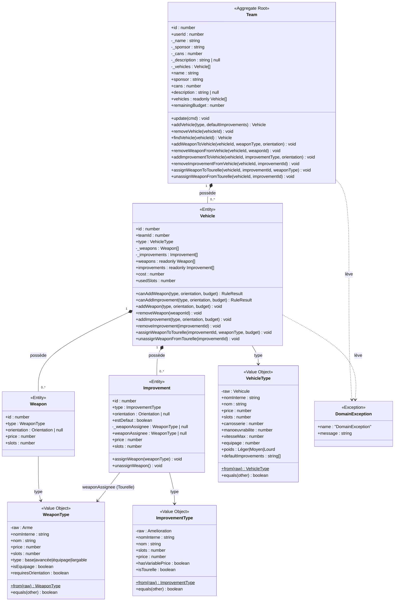
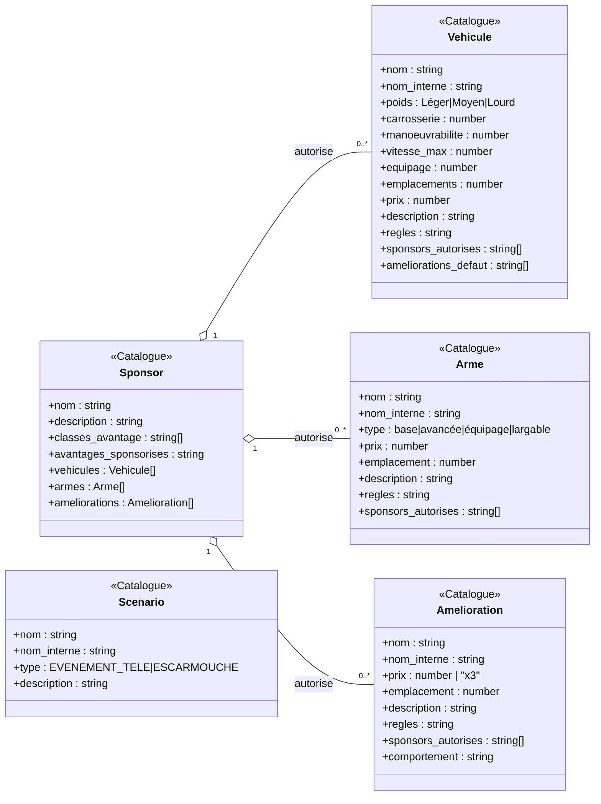
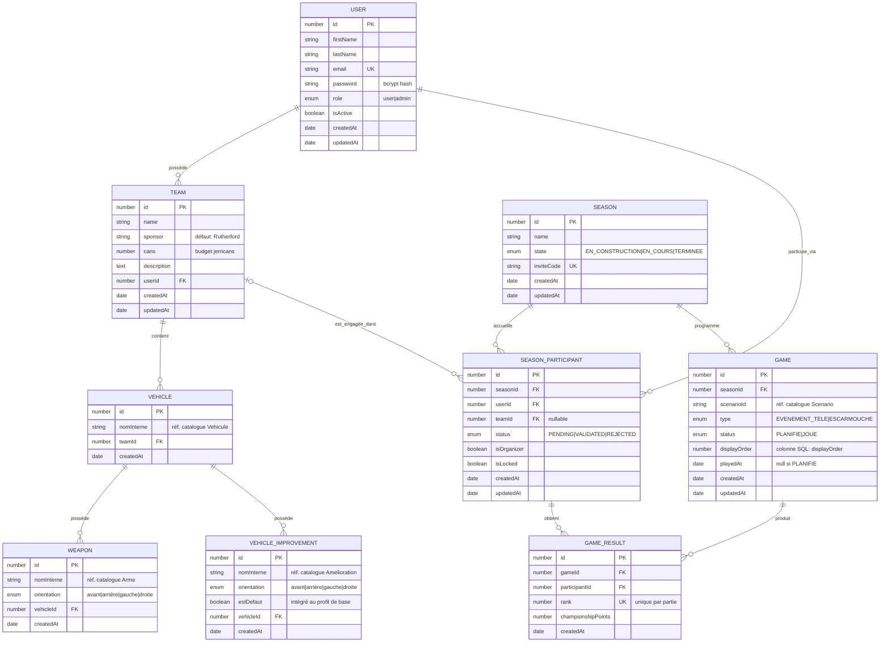

# Gaslands Manager — Modélisation du domaine

> Diagrammes UML du modèle de domaine.
> Mettre à jour après tout changement d'agrégat, d'entité ou de relation entre modules.
> Architecture et patterns : [ARCHITECTURE.md](ARCHITECTURE.md).

---

## 1. Agrégat Team (Domain-Driven Design)

Le module `team/` est l'agrégat DDD principal. `Team` est la racine ; `Vehicle`,
`Weapon` et `Improvement` sont des entités enfants dont le cycle de vie est entièrement
contrôlé par la racine. Les **Value Objects** (`VehicleType`, `WeaponType`,
`ImprovementType`) enveloppent les données brutes du catalogue YAML et exposent une API
métier typée.

**Invariant clé** : `vehicle.cost` est calculé en mémoire depuis l'agrégat chargé —
jamais via une requête SQL. `Team.remainingBudget` agrège le coût de tous ses véhicules.
Toute mutation valide d'abord les règles métier et lève `DomainException` si une règle
est violée. La couche application convertit `DomainException` → `BadRequestException`.

---

## 2. Catalogue en mémoire

Les données de jeu sont chargées **une seule fois au démarrage** depuis les fichiers YAML
(`database_init/data/`) et conservées en mémoire sous forme de `Map`. Aucune entité ORM
n'existe pour ces types — ils servent de **référence immuable** que les Value Objects
enveloppent.

Les trois types `VehicleType`, `WeaponType`, `ImprovementType` (§1) enveloppent
respectivement `Vehicule`, `Arme` et `Amelioration` via `static from(raw)`. Le catalogue
`Scenario` est géré par `ScenarioCatalogService` (même singleton pattern que
`CatalogService`).

---

## 3. Diagramme entité-relation (base de données)

Toutes les entités TypeORM persistées dans PostgreSQL.

**Clés logiques (pas de FK SQL)** : `VEHICLE.nomInterne` → `Vehicule.nom_interne`,
`WEAPON.nomInterne` → `Arme.nom_interne`, `VEHICLE_IMPROVEMENT.nomInterne` →
`Amelioration.nom_interne`, `GAME.scenarioId` → `Scenario.nom_interne`. Ces références
pointent vers des données en mémoire, pas des tables SQL.

**Contrainte unique composite** : `(SEASON_PARTICIPANT.seasonId, SEASON_PARTICIPANT.userId)` — un utilisateur ne peut engager qu'une équipe par saison. `(GAME_RESULT.gameId, GAME_RESULT.rank)` — pas deux équipes au même rang pour une même partie.
