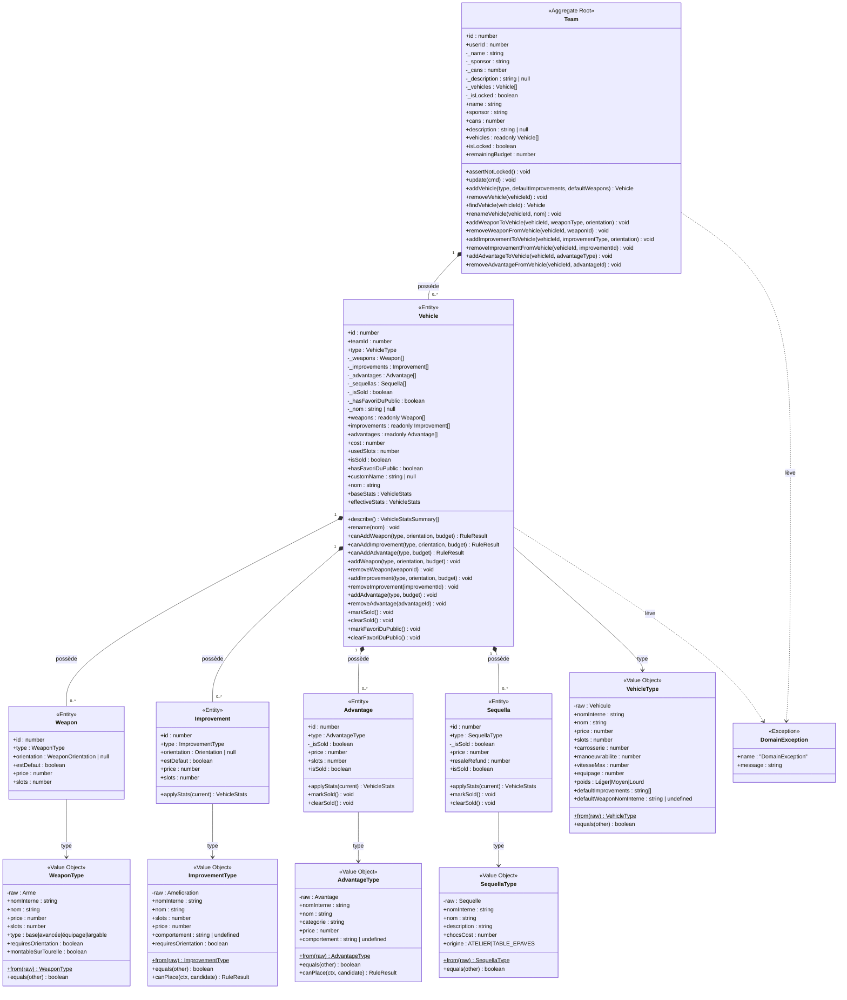
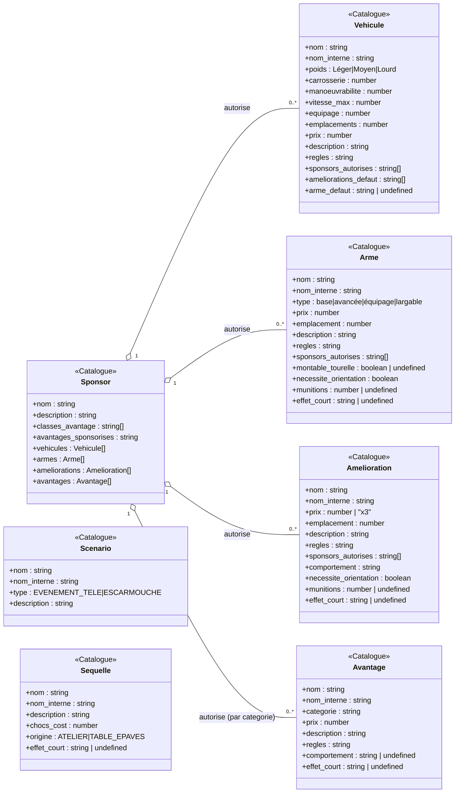
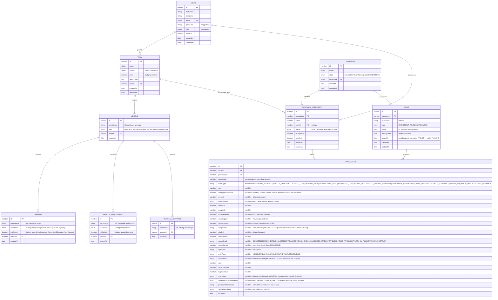
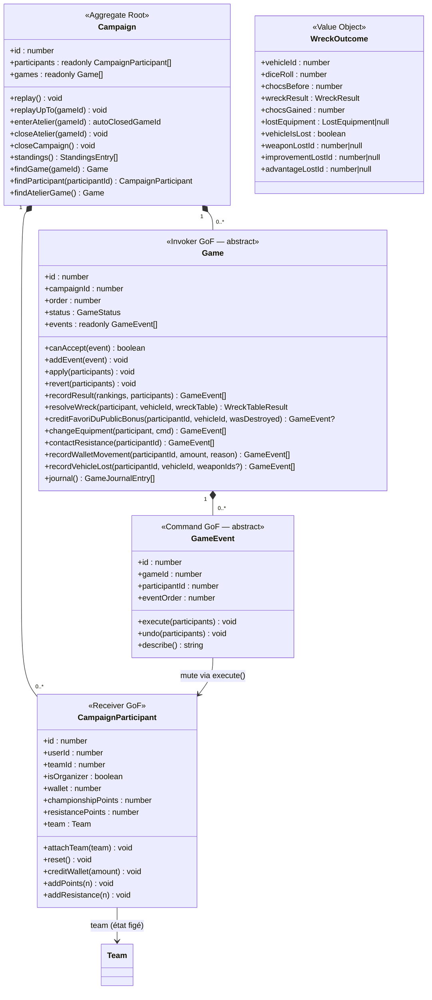

# Gaslands Manager — Modélisation du domaine

> Diagrammes UML du modèle de domaine.
> Mettre à jour après tout changement d'agrégat, d'entité ou de relation entre modules.
> Architecture et patterns : [ARCHITECTURE.md](ARCHITECTURE.md).

---

## 1. Agrégat Team (Domain-Driven Design)

Le module `team/` est l'agrégat DDD principal. `Team` est la racine ; `Vehicle`,
`Weapon`, `Improvement`, `Advantage` et `Sequella` sont des entités enfants dont le
cycle de vie est entièrement contrôlé par la racine. Les **Value Objects**
(`VehicleType`, `WeaponType`, `ImprovementType`, `AdvantageType`, `SequellaType`)
enveloppent les données brutes du catalogue YAML et exposent une API métier typée.
`Sequella` n'existe que côté mode campagne (créée exclusivement via
`addCampaignSequella`, jamais à la construction d'équipe) — cf. §Séquelles ci-dessous.

**Invariant clé** : `vehicle.cost` est calculé en mémoire depuis l'agrégat chargé —
jamais via une requête SQL. `Team.remainingBudget` agrège le coût de tous ses véhicules.
Toute mutation valide d'abord les règles métier et lève `DomainException` si une règle
est violée. La couche application convertit `DomainException` → `BadRequestException`.

**Montage sur Tourelle** : n'est pas modélisé comme une amélioration indépendante, ni
comme un booléen orthogonal à l'orientation — c'est la valeur `'tourelle'` du type
`WeaponOrientation = Orientation | 'tourelle'` (distinct de l'`Orientation` à 3 valeurs
utilisée par `VehicleImprovement`, qui ne supporte jamais ce montage). `Weapon.orientation
=== 'tourelle'` triple `price` (arc à 360°) ; l'ancien état invalide « orientation ET
montage Tourelle choisis en même temps » est désormais impossible à représenter, plutôt
que gardé à l'exécution. Ce choix élimine toute notion d'« assignation » séparée :
réassigner une arme sur une Tourelle revient à revendre l'arme actuelle (`removeWeapon`)
puis en acheter une nouvelle avec `orientation: 'tourelle'` — l'arme montée hérite alors
directement du mécanisme de revente/annulation déjà en place pour toute arme
(`isSold`/`purchasedThisSession`, prix résiduel), sans code dédié. Seule
`WeaponType.montableSurTourelle` (attribut catalogue, `Arme.montable_tourelle`) détermine
si une arme peut être montée ainsi — tous les sponsors l'acceptent.

**Orientation requise** : `WeaponType.requiresOrientation` et `ImprovementType.requiresOrientation`
lisent directement le champ catalogue `necessite_orientation` (`Arme`/`Amelioration`,
booléen obligatoire) — ni l'un ni l'autre n'est dérivé (`WeaponType` ne dérive plus de
son `type` catalogue, il n'existe d'ailleurs plus de getter `isEquipage`) ou codé en dur
(les Strategy `BelierBehavior`/`BelierExplosifBehavior`, seuls jusque-là à exiger une
orientation, ont perdu leur vérification manuelle au profit d'une garde générique dans
`Vehicle.canAddImprovement`, symétrique à celle déjà en place sur `canAddWeapon`). Détail
des valeurs catalogue : [spec/VEHICLES.md](spec/VEHICLES.md#orientation-requise-champ-catalogue-necessite_orientation).

**Calcul des stats effectives et validation de pose — Pattern Strategy** : `Vehicle`
calcule ses stats effectives (`effectiveStats`, un seul `reduce()` par famille — séquelles
puis améliorations puis avantages, cf. [VEHICLE_SYSTEM.md §4](VEHICLE_SYSTEM.md#4-pattern-strategy---equipmentbehavior))
et valide la pose d'un candidat via de petites classes Strategy stateless
(`EquipmentBehavior`, une par `comportement` de jeu — Chenilles, Bélier, Cascadeur,
Remorque Moyenne…), remplaçant un ancien Pattern Decorator (chaîne d'objets qui
s'enveloppent) courant juillet 2026. `canPlace(ctx, candidate)` est porté par
`ImprovementType`/`AdvantageType` (le Value Object — un candidat n'a pas encore
d'instance au moment de sa validation) ; `applyStats(current)` est porté par
`Improvement`/`Advantage`/`Sequella` (l'entité — un équipement déjà monté a toujours une
instance), cohérent avec `price`/`slots`/`resaleRefund` déjà présents à cet endroit.
`Advantage.price` retourne toujours `type.price`, jamais réduit même `isSold: true` —
c'est ce qui porte entièrement la règle de "perte totale" à la revente en atelier (aucun
second mécanisme de calcul de prix résiduel, contrairement à `Weapon`/`Improvement`).
Détail : [spec/VEHICLES.md — Avantages de véhicule](spec/VEHICLES.md#avantages-de-véhicule-72-au-total).

**Séquelles** : `Sequella` est un miroir quasi exact d'`Advantage` (mêmes mécaniques
`isSold`/prix jamais réduit à la revente) — seule différence, sa monnaie est `vehicle.chocs`
(compteur mutable propre au véhicule), pas le budget Jerricans de l'équipe. `Vehicle.canAddSequella`
garde l'origine catalogue (`SequellaType.origine`, une séquelle `TABLE_EPAVES` ne peut être
imposée que par un tirage de la Table des Épaves), l'unicité (comme `canAddAdvantage`) et les
Chocs suffisants ; `Vehicle.canRemoveSequella` ferme par défaut la revente cross-session, sauf
présence active de la séquelle `legende_vivante` sur le véhicule. Contrairement aux autres
entités enfants, les mutations campagne d'une séquelle (`addCampaignSequella`, `markSequellaSold`…)
sont journalisées via `EquipmentChangedEvent` (entityType `SEQUELLE`) plutôt qu'un événement dédié
— cf. [§4 — Séquelles](#séquelles-event-sourcing) et [spec/CAMPAIGN.md — Séquelles](spec/CAMPAIGN.md#séquelles).

**Revente d'un véhicule pré-existant en atelier** : `Vehicle` porte, comme
`Weapon`/`Improvement`/`Advantage`, un flag `isSold` et un prix résiduel — le
châssis contribue `Math.ceil(type.price / 2)` à `cost` une fois vendu, au lieu
du prix plein. `markSold()` (sans paramètre, auto-suffisant) **cascade** sur
toute arme/amélioration/avantage pas encore vendu(e) du véhicule — un véhicule
vendu doit voir tout son équipement vendu avec lui, par cohérence d'état, même
si `Advantage.price` ne varie jamais avec `isSold` (aucun effet monétaire pour
les avantages, seulement l'intégrité de l'état). Pour que `clearSold()` (undo)
ne dé-marque QUE les enfants cascadés par CETTE vente — pas un enfant déjà
vendu individuellement avant — `Vehicle` mémorise transitoirement (D-S5) les
ids cascadés dans trois tableaux, recalculés à chaque replay complet. Seule
différence restante avec une arme/amélioration vendue : côté application,
`GetWorkshopUseCase` filtre entièrement un véhicule vendu de la liste exposée
(il disparaît), plutôt que de le laisser visible barré avec un badge "Vendu" —
cf. [spec/CAMPAIGN.md — Annulation d'achat vs revente](spec/CAMPAIGN.md#annulation-dachat-vs-revente).

**Verrouillage campagne** : `_isLocked` est hydraté par `TeamRepository` au chargement
de l'agrégat (jointure `CampaignParticipant` → `Campaign.state`, pas une colonne
persistée sur `Team`). `assertNotLocked()` est appelé en tête de toutes les méthodes de
mutation directe (`update`, `addVehicle`, `addWeaponToVehicle`…) mais **pas** des
méthodes "campagne" (`addCampaignVehicle`, `markWeaponSold`…, section D-S5/D-S11),
utilisées par le flux atelier event-sourcing qui doit rester fonctionnel pendant que la
campagne est `EN_COURS`. Détail : [spec/TEAMS.md](spec/TEAMS.md#crud-équipes).

**Nom d'instance du véhicule** : `Vehicle._nom` (nullable) porte le nom personnalisé
donné par le joueur, distinct du type catalogue (`type.nomInterne`/`type.nom`) — `null`
tant que jamais renommé. Le getter `nom` résout et FORMATE en un seul endroit :
nom personnalisé (ou type par défaut), puis `"Nom (Type)"` uniquement si le résolu
diffère du type — aucun consommateur (DTO, `describe()` d'événement, frontend) ne
reformate. `rename(nom)` valide (non vide après trim, 100 caractères max, même limite
que `nomInterne`) et lève `DomainException` sinon ; sa validation pure est exposée en
statique (`Vehicle.assertValidName`) pour que `Game.renameVehicle` (mode campagne)
puisse rejeter un nom invalide AVANT de construire/persister l'événement. Même
dédoublement construction/campagne que le reste de l'agrégat : `Team.renameVehicle`
(`assertNotLocked()` + délégation, construction d'équipe) vs `Team.renameCampaignVehicle`
(délégation seule, atelier — la garde "Atelier uniquement" vit dans `Game.canAccept()`,
pas ici). Détail complet, y compris pourquoi le renommage en atelier passe par un
événement dédié plutôt qu'une écriture directe : [spec/CAMPAIGN.md — Renommage d'un
véhicule en atelier](spec/CAMPAIGN.md#renommage-dun-véhicule-en-atelier).

---

## 2. Catalogue en mémoire

Les données de jeu sont chargées **une seule fois au démarrage** depuis les fichiers YAML
(`database_init/data/`) et conservées en mémoire sous forme de `Map`. Aucune entité ORM
n'existe pour ces types — ils servent de **référence immuable** que les Value Objects
enveloppent.

`Sequelle` n'a **aucune** relation avec `Sponsor` — contrairement aux trois autres
catalogues d'équipement (et même à `Avantage`, résolu par `categorie`), une séquelle
est applicable à tout véhicule quel que soit le sponsor de l'équipe.

Les cinq types `VehicleType`, `WeaponType`, `ImprovementType`, `AdvantageType`,
`SequellaType` (§1) enveloppent respectivement `Vehicule`, `Arme`, `Amelioration`,
`Avantage` et `Sequelle` via `static from(raw)`. **`Avantage` est résolu différemment
des autres** : pas de champ `sponsors_autorises` — la relation Sponsor→Avantage passe
par correspondance de `categorie` avec `Sponsor.classes_avantage[2]` (cf.
[spec/VEHICLES.md — Avantages de véhicule](spec/VEHICLES.md#avantages-de-véhicule-72-au-total)).
`Sequelle` va plus loin : ni `sponsors_autorises` ni `categorie`, aucune résolution
sponsor du tout (cf. ci-dessus). Le catalogue `Scenario` est géré par
`ScenarioCatalogService` (même singleton pattern que `CatalogService`).

**`munitions`/`effet_court`** (fiche d'équipe exportable, cf.
[spec/TEAMS.md](spec/TEAMS.md#fiche-déquipe-exportable)) : deux champs optionnels
purement présentationnels, sans effet sur aucune règle métier — contrairement à
`necessite_orientation` (obligatoire, dérive une vraie règle de pose). `munitions`
existe sur `Arme` **et** `Amelioration` (une amélioration à usage limité — Bélier
Explosif, Nitro toutes variantes — porte elle aussi un nombre d'utilisations de
départ, jusqu'ici seulement décrit en texte libre dans `regles`, ex. "1 munition")
— jamais sur `Avantage`/`Sequelle`, qui n'ont pas cette notion. `effet_court`
existe sur les 4 types (y compris `Sequelle`, seul catalogue où il apparaît en
dehors des trois autres relations Sponsor). Les Value Objects
(`WeaponType`/`ImprovementType.munitions`/`.effetCourt`, `AdvantageType`/
`SequellaType.effetCourt`) les exposent tels quels — `undefined` si non
renseignés, géré par repli côté renderer (jamais une erreur).

---

## 3. Diagramme entité-relation (base de données)

Toutes les entités TypeORM persistées dans PostgreSQL.

**Clés logiques (pas de FK SQL)** : `VEHICLE.nomInterne` → `Vehicule.nom_interne`,
`WEAPON.nomInterne` → `Arme.nom_interne`, `VEHICLE_IMPROVEMENT.nomInterne` →
`Amelioration.nom_interne`, `VEHICLE_ADVANTAGE.nomInterne` → `Avantage.nom_interne`,
`GAME.scenarioId` → `Scenario.nom_interne`, `GAME_EVENT.nomInterne` (quand
`entityType = SEQUELLE`) → `Sequelle.nom_interne`, `GAME_EVENT.freeAdvantageNomInterne`
→ `Avantage.nom_interne`. Ces références pointent vers des données en mémoire, pas
des tables SQL.

**Pas de table `VEHICLE_SEQUELLE`** : contrairement à `Weapon`/`Improvement`/`Advantage`
(qui existent à la fois en table persistée — construction d'équipe — et en entité
transiente D-S11 — atelier), une séquelle n'a **aucune** table SQL propre : elle
n'existe que via `EquipmentChangedEvent` (entityType `SEQUELLE`) et le mécanisme
transient D-S11 (`id = -event.id`), jamais créée à la construction d'équipe.

**Contrainte unique composite** : `(CAMPAIGN_PARTICIPANT.campaignId, CAMPAIGN_PARTICIPANT.userId)` — un utilisateur ne peut engager qu'une équipe par campagne.

**Résultats dérivés du journal** : il n'existe plus de table `GAME_RESULT` (ni d'entité `GameResultOrm`). Le classement d'une partie est **reconstruit à la lecture** depuis les `GAME_EVENT` de type `RANKING_ASSIGNED` (rang + PC figés à l'enregistrement) — convergence event-sourcing du basculement Phase 2. `GET /api/campaigns/:id/games/:gameId/results` produit la même forme de réponse qu'auparavant.

**Table plate `GAME_EVENT`** : toutes les colonnes payload sont nullable — seules celles pertinentes au type d'événement (`eventType`) sont renseignées. Ce choix évite la hiérarchie STI TypeORM.

---

## 4. Domaine Campagne — Event Sourcing (`game/domain/`)

L'état campagne n'est jamais persisté directement. Il est **recalculé par replay** du journal `game_events` à chaque lecture. L'agrégat racine est `Campaign` (ex-`Season`, renommé pour unifier la terminologie du domaine — cf. commit `727d6e3`).

> ⚠️ Ne pas confondre avec l'entité TypeORM `CampaignOrm` — cf.
> [ARCHITECTURE.md §3.1](ARCHITECTURE.md#31-structure-des-modules) pour le détail
> de cette collision de nom.

### Répartition des responsabilités Campaign / Game

`Campaign` ne porte que ce qui dépasse une seule partie : navigation
(`findGame`, `findParticipant`), invariants transversaux (`findAtelierGame` —
un seul atelier actif à la fois sur l'ensemble des parties de la campagne) et
orchestration multi-parties (`replay`, cycle de vie, CRUD programme/participants).
**La construction des événements d'une partie donnée vit sur `Game`, pas sur
`Campaign`** : `recordResult`, `resolveWreck`, `creditFavoriDuPublicBonus`,
`changeEquipment` (achat/revente d'équipement **et** de séquelles, un seul
point d'entrée depuis l'unification — cf. [spec/CAMPAIGN.md — Séquelles](spec/CAMPAIGN.md#séquelles)),
`contactResistance`, `recordWalletMovement`,
`recordVehicleLost`, `journal()` sont toutes des méthodes de
`Game` — chacune reçoit en paramètre les `CampaignParticipant` dont elle a
besoin (même convention que `GameEvent.execute(participants)`/
`Game.apply(participants)`, qui ne détiennent pas non plus de référence
permanente aux participants). Les use cases naviguent explicitement via
l'agrégat racine (`campaign.findGame(gameId)` ou `campaign.findAtelierGame()`)
puis appellent la méthode sur l'objet `Game` obtenu — `Campaign` n'expose plus
de méthode de pur passage (`applyNewEvent`, ancien point d'entrée générique,
a été supprimé). Ce choix évite que `Campaign` devienne une classe fourre-tout
portant des règles qui appartiennent en réalité à ses parties.

### Hiérarchie Game (Invoker)

Pas de sous-type dédié à l'atelier : la phase garage post-partie est un
statut du cycle de vie de la partie elle-même (`PLANIFIE → ATELIER → JOUE`),
pas une entité séparée (cf.
[design doc](plans/2026-07-05-atelier-lifecycle-design.md) et
[CAMPAIGN.md](spec/CAMPAIGN.md#cycle-de-vie-dune-partie-et-phase-atelier)).
`canAccept(event)` dépend donc du statut courant, pas seulement du sous-type :

| Classe | Type | Statuts | Événements acceptés en PLANIFIE | Événements acceptés en ATELIER |
|--------|------|---------|----------------------------------|----------------------------------|
| `EvenementTeleGame` | `EVENEMENT_TELE` | `PLANIFIE → ATELIER → JOUE` | RankingAssigned, WalletMovement, VehicleLost, WeaponLost, ImprovementLost, WreckResolved, EquipmentChanged (entityType `SEQUELLE` uniquement), ResistanceContacted, GatesCrossed, VehicleDestroyed, FavoriDuPublicBonus | EquipmentChanged (tout entityType), VehicleRenamed |
| `EscarmoucheGame` | `ESCARMOUCHE` | `PLANIFIE → ATELIER → JOUE` | Idem EvenementTele (listes dupliquées à l'identique, volontairement non factorisées — appelées à diverger) | EquipmentChanged (tout entityType), VehicleRenamed |

`EquipmentChangedEvent` est la seule classe acceptée dans les deux statuts, mais
pas pour les mêmes `entityType` : en `PLANIFIE`, seul `SEQUELLE` passe (séquelle
`TABLE_EPAVES` imposée par la Table des Épaves, ligne "Siège irrécupérable" —
générée par le tirage, *avant* l'entrée en atelier) ; `VEHICLE`/`WEAPON`/
`IMPROVEMENT`/`ADVANTAGE`, et `SEQUELLE` `ATELIER` (achat volontaire contre des
Chocs), restent exclusifs à `ATELIER`.

Un seul `Game` en statut `ATELIER` à la fois par campagne : `enterAtelier`
clôture automatiquement (`ATELIER → JOUE`) toute autre partie encore en
atelier.

### Hiérarchie GameEvent (Command)

Chaque `GameEvent` implémente aussi `describe(): string` — une ligne de texte en
français résumant l'événement (ex. `"Classé 1 (+10 PC)"`,
`"Table des Épaves : Arrachée (D6=5+0 chocs, +1 choc(s))"`). Utilisée par la
synthèse de l'écran Résolution du wizard de fin de partie (cf.
[`docs/spec/CAMPAIGN.md`](spec/CAMPAIGN.md#wizard-de-fin-de-partie)) : `WreckResolveUseCase`
et `RollIncomeUseCase` renvoient `descriptions: string[]` (une par événement créé) ; et
par `Game.journal()` (cf.
[spec/CAMPAIGN.md — Journal d'une partie](spec/CAMPAIGN.md#journal-dune-partie)),
qui traduit **tout** le journal d'une partie pour affichage, tous types
d'événements confondus.

| Événement | Effet `execute()` | `undo()` |
|-----------|-----------------|---------|
| `RankingAssignedEvent` | `participant.addPoints(+PC)` | `addPoints(-PC)` |
| `WalletMovementEvent` | `participant.creditWallet(amount)` | `creditWallet(-amount)` |
| `VehicleLostEvent` | `vehicle.markLost()` | `vehicle.clearLost()` |
| `WeaponLostEvent` | `weapon.markLost()` | `weapon.clearLost()` |
| `ImprovementLostEvent` | `improvement.markLost()` (mirroir `WeaponLostEvent`) | `improvement.clearLost()` |
| `AdvantageLostEvent` | `advantage.markLost()` (mirroir `WeaponLostEvent`/`ImprovementLostEvent`) | `advantage.clearLost()` |
| `WreckResolvedEvent` | `vehicle.addChocs(+n)` (`n` peut être négatif — ligne `DEBOSSELE`) ; `vehicle.markFavoriDuPublic()` si `wreckResult = FAVORI_DU_PUBLIC` | `vehicle.addChocs(-n)` ; `vehicle.clearFavoriDuPublic()` si `wreckResult = FAVORI_DU_PUBLIC` |
| `EquipmentChangedEvent` (`entityType` ≠ `SEQUELLE`) | BUY : `creditWallet(-cost)` + `addCampaignVehicle/Weapon/…` ; SELL : `markSoldEntity` | Inverse de execute |
| `EquipmentChangedEvent` (`entityType = SEQUELLE`) | BUY : `vehicle.addChocs(-cost)` + `addCampaignSequella` (+ `addCampaignAdvantage` taggé si `dur_a_cuire`) ; SELL : `vehicle.addChocs(+refund)` + `markSequellaSold` (+ `markGrantedAdvantageSold` si `dur_a_cuire`) | Inverse de execute — monnaie `vehicle.chocs`, jamais la cagnotte |
| `ResistanceContactedEvent` | `participant.addResistance(+3)` | `addResistance(-3)` |
| `GatesCrossedEvent` (US-B2) | `participant.addPoints(+1 par porte)` | `addPoints(-n)` |
| `VehicleDestroyedEvent` (US-B2) | `participant.addPoints(+1/+2/+3/+5 selon poids)` — crédite le destructeur, ne mute jamais le véhicule ciblé | `addPoints(-n)` |
| `FavoriDuPublicBonusEvent` (Table des Épaves, ligne 9) | `participant.addPoints(+5)` + `vehicle.clearFavoriDuPublic()` (consomme le statut) — effet différé, revérifié côté serveur via `Vehicle.hasFavoriDuPublic` avant construction de l'événement (cf. `Game.creditFavoriDuPublicBonus`) | `addPoints(-5)` + `vehicle.markFavoriDuPublic()` |
| `VehicleRenamedEvent` | `vehicle.renameCampaignVehicle(newName)` (via `Team`, pas `assertNotLocked()` — cf. §1) | `vehicle.renameCampaignVehicle(previousName)` |

### Entités transientes (D-S11)

Les véhicules, armes, améliorations, avantages et séquelles achetés en atelier
**n'ont pas de ligne en base**. Leur identité est `id = -event.id` (espace
négatif). À chaque replay, `EquipmentChangedEvent.execute()` les recrée avec
cet id. Les ids positifs restent réservés aux entités persistées (`VEHICLE`,
`WEAPON`, `VEHICLE_IMPROVEMENT`, `VEHICLE_ADVANTAGE` — aucune table pour
`Sequella`, toujours transiente, cf. §3). Cas particulier Dur à Cuire : la
séquelle et l'avantage gratuit qu'elle accorde partagent le **même** id
(`-event.id`, un seul événement les crée tous les deux) — sans collision
possible, ces deux entités vivant dans des collections distinctes
(`vehicle.sequellas` / `vehicle.advantages`).

**Équipement par défaut d'un véhicule acheté en atelier** : un second cas de
plusieurs entités créées par un seul événement `BUY_VEHICLE` — le véhicule lui-même
GARDE `id = -event.id` (contrat exploité par `Game.findSameSessionPurchase`/
`collectSessionEventsForVehicle`), mais son amélioration/arme intégrée
(`estDefaut: true`, résolues depuis `VehicleType.defaultImprovements`/
`.defaultWeaponNomInterne`) reçoit un id dérivé par **offset constant**
(`Team.DEFAULT_IMPROVEMENT_ID_OFFSET`/`DEFAULT_WEAPON_ID_OFFSET`, cf.
`Team.addCampaignVehicle`) plutôt que `-event.id` directement — nécessaire car
ces entités vivent dans des collections où d'AUTRES événements (`BUY_WEAPON`/
`BUY_IMPROVEMENT`) déposent déjà des entités à `-leur_event.id`. L'offset
(10/20 milliards) dépasse la capacité de la colonne `GAME_EVENT.id`
(Postgres `integer`, max ~2,147,483,647) : aucune collision possible avec un id
d'événement réel, garantie mathématique plutôt que probabiliste.

### Séquelles (event-sourcing)

Résumé de la partie event-sourcing du système de séquelles — conception
complète : [spec/CAMPAIGN.md — Séquelles](spec/CAMPAIGN.md#séquelles) et
[docs/plans/2026-07-13-sequelles-design.md](plans/2026-07-13-sequelles-design.md).

- **Aucun événement dédié** : `SequellaAddedEvent` (et l'idée d'un
  `SequellaRemovedEvent`, jamais implémentée) sont retirés — tout passe par
  `EquipmentChangedEvent`, `entityType SEQUELLE`.
- **Monnaie différente** : `vehicle.chocs`, pas `participant.wallet` — seule
  exception à "le wallet n'est plus jamais touché" par un événement d'atelier.
- **Revente gardée** : contrairement aux 4 autres `entityType`, la revente
  cross-session d'une séquelle est rejetée par défaut
  (`Vehicle.canRemoveSequella()`), sauf présence active de `legende_vivante`
  sur le véhicule.
- **Dur à Cuire** : un seul événement porte deux effets (séquelle + avantage
  gratuit taggé `Advantage.grantedBySequellaNomInterne`) — annulation même
  session atomique par construction (un seul événement supprimé du journal).
- **Maintenu par la Rouille / Légende Vivante** : aucun événement spécifique —
  deux modificateurs permanents de `WreckTable` (double tirage chaîné / D6
  forcé à 1), lus par présence (`Vehicle.hasActiveSequella`) à chaque
  résolution de la Table des Épaves.
- **`WreckTable` gagne une dépendance `ICatalogRepository`** (résout
  `siege_irrecuperable` pour construire l'`EquipmentChangedEvent` imposé),
  en plus de son `IRandomizer` existant.
