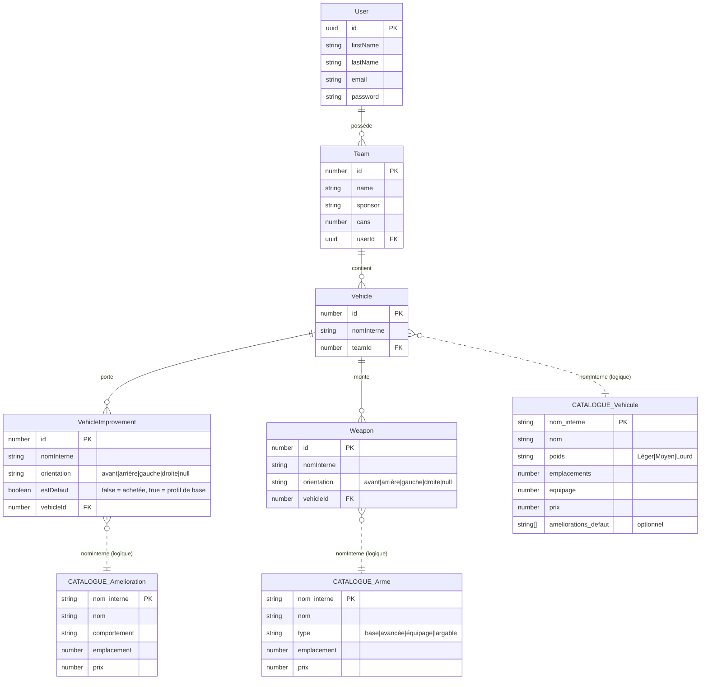
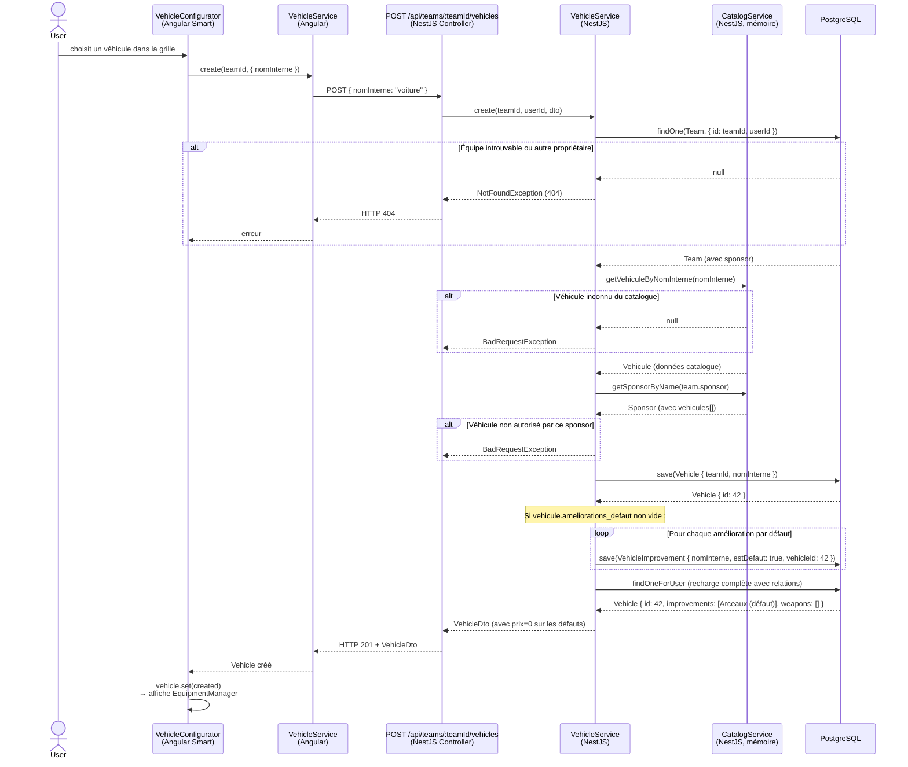
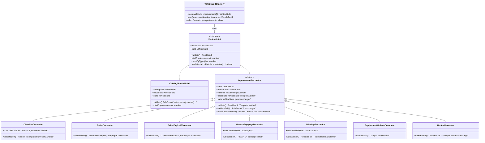
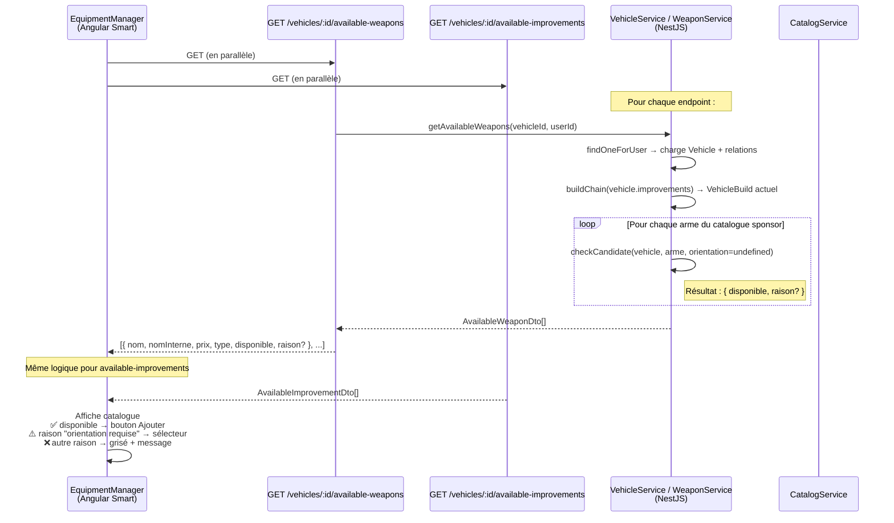
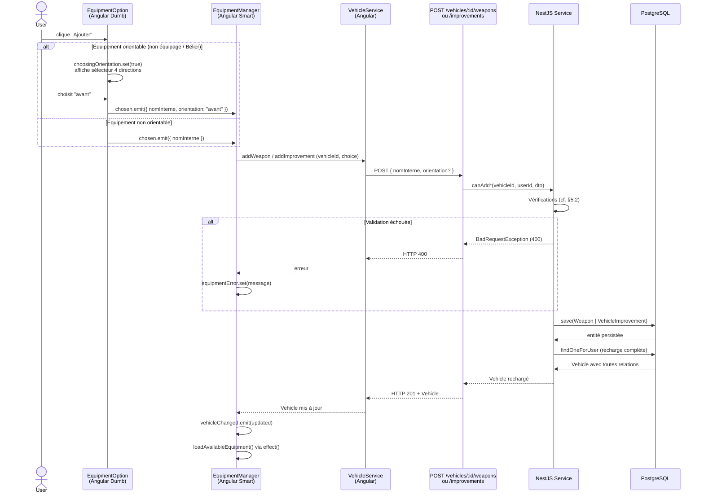
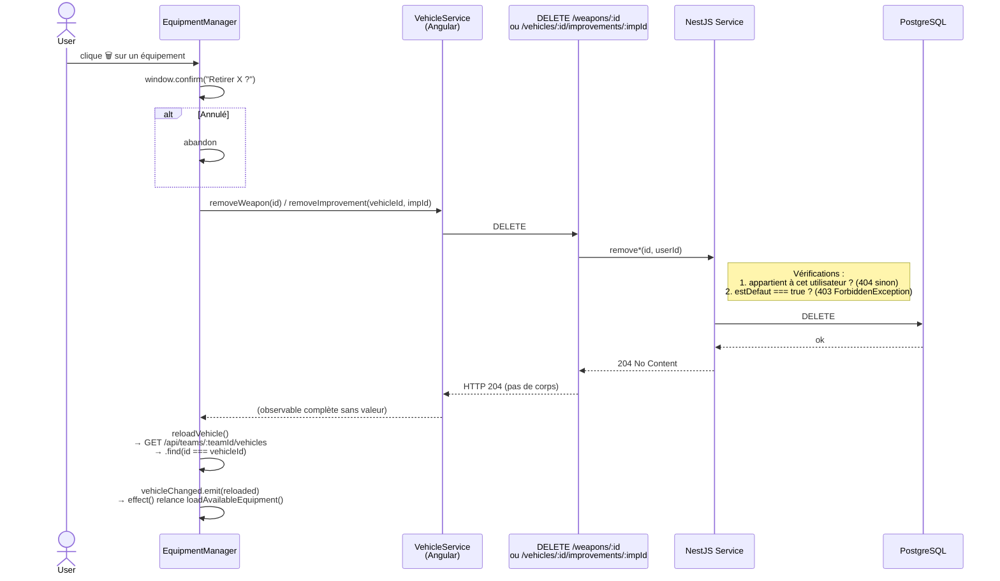
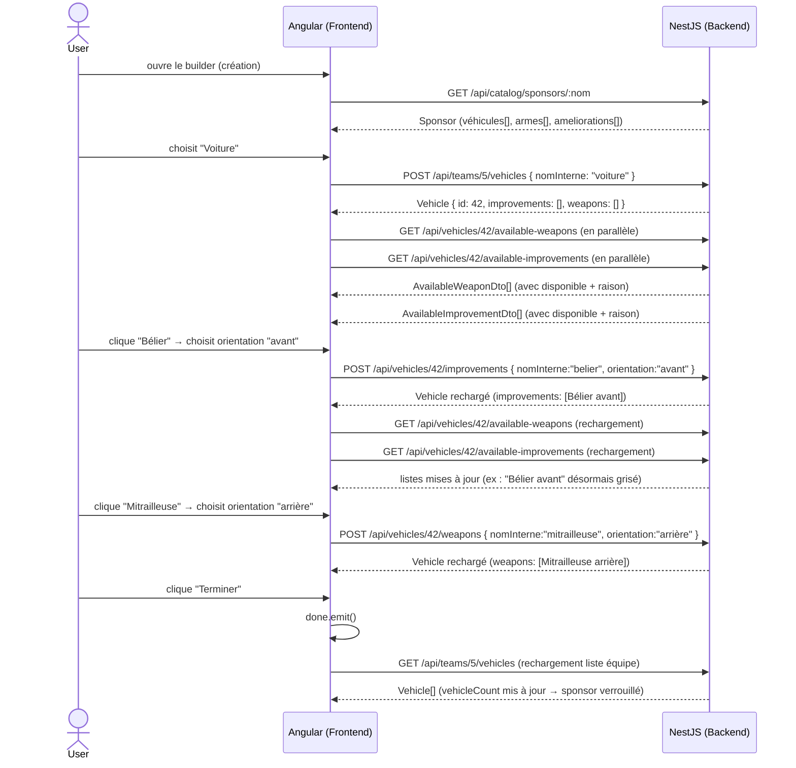

# Gaslands Manager — Conception technique : système Véhicules / Armes / Améliorations

> **À qui s'adresse ce document ?**
> À tout intervenant (humain ou agent IA) qui doit modifier les modules `vehicle`, `weapon`,
> ou les composants Angular `vehicle-builder` / `vehicle-editor`. Il décrit les flux complets,
> les règles de validation et les patterns d'architecture, en s'appuyant sur des diagrammes
> pour réduire le temps de compréhension.
>
> Il ne remplace pas les commentaires dans le code — il les complète par une vue d'ensemble.

---

## 1. Deux mondes distincts : catalogue vs instances de jeu

Le projet manipule deux natures de données très différentes. Ne pas les confondre est fondamental.

| | **Catalogue** | **Instances de jeu** |
|---|---|---|
| Source | Fichiers YAML dans `database_init/data/` | Base de données PostgreSQL |
| Chargement | Une seule fois au démarrage (`OnModuleInit`) | À chaque requête (TypeORM) |
| Mutabilité | **Jamais modifié** à l'exécution | Créé / supprimé par les utilisateurs |
| Représentation | `Map<string, Sponsor>` dans `CatalogService` | Entités `Vehicle`, `Weapon`, `VehicleImprovement` |
| Identifiant stable | `nom_interne` (snake_case, sans accents) | `id` auto-incrémenté |
| Exemples | `Vehicule`, `Arme`, `Amelioration`, `Sponsor` | `Vehicle`, `Weapon`, `VehicleImprovement` |

Les entités persistées référencent le catalogue **uniquement via `nomInterne`** — une clé logique
stable. Ce choix permet d'avoir plusieurs variantes d'un même véhicule/arme
(ex. `belier` vs `belier_slime`) avec des prix différents mais **le même comportement de validation**.

---

## 2. Architecture des entités TypeORM



> **Cascade** : supprimer un `Team` supprime ses `Vehicle`, qui suppriment leurs `VehicleImprovement`
> et `Weapon` — via `onDelete: 'CASCADE'` TypeORM à chaque niveau.

---

## 3. Flux de création d'un véhicule

Un véhicule est d'abord créé « nu » (sans équipement), puis équipé séparément.



---

## 4. Pattern Décorateur — `VehicleBuild`

C'est le cœur du système de validation. Chaque amélioration installée **enveloppe** la chaîne
courante et peut modifier les statistiques et les règles de validation.

### 4.1 Hiérarchie de classes



### 4.2 Construction de la chaîne

La factory parcourt les améliorations installées et les enfile les unes dans les autres :

```
CatalogVehicleBuild("voiture")
  ↑ enveloppé par
BelierDecorator(orientation="avant")
  ↑ enveloppé par
BlindageDecorator
  ↑ enveloppé par
MembreEquipageDecorator
```

Appeler `build.stats` retourne les statistiques **cumulées** depuis le bas de la chaîne.
Appeler `build.validate()` déclenche le **Template Method** à chaque niveau :

```
MembreEquipageDecorator.validate()
  1. validateSelf()  → equipage ≤ max ?
  2. inner.validate() →
    BlindageDecorator.validate()
      1. validateSelf()  → ok (pas de règle)
      2. inner.validate() →
        BelierDecorator.validate()
          1. validateSelf()  → orientation fournie ? doublon ?
          2. inner.validate() →
            CatalogVehicleBuild.validate()
              → ok()
```

### 4.3 `baseStats` vs `stats` — différence critique

| Propriété | Valeur | Usage |
|-----------|--------|-------|
| `baseStats` | Profil d'origine du catalogue | "quel type de véhicule ?" (`nom_interne === 'char_assaut'`) |
| `stats` | Profil après accumulation des décorateurs | Affichage, validation "équipage max = 2× initial" |

Tous les décorateurs **délèguent** `baseStats` vers `inner` sans le modifier — seul
`CatalogVehicleBuild` le détient.

### 4.4 Sélection du décorateur — clé `comportement` YAML

Le champ `comportement` dans le YAML d'amélioration détermine quelle classe instancier,
**indépendamment du `nom_interne`**. C'est ce qui permet aux variantes sponsor d'avoir
le même comportement de validation à prix différent :

```yaml
# Deux entrées YAML, une seule classe de décorateur
- nom: "Bélier"
  nom_interne: belier
  comportement: belier    # → BelierDecorator
  prix: 4

- nom: "Bélier (Slime)"
  nom_interne: belier_slime
  comportement: belier    # → BelierDecorator identique
  prix: 2
```

---

## 5. Flux d'ajout d'un équipement

### 5.1 Chargement du catalogue disponible (GET)

Avant d'afficher les options, `EquipmentManager` charge les listes filtrées via `forkJoin` :



### 5.2 Ordre des vérifications dans `checkCandidate` (CRITIQUE)

L'ordre est intentionnel et garantit des messages d'erreur cohérents :

```
1. Sponsor            : l'item appartient-il au catalogue du sponsor ?
                        → fail si non (pas d'accès à cet item)

2. Orientation invalide : arme d'équipage + orientation fournie ?
                        → fail si oui (incohérence de la requête)

3. Emplacements       : total (pool améliorations + armes + candidat) ≤ capacité ?
                        → fail si dépassement (vrai blocage physique)

4. Orientation manquante : arme non-équipage sans orientation ?
                        → fail si oui (info manquante)
```

> **Pourquoi 3 avant 4 ?** Si on inversait, une arme sans emplacement disponible
> afficherait « orientation requise » au lieu de « emplacements insuffisants » — message
> trompeur puisque le vrai problème est le manque d'emplacements.

### 5.3 Ajout effectif (POST)



---

## 6. Pool d'emplacements partagé

**Règle Gaslands** : un véhicule dispose de N emplacements **totaux**, partagés entre
armes **et** améliorations. Ce n'est pas deux pools séparés.

### Calcul backend (dans `checkCandidate` pour les améliorations)

```
totalDemande = candidateBuild.totalEmplacements()   ← amélio ACHETÉES + candidat
             + weaponSlotsOf(vehicle)               ← armes déjà montées

si totalDemande > candidateBuild.baseStats.emplacements → BLOQUÉ
```

**Les améliorations par défaut (`estDefaut: true`) sont exclues du calcul** — elles
font partie du profil du véhicule, pas de ses achats. `VehicleService.improvementSlotsOf()`
les filtre avant de traverser la chaîne, et `getBuild()` ne les enfile pas dans les
décorateurs (elles n'ont aucun `comportement` à appliquer).

`candidateBuild.totalEmplacements()` traverse la chaîne complète via délégation :
chaque décorateur retourne `this.amelioration.emplacement + this.inner.totalEmplacements()`.

### Reflet côté frontend

`EquipmentManager` recalcule un signal `emplacementsUtilises` en miroir :

```typescript
emplacementsUtilises = computed(() => {
  const vehicle = this.vehicle();
  const catalog = this.sponsorCatalog();

  const weaponSlots = vehicle.weapons.reduce((sum, w) => {
    const arme = catalog.armes.find(a => a.nom_interne === w.nomInterne);
    return sum + (arme?.emplacement ?? 0);
  }, 0);

  // Les améliorations par défaut (estDefaut: true) sont filtrées —
  // cohérence avec le backend qui les exclut de improvementSlotsOf().
  const improvementSlots = vehicle.improvements
    .filter(imp => !imp.estDefaut)
    .reduce((sum, imp) => {
      const amelioration = catalog.ameliorations.find(a => a.nom_interne === imp.nomInterne);
      return sum + (amelioration?.emplacement ?? 0);
    }, 0);

  return weaponSlots + improvementSlots;
});
```

Ce signal alimente la barre de progression « Emplacements » dans l'UI — la source
de vérité reste le backend, mais le frontend donne un retour visuel immédiat.

---

## 7. Flux de retrait

Le retrait est **permis pour les améliorations achetées** — aucune règle métier
n'est vérifiée (retirer un équipement ne peut jamais rendre une configuration valide
invalide). **Exception : les améliorations par défaut (`estDefaut: true`)** — elles
font partie du profil du véhicule et ne peuvent pas être retirées ; toute tentative
retourne HTTP **403 ForbiddenException** (la ressource existe mais est protégée —
pas un 404 d'appartenance).



> **Pourquoi recharger via `getAllForTeam` et non `GET /vehicles/:id` ?**
> Il n'existe pas de route `GET /vehicles/:id` retournant l'entité brute
> (il y a `GET /vehicles/:id` mais il retourne un `VehicleDetailDto` calculé, non
> directement réinjectables dans les composants). Le rechargement de liste est la
> seule voie pour obtenir l'entité brute avec ses relations fraîches.

---

## 8. Pattern hydratation + DTO — calcul du prix

### 8.1 Pourquoi une hydratation manuelle ?

Le catalogue (véhicules, armes, améliorations avec leurs prix) est en **mémoire dans
`CatalogService`**, pas en base. TypeORM ne peut pas résoudre cette relation automatiquement.
C'est le service qui **hydrate** les entités après chaque chargement depuis la DB — il
attache les objets catalogue comme propriétés transientes (non mappées) :

```typescript
// VehicleService.hydrateVehicle() — appelé après chaque findOne / findAll
private hydrateVehicle(vehicle: Vehicle): void {
  for (const imp of vehicle.improvements) {
    // Propriété transiente — pas de @Column, pas persistée
    imp.ameliorationCatalogue = this.catalogService.getAmeliorationByNomInterne(imp.nomInterne);
  }
  for (const weapon of vehicle.weapons) {
    weapon.armeCatalogue = this.catalogService.getArmeByNomInterne(weapon.nomInterne);
  }
}
```

### 8.2 Getters sur les entités — règle de gestion portée par l'objet

Une fois hydratées, les entités exposent un getter `prix` qui **encapsule la règle
de gestion** : l'objet sait lui-même combien il coûte.

```typescript
// VehicleImprovement.prix — règle : 0 si défaut, prix catalogue sinon
get prix(): number {
  if (this.estDefaut) return 0;
  return (this.ameliorationCatalogue?.prix as number) ?? 0;
}

// Weapon.prix — règle simple : prix catalogue
get prix(): number {
  return (this.armeCatalogue?.prix as number) ?? 0;
}
```

### 8.3 DTOs — sérialisation explicite via `toVehicleDto`

Les getters TypeScript **ne sont pas sérialisés** par `JSON.stringify` (ils vivent sur
le prototype, pas sur l'instance). Le contrôleur HTTP ne doit donc jamais retourner
une entité brute — il appelle `VehicleService.toVehicleDto(vehicle)` qui lit les
getters explicitement et construit un objet plain sérialisable :

```typescript
toVehicleDto(vehicle: Vehicle): VehicleDto {
  const improvements = vehicle.improvements.map((imp) => ({
    ...fields,
    estDefaut: imp.estDefaut,
    prix: imp.prix,  // ← appel du getter
  }));
  const weapons = vehicle.weapons.map((w) => ({
    ...fields,
    prix: w.prix,  // ← appel du getter
  }));
  return { id, nomInterne, teamId, createdAt, improvements, weapons };
}
```

Ce DTO est ce que tous les endpoints d'écriture (`POST /improvements`, `POST /weapons`,
`POST /vehicles`) retournent — le frontend reçoit directement `prix` sans calcul propre.

---

## 9. Règles métier par comportement

| Comportement YAML | Décorateur | Modificateur de stats | Règles de validation |
|---|---|---|---|
| `chenilles` | `ChenillesDecorator` | `vitesse_max−1`, `manoeuvrabilite+1` | Unique par véhicule ; interdit sur `char_assaut`, `helicoptere`, `gyrocoptere` |
| `belier` | `BelierDecorator` | — | Orientation **obligatoire** ; un seul Bélier par orientation |
| `belier_explosif` | `BelierExplosifDecorator` | — | Orientation **obligatoire** ; un seul Bélier Explosif par orientation |
| `membre_equipage` | `MembreEquipageDecorator` | `equipage+1` | Max = 2× équipage initial (ex : Voiture équipage 1 → max 2) |
| `blindage` | `BlindageDecorator` | `carrosserie+2` | Cumulable sans limite — aucune règle spécifique |
| `mishkin` | `EquipementMishkinDecorator` | — | Un seul équipement Mishkin par véhicule |
| `neutre` *(autres)* | `NeutralDecorator` | — | Aucune règle — pose libre dans la limite des emplacements |

### Orientation des armes

| Type d'arme | Orientation |
|---|---|
| `base`, `avancée`, `largable` | **Obligatoire** — définit l'arc de tir |
| `équipage` | **Interdite** — portée par un équipier, tir à 360° automatique |

---

## 10. Sécurité et vérification de propriété

**Principe** : tout accès à une ressource inexistante **ou** appartenant à un autre
utilisateur retourne HTTP 404 — jamais 403. Cela évite de divulguer l'existence
d'une ressource qu'on ne possède pas.

### Chaîne de propriété

```
Weapon → vehicle.team.userId === userId (requis)
VehicleImprovement → vehicle.team.userId === userId
Vehicle → team.userId === userId
Team → userId === userId
```

NestJS implémente cette vérification via une jointure TypeORM implicite :

```typescript
// WeaponService — suppression d'une arme
const weapon = await weaponRepo.findOne({
  where: { id: weaponId, vehicle: { team: { userId } } }
  //        ↑ si l'une de ces conditions échoue → null → NotFoundException
});
if (!weapon) throw new NotFoundException(`Arme #${weaponId} introuvable`);
```

La requête SQL générée effectue des `JOIN` successifs et ne retourne de ligne
que si l'ensemble de la chaîne correspond — une seule requête suffit.

---

## 11. Cycle complet illustré (vue macro)



---

## 12. Fichiers clés de référence

### Backend

| Fichier | Rôle |
|---------|------|
| `apps/backend/src/app/vehicle/vehicle.entity.ts` | Entité `Vehicle` + relation vers `Team`, `VehicleImprovement`, `Weapon` |
| `apps/backend/src/app/vehicle/vehicle-improvement.entity.ts` | Entité `VehicleImprovement` |
| `apps/backend/src/app/vehicle/vehicle-build.ts` | Interface `VehicleBuild` + `CatalogVehicleBuild` |
| `apps/backend/src/app/vehicle/improvement-decorators/` | Tous les décorateurs concrets + Factory |
| `apps/backend/src/app/vehicle/vehicle.service.ts` | CRUD + `canAddImprovement` + `getAvailableImprovements` |
| `apps/backend/src/app/vehicle/vehicle.controller.ts` | Routes véhicule et améliorations |
| `apps/backend/src/app/weapon/weapon.entity.ts` | Entité `Weapon` |
| `apps/backend/src/app/weapon/weapon.service.ts` | `canAddWeapon` + `getAvailableWeapons` + `addWeapon` |
| `apps/backend/src/app/weapon/weapon.controller.ts` | Routes armes |
| `apps/backend/src/app/catalog/catalog.service.ts` | Catalogue en mémoire — `getVehiculeByNomInterne`, `getSponsorByName`, etc. |

### Frontend

| Fichier | Rôle |
|---------|------|
| `apps/frontend/src/app/teams/vehicle-builder/` | `VehicleConfigurator` (Smart) — orchestrateur création + édition |
| `apps/frontend/src/app/teams/vehicle-builder/equipment-manager/` | `EquipmentManager` (Smart) — ajout/retrait équipement |
| `apps/frontend/src/app/teams/vehicle-builder/equipment-option/` | `EquipmentOption` (Dumb) — UX sélection + orientation |
| `apps/frontend/src/app/teams/vehicle-summary.ts` | Type `VehicleSummary` — résumé pour la carte équipe |
| `apps/frontend/src/app/vehicles/vehicle.service.ts` | Tous les appels HTTP véhicule/arme/amélioration |
