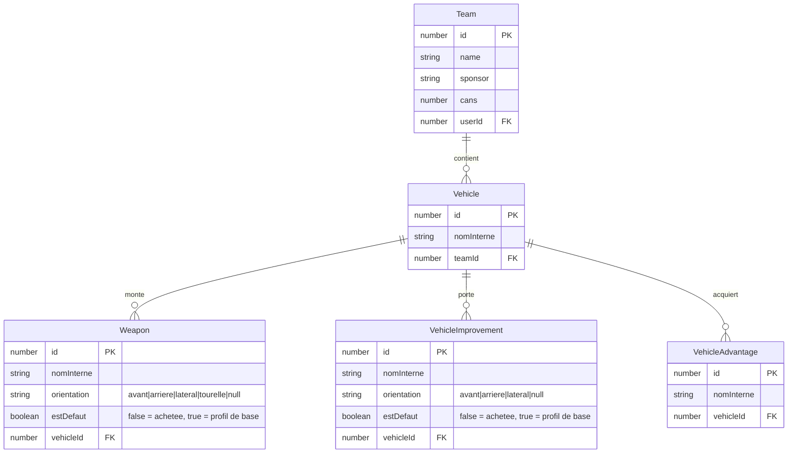
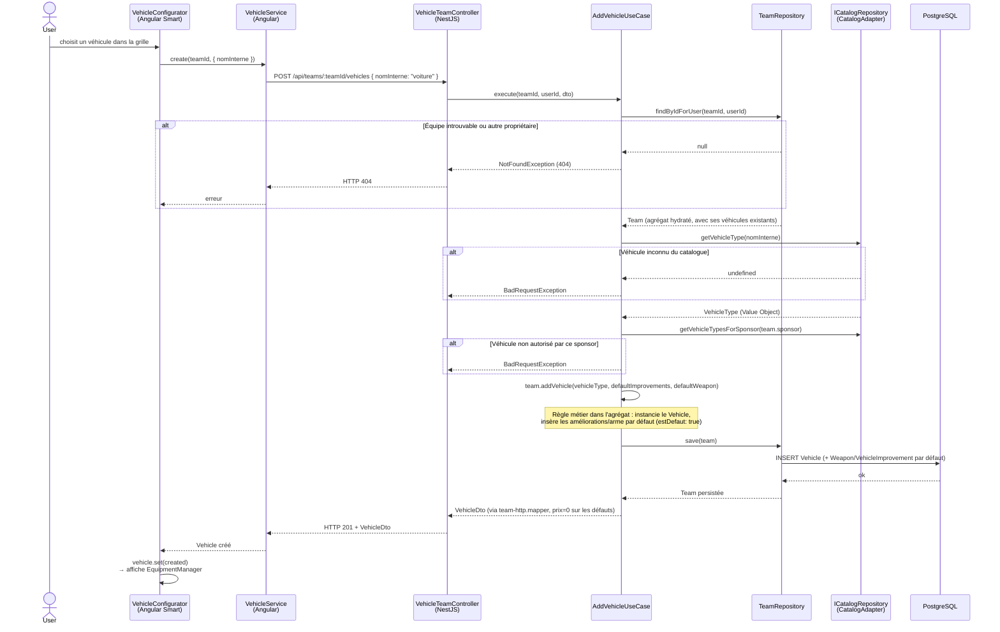
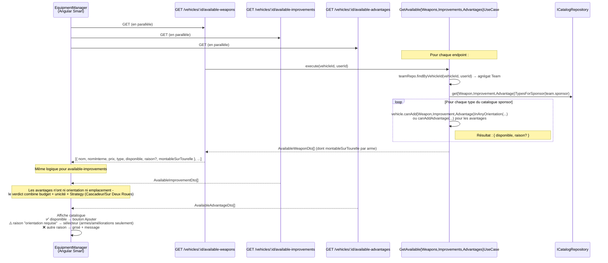
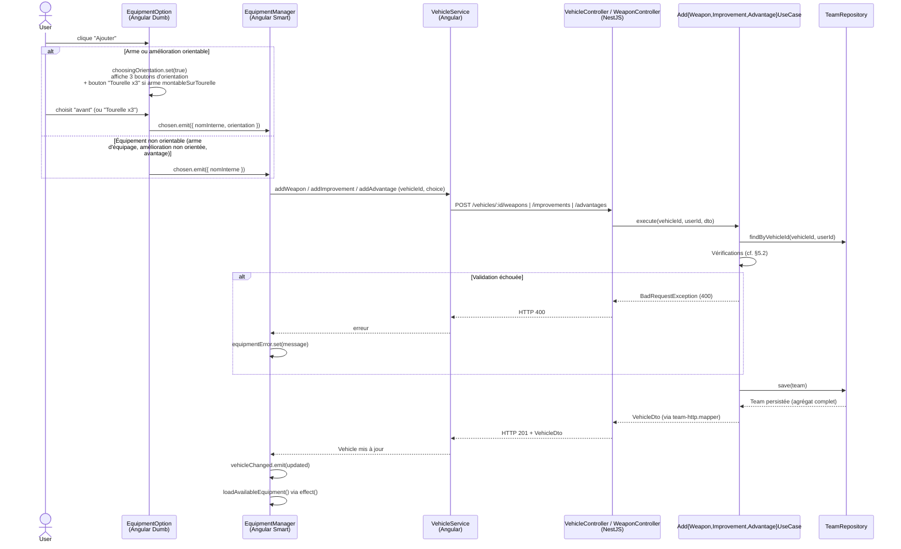
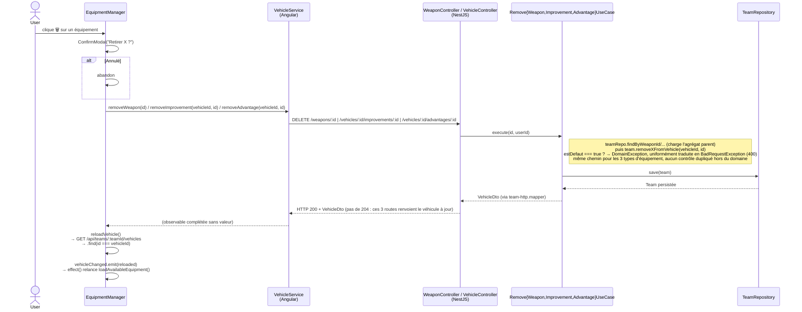
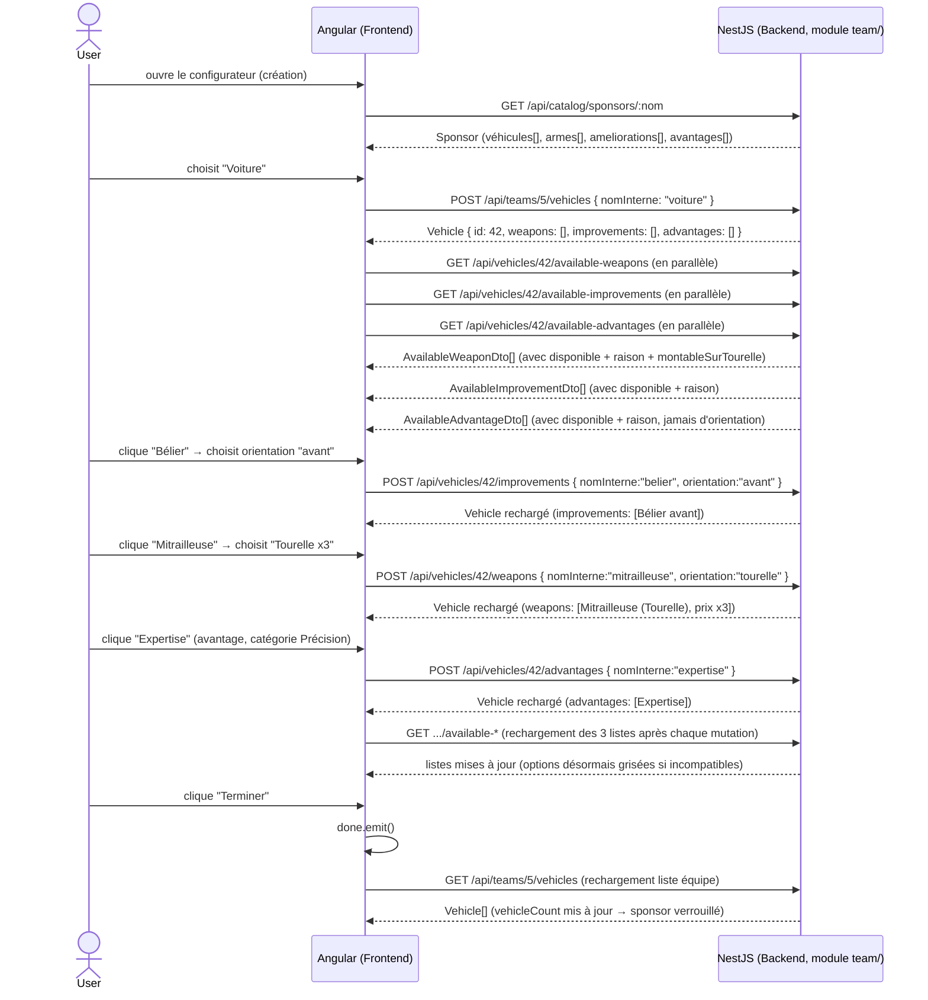

# Gaslands Manager - Conception technique : système Véhicules / Armes / Améliorations / Avantages

> **À qui s'adresse ce document ?**
> À tout intervenant (humain ou agent IA) qui doit modifier le module `team/` (agrégat
> DDD `Team`/`Vehicle`/`Weapon`/`Improvement`/`Advantage`) ou les composants Angular
> `vehicle-configurator` / `equipment-manager`. Il décrit les flux complets, les règles
> de validation et les patterns d'architecture, en s'appuyant sur des diagrammes pour
> réduire le temps de compréhension.
>
> Il complète, sans les dupliquer, [ARCHITECTURE.md](ARCHITECTURE.md) (structure des
> couches DDD, §3.4) et [DOMAIN_MODEL.md](DOMAIN_MODEL.md) (diagramme de classes complet
> de l'agrégat, ERD global). Ce document-ci se concentre sur les *flux* (séquences
> d'appels) et le détail d'implémentation des règles - pas sur les commentaires du code,
> qu'il complète par une vue d'ensemble.

---

## 1. Deux mondes distincts : catalogue vs instances de jeu

Le projet manipule deux natures de données très différentes. Ne pas les confondre est fondamental.

| | **Catalogue** | **Instances de jeu** |
|---|---|---|
| Source | Fichiers YAML dans `database_init/data/` | Base de données PostgreSQL |
| Chargement | Une seule fois au démarrage (`OnModuleInit`) | À chaque requête (TypeORM) |
| Mutabilité | **Jamais modifié** à l'exécution | Créé / supprimé par les utilisateurs |
| Représentation | `Map<string, Sponsor>` dans `CatalogService` | Entités domaine `Vehicle`, `Weapon`, `Improvement`, `Advantage` (agrégat `Team`) |
| Identifiant stable | `nom_interne` (snake_case, sans accents) | `id` auto-incrémenté |
| Exemples | `Vehicule`, `Arme`, `Amelioration`, `Avantage`, `Sponsor` | `Vehicle`, `Weapon`, `VehicleImprovement`, `VehicleAdvantage` |

Les entités persistées référencent le catalogue **uniquement via `nomInterne`** - une clé
logique stable. Ce choix permet d'avoir plusieurs variantes d'un même véhicule/arme/
amélioration (ex. `belier` vs `belier_slime`) avec des prix différents mais **le même
comportement de validation** - la résolution passe par le champ catalogue `comportement`,
pas par `nom_interne` (cf. §4.4).

---

## 2. Entités persistées (vue simplifiée)

Diagramme minimal, centré sur ce que ce document utilise ensuite. Le diagramme de
classes complet de l'agrégat `Team` (Value Objects compris) et l'ERD global de toute
la base vivent dans [DOMAIN_MODEL.md §1 et §3](DOMAIN_MODEL.md) - ne pas les dupliquer ici.


```mermaid
erDiagram
    Team {
        number id PK
        string name
        string sponsor
        number cans
        number userId FK
    }

    Vehicle {
        number id PK
        string nomInterne
        number teamId FK
    }

    Weapon {
        number id PK
        string nomInterne
        string orientation "avant|arriere|lateral|tourelle|null"
        boolean estDefaut "false = achetee, true = profil de base"
        number vehicleId FK
    }

    VehicleImprovement {
        number id PK
        string nomInterne
        string orientation "avant|arriere|lateral|null"
        boolean estDefaut "false = achetee, true = profil de base"
        number vehicleId FK
    }

    VehicleAdvantage {
        number id PK
        string nomInterne
        number vehicleId FK
    }

    Team ||--o{ Vehicle : "contient"
    Vehicle ||--o{ Weapon : "monte"
    Vehicle ||--o{ VehicleImprovement : "porte"
    Vehicle ||--o{ VehicleAdvantage : "acquiert"
```

> **Montage sur Tourelle : ce n'est pas une entité.** `Weapon.orientation` accepte 4
> valeurs (`'avant' | 'arrière' | 'lateral' | 'tourelle'`) - la Tourelle est la
> 4ᵉ valeur de ce même champ, choisie à l'achat de l'arme, pas une amélioration ni une
> ligne séparée. Aucun champ `weaponNomInterne` n'existe nulle part dans le schéma -
> l'arme sur Tourelle EST l'entité `Weapon`, avec un `orientation` particulier. Détail
> complet : §7.bis ci-dessous, et [spec/VEHICLES.md](spec/VEHICLES.md#montage-sur-tourelle-attribut-de-larme).

> **Cascade** : supprimer un `Team` supprime ses `Vehicle`, qui suppriment leurs `Weapon`,
> `VehicleImprovement` et `VehicleAdvantage` - via `onDelete: 'CASCADE'` TypeORM à chaque niveau.

---

## 3. Flux de création d'un véhicule

Un véhicule est d'abord créé « nu » (sans équipement), puis équipé séparément. Contrairement
à l'ancienne génération de services NestJS "à plat", la création passe par l'agrégat `Team`
(cf. [ARCHITECTURE.md §3.4](ARCHITECTURE.md#34-architecture-ddd---standard-du-projet)) :
le use case charge l'agrégat, délègue la règle métier à `Team.addVehicle()`, puis persiste
l'agrégat complet.


```mermaid
sequenceDiagram
    actor User
    participant VC as VehicleConfigurator<br/>(Angular Smart)
    participant VS as VehicleService<br/>(Angular)
    participant Ctrl as VehicleTeamController<br/>(NestJS)
    participant UC as AddVehicleUseCase
    participant TR as TeamRepository
    participant CR as ICatalogRepository<br/>(CatalogAdapter)
    participant DB as PostgreSQL

    User->>VC: choisit un véhicule dans la grille
    VC->>VS: create(teamId, { nomInterne })
    VS->>Ctrl: POST /api/teams/:teamId/vehicles { nomInterne: "voiture" }

    Ctrl->>UC: execute(teamId, userId, dto)
    UC->>TR: findByIdForUser(teamId, userId)
    alt Équipe introuvable ou autre propriétaire
        TR-->>UC: null
        UC-->>Ctrl: NotFoundException (404)
        Ctrl-->>VS: HTTP 404
        VS-->>VC: erreur
    end
    TR-->>UC: Team (agrégat hydraté, avec ses véhicules existants)

    UC->>CR: getVehicleType(nomInterne)
    alt Véhicule inconnu du catalogue
        CR-->>UC: undefined
        UC-->>Ctrl: BadRequestException
    end
    CR-->>UC: VehicleType (Value Object)

    UC->>CR: getVehicleTypesForSponsor(team.sponsor)
    alt Véhicule non autorisé par ce sponsor
        UC-->>Ctrl: BadRequestException
    end

    UC->>UC: team.addVehicle(vehicleType, defaultImprovements, defaultWeapon)
    Note over UC: Règle métier dans l'agrégat : instancie le Vehicle,<br/>insère les améliorations/arme par défaut (estDefaut: true)

    UC->>TR: save(team)
    TR->>DB: INSERT Vehicle (+ Weapon/VehicleImprovement par défaut)
    DB-->>TR: ok
    TR-->>UC: Team persistée

    UC-->>Ctrl: VehicleDto (via team-http.mapper, prix=0 sur les défauts)
    Ctrl-->>VS: HTTP 201 + VehicleDto
    VS-->>VC: Vehicle créé

    VC->>VC: vehicle.set(created)<br/>→ affiche EquipmentManager
```

---

## 4. Pattern Strategy - `EquipmentBehavior`

C'est le cœur du système de validation. Chaque comportement de jeu (Chenilles, Bélier,
Cascadeur, Remorque Moyenne…) est une petite classe **stateless**, invoquée directement
par `Vehicle` sur l'état qu'il lui fournit - contrairement à un ancien Pattern Decorator
(chaîne d'objets qui s'enveloppent les uns les autres), remplacé courant juillet 2026
pour éliminer une capacité fixe non extensible et simplifier le mécanisme. Fichiers de
référence : [`domain/behaviors/equipment-behavior.ts`](../apps/backend/src/app/team/domain/behaviors/equipment-behavior.ts)
(contrat + base commune) et les 3 fichiers `*-behaviors.ts` par famille (améliorations,
avantages, séquelles) - chacun porte un commentaire d'en-tête ; cette section en donne la
vue d'ensemble.

### 4.1 Hiérarchie de classes


```mermaid
classDiagram
    class EquipmentBehavior {
        <<interface>>
        +applyStats(current) VehicleStats
        +canPlace(ctx, candidate) RuleResult
    }

    class EquipmentBehaviorBase {
        <<abstract>>
        +applyStats(current) VehicleStats  "identité par défaut"
        +canPlace(ctx, candidate) RuleResult  "ok() par défaut"
    }

    class ChenillesBehavior {
        +applyStats  "vitesse_max-1, manoeuvrabilite+1"
        +canPlace    "unique ; incompatible char_assaut/helicoptere/gyrocoptere"
    }

    class BelierBehavior {
        +canPlace    "unique PAR ORIENTATION (lit candidate.orientation)"
    }

    class BelierExplosifBehavior {
        +canPlace    "poids Léger interdit ; unique par véhicule"
    }

    class MembreEquipageBehavior {
        +applyStats  "equipage+1"
        +canPlace    "max = 2x equipage initial (baseStats), testé sur l'effectif+candidat"
    }

    class BlindageBehavior {
        +applyStats  "carrosserie+2"
        "aucun canPlace propre - cumulable sans limite"
    }

    class MishkinExclusifBehavior {
        +canPlace    "unique par véhicule"
    }

    class RemorqueMoyenneBehavior {
        +applyStats  "emplacements+1"
        +canPlace    "poids Léger interdit ; une seule remorque (toutes comportements confondus)"
    }

    class RemorqueLourdeBehavior {
        +applyStats  "emplacements+3"
        +canPlace    "poids Lourd requis ; une seule remorque"
    }

    class NeutralEquipmentBehavior {
        "aucun override - comportement par défaut, sans effet ni règle propre"
    }

    class ExpertiseBehavior {
        +applyStats  "manoeuvrabilite+1"
    }

    class CascadeurBehavior {
        +canPlace  "poids Leger/Moyen requis, manoeuvrabilite EFFECTIVE >= 3"
    }

    class SurDeuxRouesBehavior {
        +canPlace  "manoeuvrabilite EFFECTIVE >= 3, tout poids"
    }

    class SequellaBehavior {
        <<interface, plus étroite>>
        +applyStats(current) VehicleStats
        "PAS de canPlace - une séquelle n'est jamais validée via ce mécanisme"
    }

    EquipmentBehavior <|.. EquipmentBehaviorBase
    EquipmentBehaviorBase <|-- ChenillesBehavior
    EquipmentBehaviorBase <|-- BelierBehavior
    EquipmentBehaviorBase <|-- BelierExplosifBehavior
    EquipmentBehaviorBase <|-- MembreEquipageBehavior
    EquipmentBehaviorBase <|-- BlindageBehavior
    EquipmentBehaviorBase <|-- MishkinExclusifBehavior
    EquipmentBehaviorBase <|-- RemorqueMoyenneBehavior
    EquipmentBehaviorBase <|-- RemorqueLourdeBehavior
    EquipmentBehaviorBase <|-- NeutralEquipmentBehavior
    EquipmentBehaviorBase <|-- ExpertiseBehavior
    EquipmentBehaviorBase <|-- CascadeurBehavior
    EquipmentBehaviorBase <|-- SurDeuxRouesBehavior
```

Aucune classe ne référence une autre via un champ `inner` (contrairement à l'ancien
Decorator) : chaque `XxxBehavior` est une feuille isolée, et **une seule instance de
chaque classe suffit pour toute l'application** (les registres, cf. §4.4, stockent des
singletons) - il n'y a plus jamais de `new XxxBehavior(inner, ...)` à chaque validation.
`SequellaBehavior` porte une interface volontairement plus étroite (pas de `canPlace`) :
les séquelles ne sont jamais validées via ce mécanisme, `Vehicle.canAddSequella` reste
un chemin de validation indépendant (origine/unicité/Chocs).

### 4.2 Un seul mécanisme de fold - `Vehicle.effectiveStats`

Contrairement à l'ancien système (deux mécanismes distincts - `Vehicle.buildChain()`
pour la validation, `VehicleBuildFactory` `@Injectable` pour l'affichage), il n'y en a
plus qu'un seul aujourd'hui : `Vehicle.effectiveStats` (`domain/vehicle.ts`), un getter
qui plie directement les 3 collections de l'agrégat via `reduce()` - aucune classe
séparée, aucun service NestJS dédié à instancier :

```typescript
get effectiveStats(): VehicleStats {
  const apresSequellas = this._sequellas
    .filter((s) => !s.isSold)
    .reduce((stats, s) => s.applyStats(stats), this.baseStats);

  const apresAmeliorations = this._improvements
    .filter((i) => !i.isSold && !i.isLost)
    .reduce((stats, i) => i.applyStats(stats), apresSequellas);

  return this._advantages
    .filter((a) => !a.isSold)
    .reduce((stats, a) => a.applyStats(stats), apresAmeliorations);
}
```

Ordre figé - **séquelles → améliorations → avantages** : les deux avantages à
comportement mécanique (Cascadeur, Sur Deux Roues) doivent lire la Manœuvrabilité
**effective**, c'est-à-dire après le bonus d'une amélioration déjà montée (Chenilles),
d'une séquelle (dommage permanent), ou d'un autre avantage déjà acquis (Expertise) - d'où
le pliage successif des 3 collections dans cet ordre précis. Aucune règle du jeu ne
justifie qu'une catégorie reste invisible à une autre : `effectiveStats` est donc l'état
**complet** consulté par tout appelant (validation d'une amélioration, d'un avantage, ou
calcul de capacité `availableSlots`) - jamais un fold partiel.

`Vehicle` ne référence jamais directement `resolveImprovementBehavior`/
`resolveAdvantageBehavior`/`resolveSequellaBehavior` : chaque entité/Type délègue lui-même
(cf. §4.5) - le mécanisme Strategy est invisible depuis l'agrégat.

### 4.3 `baseStats` vs `effectiveStats` - différence critique

| Propriété | Valeur | Usage |
|-----------|--------|-------|
| `baseStats` | Profil d'origine du catalogue (`emplacements` inclus) | "quel type de véhicule ?" (`nom_interne === 'char_assaut'`), seuil de `MembreEquipageBehavior` |
| `effectiveStats` | Profil après accumulation de tout ce qui est monté | Affichage, validation "équipage max = 2× initial", Manœuvrabilité effective (Cascadeur/Sur Deux Roues), capacité effective (`availableSlots`) |

`baseStats` ne change jamais, quelle que soit la couche qui le consulte - c'est un
simple getter sur `Vehicle`, projection directe de `this.type` (aucune classe séparée ne
le porte, contrairement à `CatalogVehicleBuild` dans l'ancien système).

### 4.4 Sélection du comportement - clé `comportement` YAML

Le champ `comportement` dans le YAML d'amélioration ou d'avantage détermine quelle
Strategy invoquer, **indépendamment du `nom_interne`**. C'est ce qui permet aux variantes
sponsor d'avoir le même comportement de validation à prix différent :

```yaml
# Deux entrées YAML, une seule Strategy
- nom: "Bélier"
  nom_interne: belier
  comportement: belier    # → BelierBehavior
  prix: 4

- nom: "Bélier (Slime)"
  nom_interne: belier_slime
  comportement: belier    # → BelierBehavior identique
  prix: 2
```

Registre des améliorations (`domain/behaviors/improvement-behaviors.ts`,
`IMPROVEMENT_BEHAVIORS` + `resolveImprovementBehavior`) :

```
chenilles          → ChenillesBehavior
membre_equipage    → MembreEquipageBehavior
belier             → BelierBehavior
belier_explosif    → BelierExplosifBehavior
blindage           → BlindageBehavior
mishkin_exclusif   → MishkinExclusifBehavior
remorque_moyenne   → RemorqueMoyenneBehavior
remorque_lourde    → RemorqueLourdeBehavior
(autre/absent)     → NEUTRAL_EQUIPMENT_BEHAVIOR
```

Registre des avantages (`domain/behaviors/advantage-behaviors.ts`,
`ADVANTAGE_BEHAVIORS` + `resolveAdvantageBehavior`) :

```
expertise          → ExpertiseBehavior
cascadeur          → CascadeurBehavior
sur_deux_roues     → SurDeuxRouesBehavior
(autre/absent)     → NEUTRAL_EQUIPMENT_BEHAVIOR   (69 des 72 avantages)
```

Registre des séquelles (`domain/behaviors/sequella-behaviors.ts`,
`SEQUELLA_BEHAVIORS` - une `Map`, clé = `nom_interne` et non `comportement`, les
séquelles n'ayant pas ce champ au catalogue) :

```
siege_irrecuperable    → SiegeIrrecuperableBehavior
(autre/absent)         → comportement neutre   (11 des 12 séquelles)
```

### 4.5 `canPlace` sur le Type, `applyStats` sur l'Instance

Ni `Vehicle` ni les use cases n'appellent directement `resolveImprovementBehavior(...)` -
chaque objet du domaine délègue lui-même à la Strategy résolue depuis son propre
`comportement`, mais **pas au même niveau** selon la méthode :

| Méthode | Portée par | Pourquoi |
|---|---|---|
| `canPlace(ctx, candidate)` | `ImprovementType`/`AdvantageType` (Value Object) | Au moment de valider un **candidat**, aucune instance `Improvement`/`Advantage` n'existe encore - seul son Type est disponible (`Vehicle.canAddImprovement`/`canAddAdvantage`) |
| `applyStats(current)` | `Improvement`/`Advantage`/`Sequella` (entité) | S'applique toujours à un équipement **déjà monté** - une instance existe systématiquement (cf. le fold `effectiveStats` ci-dessus) ; cohérent avec `price`/`slots`/`resaleRefund`, déjà des méthodes d'instance qui lisent `this.type` |

```typescript
// value-objects/improvement-type.ts
canPlace(ctx: PlacementContext, candidate: PlacementCandidate): RuleResult {
  return resolveImprovementBehavior(this.comportement).canPlace(ctx, candidate);
}

// improvement.ts (entité)
applyStats(current: VehicleStats): VehicleStats {
  return resolveImprovementBehavior(this.type.comportement).applyStats(current);
}
```

`Sequella` n'a que `applyStats` (pas de `canPlace` sur `SequellaType` - asymétrie
volontaire, cf. §4.1).

### 4.6 Unicité transversale - `PlacementContext.hasComportementAmong`

Certaines règles de pose doivent traverser **plusieurs** `comportement` différents - ex.
« un véhicule ne peut être équipé que d'une seule remorque », vraie qu'il s'agisse de
Remorque Moyenne ou Remorque Lourde ensemble, pas seulement de deux Remorques Moyennes.
`PlacementContext` expose une méthode générique pour ça :

```typescript
hasComportementAmong(comportements: readonly string[]): boolean
```

C'est la Strategy qui fournit la liste des comportements "frères" (elle seule la
connaît) ; `Vehicle` exécute juste la recherche sur l'état qu'il possède déjà - aucune
classe n'a besoin de connaître ou répéter sa propre clé de registre pour se compter
elle-même (`installedCount`/`hasOrientation`, scopés à un seul comportement, suivent le
même principe).

---

## 5. Flux d'ajout d'un équipement

### 5.1 Chargement du catalogue disponible (GET)

Avant d'afficher les options, `EquipmentManager` charge les **trois** listes filtrées
en parallèle via `forkJoin` - armes, améliorations, **et avantages** :


```mermaid
sequenceDiagram
    participant EM as EquipmentManager<br/>(Angular Smart)
    participant API_W as GET /vehicles/:id/available-weapons
    participant API_I as GET /vehicles/:id/available-improvements
    participant API_A as GET /vehicles/:id/available-advantages
    participant UC as GetAvailable{Weapons,Improvements,Advantages}UseCase
    participant CR as ICatalogRepository

    EM->>API_W: GET (en parallèle)
    EM->>API_I: GET (en parallèle)
    EM->>API_A: GET (en parallèle)

    Note over UC: Pour chaque endpoint :
    API_W->>UC: execute(vehicleId, userId)
    UC->>UC: teamRepo.findByVehicleId(vehicleId, userId) → agrégat Team
    UC->>CR: get{Weapon,Improvement,Advantage}TypesForSponsor(team.sponsor)

    loop Pour chaque type du catalogue sponsor
        UC->>UC: vehicle.canAdd{Weapon,Improvement,Advantage}InAnyOrientation(...)<br/>ou canAddAdvantage(...) pour les avantages
        Note right of UC: Résultat : { disponible, raison? }
    end

    UC-->>API_W: AvailableWeaponDto[] (dont montableSurTourelle par arme)
    API_W-->>EM: [{ nom, nomInterne, prix, type, disponible, raison?, montableSurTourelle }, ...]

    Note over EM: Même logique pour available-improvements
    API_I-->>EM: AvailableImprovementDto[]

    Note over EM: Les avantages n'ont ni orientation ni emplacement -<br/>le verdict combine budget + unicité + Strategy (Cascadeur/Sur Deux Roues)
    API_A-->>EM: AvailableAdvantageDto[]

    EM->>EM: Affiche catalogue<br/>✅ disponible → bouton Ajouter<br/>⚠️ raison "orientation requise" → sélecteur (armes/améliorations seulement)<br/>❌ autre raison → grisé + message
```

### 5.2 Ordre des vérifications à l'ajout (CRITIQUE)

L'ordre est intentionnel et garantit des messages d'erreur cohérents. Il se répartit sur
**deux couches** : le use case (qui connaît le sponsor, l'agrégat `Vehicle` ne le connaît
pas) puis l'agrégat lui-même.

**Couche use case (`Add{Weapon,Improvement,Advantage}UseCase`)** :

```
1. Type inconnu du catalogue global → BadRequestException
2. Type absent de la liste résolue pour le sponsor de l'équipe
   (catalogRepo.get{Weapon,Improvement,Advantage}TypesForSponsor(team.sponsor))
   → BadRequestException ("n'est pas autorisé(e) pour le sponsor")
3. Délégation à l'agrégat (team.addXToVehicle(...) → vehicle.canAddX(...))
```

**Couche agrégat, armes (`Vehicle.canAddWeapon`)** :

```
1. Véhicule perdu/vendu (campagne)     → fail
2. Montage Tourelle demandé mais l'arme n'est pas montable_tourelle → fail
3. Budget de l'équipe insuffisant (prix x3 déjà inclus si Tourelle) → fail
4. Emplacements insuffisants           → fail
5. Cohérence orientation/type d'arme (requise mais absente,
   ou fournie sur une arme d'équipage) → fail
```

**Couche agrégat, améliorations (`Vehicle.canAddImprovement`)** :

```
1. Véhicule perdu/vendu                → fail
2. Budget de l'équipe insuffisant       → fail
3. Emplacements insuffisants (contrôle global armes+améliorations, porté par
   l'agrégat via `availableSlots` - capacité EFFECTIVE, pas figée : certaines
   améliorations, ex. Remorque Moyenne/Lourde, l'augmentent, cf. §6) → fail
4. Orientation requise mais absente     → fail
5. Règle de pose spécifique à ce SEUL comportement (Strategy GoF, déléguée par
   `ImprovementType.canPlace` - incompatibilité véhicule, unicité, orientation
   exclusive, équipage max...) → fail
```

**Couche agrégat, avantages (`Vehicle.canAddAdvantage`)** :

```
1. Véhicule perdu/vendu                        → fail
2. Budget de l'équipe insuffisant               → fail
3. Unicité (déjà acquis et pas encore revendu)  → fail
4. Règle de pose spécifique (Strategy GoF, déléguée par `AdvantageType.canPlace` :
   Cascadeur poids+manœuvrabilité, Sur Deux Roues manœuvrabilité) → fail
   (jamais de contrôle d'emplacement ni d'orientation - un avantage
   n'en a pas)
```

> **Pourquoi le budget passe avant les emplacements ?** Règle explicite du jeu
> (cf. [spec/VEHICLES.md](spec/VEHICLES.md#budget-jerricans) : "Budget de l'équipe
> insuffisant" est vérifiée avant toute autre règle, sponsor excepté). Si l'ordre était
> inversé, un équipement à la fois trop cher ET sans emplacement libre afficherait un
> message trompeur sur les emplacements alors que le vrai blocage est budgétaire.

### 5.3 Ajout effectif (POST)


```mermaid
sequenceDiagram
    actor User
    participant EO as EquipmentOption<br/>(Angular Dumb)
    participant EM as EquipmentManager<br/>(Angular Smart)
    participant VS as VehicleService<br/>(Angular)
    participant Ctrl as VehicleController / WeaponController<br/>(NestJS)
    participant UC as Add{Weapon,Improvement,Advantage}UseCase
    participant TR as TeamRepository

    User->>EO: clique "Ajouter"
    alt Arme ou amélioration orientable
        EO->>EO: choosingOrientation.set(true)<br/>affiche 3 boutons d'orientation<br/>+ bouton "Tourelle x3" si arme montableSurTourelle
        User->>EO: choisit "avant" (ou "Tourelle x3")
        EO->>EM: chosen.emit({ nomInterne, orientation })
    else Équipement non orientable (arme d'équipage, amélioration non orientée, avantage)
        EO->>EM: chosen.emit({ nomInterne })
    end

    EM->>VS: addWeapon / addImprovement / addAdvantage (vehicleId, choice)
    VS->>Ctrl: POST /vehicles/:id/weapons | /improvements | /advantages

    Ctrl->>UC: execute(vehicleId, userId, dto)
    UC->>TR: findByVehicleId(vehicleId, userId)
    UC->>UC: Vérifications (cf. §5.2)
    alt Validation échouée
        UC-->>Ctrl: BadRequestException (400)
        Ctrl-->>VS: HTTP 400
        VS-->>EM: erreur
        EM->>EM: equipmentError.set(message)
    end

    UC->>TR: save(team)
    TR-->>UC: Team persistée (agrégat complet)
    UC-->>Ctrl: VehicleDto (via team-http.mapper)
    Ctrl-->>VS: HTTP 201 + VehicleDto
    VS-->>EM: Vehicle mis à jour
    EM->>EM: vehicleChanged.emit(updated)
    EM->>EM: loadAvailableEquipment() via effect()
```

---

## 6. Pool d'emplacements partagé

**Règle Gaslands** : un véhicule dispose de N emplacements **totaux**, partagés entre
armes **et** améliorations. Ce n'est pas deux pools séparés. Les avantages n'y
participent **jamais** (`AdvantageType` n'expose aucune notion de slot).

### Capacité EFFECTIVE, pas fixe - Remorques

Depuis juillet 2026, N n'est plus toujours `this.type.slots` (catalogue, fixe) : deux
améliorations (Remorque Moyenne +1, Remorque Lourde +3, cf.
[spec/VEHICLES.md](spec/VEHICLES.md#améliorations-de-véhicule-19-au-total)) augmentent la
capacité totale du véhicule remorqueur. `emplacements` fait donc partie de `VehicleStats`
(cf. §4.3) et se plie exactement comme carrosserie/manœuvrabilité/etc. via `applyStats` -
aucun mécanisme séparé pour la capacité :

```typescript
class RemorqueMoyenneBehavior extends EquipmentBehaviorBase {
  override applyStats(current: VehicleStats): VehicleStats {
    return { ...current, emplacements: current.emplacements + 1 };
  }
  // + canPlace : poids Léger interdit, une seule remorque (cf. §4.6)
}
```

### Calcul backend

`Vehicle.usedSlots` (`domain/vehicle.ts`) est une simple somme, sans aucune distinction
pour une arme montée sur Tourelle. `availableSlots`, lui, lit désormais la capacité
**effective** (`effectiveStats.emplacements`, cf. §4.2) plutôt que `type.slots` brut -
pour un véhicule sans amélioration de capacité, les deux valeurs restent identiques :

```typescript
get usedSlots(): number {
  const weaponSlots = this._weapons.reduce((sum, w) => sum + w.slots, 0);
  const improvementSlots = this._improvements.reduce((sum, i) => sum + i.slots, 0);
  return weaponSlots + improvementSlots;
}

private get availableSlots(): number {
  return this.effectiveStats.emplacements - this.usedSlots;
}
```

`Weapon.slots` retourne simplement `type.slots` (le champ catalogue `emplacement` de
l'arme), sauf si l'arme est intégrée au profil de base (`estDefaut`), perdue ou vendue -
dans ces trois cas, `0` (emplacement libéré) :

```typescript
get slots(): number {
  return this.estDefaut || this.isLost || this.isSold ? 0 : this.type.slots;
}
```

**Une arme montée sur Tourelle (`orientation === 'tourelle'`) consomme exactement le même
nombre d'emplacements qu'une arme montée normalement** - seul son *prix* est multiplié par
3 (`Weapon.price`, cf. §7.bis). Il n'existe plus, contrairement à l'ancien système, de
calcul séparé "emplacements des armes sur Tourelle" : la Tourelle n'étant plus une
amélioration distincte, il n'y a rien à additionner en plus.

`Improvement.slots` suit la même règle (0 si `estDefaut`) - les améliorations intégrées
au profil de base du véhicule (ex. Arceaux du Buggy) ne consomment pas d'emplacement
achetable.

### Reflet côté frontend

`EquipmentManager.emplacementsUtilises` (signal `computed`) est le miroir exact de
`Vehicle.usedSlots` : une boucle sur `vehicle.weapons` (toutes confondues, Tourelle
incluse) et une boucle sur `vehicle.improvements` non `estDefaut`, résolues via le
catalogue sponsor déjà chargé côté client. Aucun troisième terme pour les avantages -
leur synthèse d'affichage force `emplacement: 0` avant transmission à `EquipmentOption`.

Ce signal alimente la barre de progression « Emplacements » dans l'UI - la source de
vérité reste le backend, mais le frontend donne un retour visuel immédiat.

**Correctif appliqué - `emplacementsTotal` reflète désormais le bonus des Remorques.**
`EquipmentManager.emplacementsTotal` (signal `computed`) lisait auparavant
`this.chosenVehicule()?.emplacements` - la valeur **catalogue brute** du véhicule, jamais
la capacité effective (`Vehicle.effectiveStats.emplacements`, cf. ci-dessus) : sur un
véhicule équipé d'une Remorque Moyenne/Lourde, le backend acceptait plus d'équipement que
ce que la barre de progression affichait comme total. `VehicleDto`/`WorkshopVehicleDto`
(`team-http.mapper.ts`/`GetWorkshopUseCase`) exposent désormais un champ
`emplacementsTotal: vehicle.effectiveStats.emplacements`, calculé une seule fois côté
backend ; le frontend (`EquipmentManager.emplacementsTotal`, `buildVehicleSummary` dans
`teams/vehicle-summary.ts`, et `mapWorkshopVehicleToVehicle` côté atelier) le lit
directement au lieu de le recalculer depuis le catalogue statique.

---

## 7. Flux de retrait

Le retrait est **permis pour tout équipement acheté** (arme, amélioration, avantage) -
aucune règle métier n'est revérifiée à l'écriture (retirer un équipement ne peut jamais
rendre une configuration valide invalide). **Exception : les éléments intégrés au profil
de base (`estDefaut: true`)** - ils ne peuvent pas être retirés ; toute tentative lève une
`DomainException` dans l'agrégat, traduite en HTTP 400 - une règle de gestion comme une
autre, portée par le domaine, pas un statut HTTP dédié.


```mermaid
sequenceDiagram
    actor User
    participant EM as EquipmentManager
    participant VS as VehicleService<br/>(Angular)
    participant Ctrl as WeaponController / VehicleController<br/>(NestJS)
    participant UC as Remove{Weapon,Improvement,Advantage}UseCase
    participant TR as TeamRepository

    User->>EM: clique 🗑 sur un équipement
    EM->>EM: ConfirmModal("Retirer X ?")
    alt Annulé
        EM->>EM: abandon
    end

    EM->>VS: removeWeapon(id) / removeImprovement(vehicleId, id) / removeAdvantage(vehicleId, id)
    VS->>Ctrl: DELETE /weapons/:id | /vehicles/:id/improvements/:id | /vehicles/:id/advantages/:id
    Ctrl->>UC: execute(id, userId)
    Note right of UC: teamRepo.findByWeaponId/... (charge l'agrégat parent)<br/>puis team.removeXFromVehicle(vehicleId, id)<br/>estDefaut === true ? → DomainException, uniformément traduite en BadRequestException (400)<br/>même chemin pour les 3 types d'équipement, aucun contrôle dupliqué hors du domaine
    UC->>TR: save(team)
    TR-->>UC: Team persistée
    UC-->>Ctrl: VehicleDto (via team-http.mapper)
    Ctrl-->>VS: HTTP 200 + VehicleDto (pas de 204 : ces 3 routes renvoient le véhicule à jour)

    VS-->>EM: (observable complétée sans valeur)
    EM->>EM: reloadVehicle()<br/>→ GET /api/teams/:teamId/vehicles<br/>→ .find(id === vehicleId)
    EM->>EM: vehicleChanged.emit(reloaded)<br/>→ effect() relance loadAvailableEquipment()
```

---

## 7.bis. Montage sur Tourelle - une valeur d'orientation, pas une entité

**Ce système a été entièrement refondu depuis une version antérieure du projet** (où la
Tourelle existait comme une amélioration séparée, avec assignation/désassignation
d'arme après coup, un champ `weaponNomInterne`, et des endpoints `PATCH`/`DELETE
.../improvements/:impId/weapon` dédiés). **Plus rien de tout cela n'existe dans le code
actuel** : aucune entité "Tourelle", aucun champ `weaponNomInterne`, aucune route dédiée -
confirmé par recherche exhaustive sur le backend et le frontend.

Le modèle actuel, complet, tient en quelques points :

- `Weapon.orientation` est de type `WeaponOrientation = Orientation | 'tourelle'`
  (`domain/team.ts`) - la Tourelle est simplement la 5ᵉ valeur possible de ce champ.
- Elle est choisie **au moment même de l'achat de l'arme**, via `AddWeaponDto.orientation
  = 'tourelle'` (`POST /vehicles/:id/weapons`) - jamais après coup.
- Seules les armes marquées `montable_tourelle: true` au catalogue peuvent la recevoir
  (`WeaponType.montableSurTourelle`, cf. `Vehicle.canAddWeapon`).
- **Prix** : `Weapon.price` triple le prix catalogue si `orientation === 'tourelle'`,
  avant application du résiduel de revente éventuel (`Math.ceil(/2)` si `isSold`) :
  ```typescript
  get price(): number {
    if (this.estDefaut) return 0;
    const base = this.type.price * (this.orientation === 'tourelle' ? 3 : 1);
    return this.isSold ? Math.ceil(base / 2) : base;
  }
  ```
- **Emplacements** : identiques à une arme montée normalement (cf. §6) - aucun calcul
  séparé.
- **Pour changer l'arme montée sur une Tourelle** : il n'existe pas d'opération de
  réassignation. Il faut revendre l'arme actuelle (`DELETE /api/weapons/:id`) puis en
  acheter une nouvelle avec `orientation: 'tourelle'` dans le corps de la requête. L'arme
  montée hérite ainsi directement du mécanisme générique de revente/annulation déjà en
  place pour toute arme (`isSold`/prix résiduel), sans code dédié.
- **Frontend** : `equipment-option.ts`/`.html` affiche un bouton « Tourelle x3 » dans le
  même sélecteur que les 3 arcs de tir classiques, visible uniquement si
  `option().montableSurTourelle` est vrai. Son clic appelle exactement le même handler
  que le choix d'un arc (`onOrientationChosen('tourelle')`). Aucune modale séparée,
  aucune notion de « Tourelle orpheline » à pourvoir plus tard. `mounted-equipment.ts`
  affiche un badge inline « (Tourelle) » sur la ligne de l'arme concernée - ce n'est pas
  une ligne d'amélioration à part.

Détail des règles de jeu (coût, sponsors autorisés, cas du Char d'assaut) :
[spec/VEHICLES.md - Montage sur Tourelle](spec/VEHICLES.md#montage-sur-tourelle-attribut-de-larme).
Diagramme de classes de l'agrégat : [DOMAIN_MODEL.md §1](DOMAIN_MODEL.md#1-agrégat-team-domain-driven-design).

---

## 8. Value Objects et calcul du prix - pas d'hydratation manuelle

### 8.1 Pourquoi pas une relation TypeORM classique ?

Le catalogue (véhicules, armes, améliorations, avantages avec leurs prix) est en
**mémoire dans `CatalogService`**, pas en base. TypeORM ne peut donc pas résoudre cette
relation par une jointure SQL classique. La solution retenue n'est **pas** une
hydratation manuelle de propriétés transientes après coup : chaque entité domaine reçoit
directement, dès sa construction, le Value Object qui porte les données catalogue.

`TeamMapper` (`infrastructure/team.mapper.ts`) est le seul endroit qui traduit une entité
ORM en entité domaine - et c'est lui qui résout ces Value Objects via `ICatalogRepository` :

```typescript
// TeamMapper.weaponToDomain - résolution du Value Object à la construction
private weaponToDomain(orm: WeaponOrm): Weapon {
  const weaponType = this.catalogRepo.getWeaponType(orm.nomInterne);
  if (!weaponType) {
    throw new Error(`Arme catalogue inconnue : "${orm.nomInterne}" (weapon #${orm.id})`);
  }
  return new Weapon(orm.id, weaponType, orm.orientation, orm.estDefaut);
}
```

Même principe pour `improvementToDomain`, `advantageToDomain` et `vehicleToDomain` (ce
dernier résolvant `VehicleType`). Si le catalogue ne connaît plus un `nomInterne`
persisté (donnée orpheline), le mapper échoue bruyamment plutôt que de construire une
entité à moitié hydratée - cohérent avec le principe fail-fast déjà en place pour le
chargement du catalogue lui-même (cf. [ARCHITECTURE.md §3.3](ARCHITECTURE.md#33-catalogue-de-jeu---singleton-en-mémoire)).

### 8.2 Getters sur les entités - la règle de gestion vit sur l'objet

Une fois construites avec leur Value Object (`type`), les entités domaine exposent des
getters `price`/`slots` qui **encapsulent directement la règle de gestion** - l'objet
sait lui-même combien il coûte et combien d'emplacements il occupe, sans recalcul externe :

```typescript
// Weapon.price - prix catalogue, x3 si Tourelle, résiduel si vendue
get price(): number {
  if (this.estDefaut) return 0;
  const base = this.type.price * (this.orientation === 'tourelle' ? 3 : 1);
  return this.isSold ? Math.ceil(base / 2) : base;
}

// Improvement.price - prix catalogue direct, ou résiduel si vendue (0 si estDefaut)
// Advantage.price - TOUJOURS le prix catalogue plein, même si isSold (perte totale à
// la revente, cf. spec/VEHICLES.md - Avantages de véhicule)
```

### 8.3 DTOs - sérialisation explicite via `team-http.mapper.ts`

Les getters TypeScript **ne sont pas sérialisés** par `JSON.stringify` (ils vivent sur le
prototype, pas sur l'instance). Le contrôleur HTTP ne doit donc jamais retourner une
entité domaine brute - il appelle `vehicleDomainToDto(vehicle)`
(`infrastructure/team-http.mapper.ts`), qui lit les getters explicitement et construit un
objet plain sérialisable :

```typescript
// team-http.mapper.ts - extrait pour Weapon → WeaponDto
{
  id: w.id,
  nomInterne: w.type.nomInterne,
  orientation: w.orientation,   // ← transmis tel quel, y compris 'tourelle'
  estDefaut: w.estDefaut,
  vehicleId,
  createdAt,
  prix: w.price,                // ← appel du getter (déjà x3 si Tourelle, résiduel si vendue)
}
```

Ce DTO est ce que tous les endpoints d'écriture (`POST /vehicles`, `POST/DELETE
/weapons`, `/improvements`, `/advantages`) retournent - le frontend reçoit directement
`prix` (toujours un `number` réel) et `orientation` sans calcul propre.

---

## 9. Règles métier par comportement

### Améliorations

| Comportement YAML | Strategy | Modificateur de stats | Règles de validation |
|---|---|---|---|
| `chenilles` | `ChenillesBehavior` | `vitesse_max-1`, `manoeuvrabilite+1` | Unique par véhicule ; interdit sur `char_assaut`, `helicoptere`, `gyrocoptere` |
| `belier` | `BelierBehavior` | - | Orientation **obligatoire** ; un seul Bélier par orientation |
| `belier_explosif` | `BelierExplosifBehavior` | - | Orientation **obligatoire** ; un seul Bélier Explosif par orientation |
| `membre_equipage` | `MembreEquipageBehavior` | `equipage+1` | Max = 2× équipage initial (ex : Voiture équipage 1 → max 2) |
| `blindage` | `BlindageBehavior` | `carrosserie+2` | Cumulable sans limite - aucune règle spécifique |
| `mishkin_exclusif` | `MishkinExclusifBehavior` | - | Un seul équipement Mishkin par véhicule |
| `remorque_moyenne` | `RemorqueMoyenneBehavior` | `emplacements+1` | Poids Moyen/Lourd requis ; une seule remorque (toutes comportements confondus, cf. §4.6) |
| `remorque_lourde` | `RemorqueLourdeBehavior` | `emplacements+3` | Poids Lourd requis ; une seule remorque |
| `neutre` / absent | comportement neutre | - | Aucune règle - pose libre dans la limite des emplacements |

### Avantages (72 au total, 12 catégories - cf. [spec/VEHICLES.md](spec/VEHICLES.md#avantages-de-véhicule-72-au-total))

| Comportement YAML | Strategy | Modificateur de stats | Règles de validation |
|---|---|---|---|
| `expertise` | `ExpertiseBehavior` | `manoeuvrabilite+1` en permanence | Aucune restriction de pose |
| `cascadeur` | `CascadeurBehavior` | - | Réservé aux véhicules Poids Léger/Moyen (pas Lourd) ; manœuvrabilité **effective** (après bonus déjà montés) ≥ 3 |
| `sur_deux_roues` | `SurDeuxRouesBehavior` | - | Manœuvrabilité **effective** ≥ 3 (pas de restriction de poids) |
| absent (69/72 avantages) | comportement neutre | - | Purement descriptif, aucune règle propre |

Un avantage n'a par ailleurs **jamais** d'emplacement ni d'orientation (cf. §6/§7.bis), et
sa règle d'unicité (un même avantage ne peut être acquis qu'une fois par véhicule) est
portée par l'agrégat lui-même (`Vehicle.canAddAdvantage`), pas par une Strategy - elle
s'applique à tous les avantages indistinctement, pas à un `comportement` particulier.

### Orientation des armes

| Type d'arme | Orientation |
|---|---|
| `base`, `avancée`, `largable` (avec `necessite_orientation: true`) | **Obligatoire** - définit l'arc de tir (3 arcs classiques, ou Tourelle si l'arme le permet) |
| `équipage`, ou toute arme avec `necessite_orientation: false` | **Interdite** - tir à 360° automatique |

Détail du champ catalogue `necessite_orientation` (remplace l'ancienne dérivation
implicite depuis le `type`) : [spec/VEHICLES.md - Orientation requise](spec/VEHICLES.md#orientation-requise-champ-catalogue-necessite_orientation).

---

## 10. Sécurité et vérification de propriété

**Principe** : tout accès à une ressource inexistante **ou** appartenant à un autre
utilisateur retourne HTTP 404 - jamais 403. Cela évite de divulguer l'existence d'une
ressource qu'on ne possède pas. Le refus de retirer un élément `estDefaut` (cf. §7)
n'est pas non plus un 403 : c'est une règle de gestion normale portée par l'agrégat
(`DomainException`), traduite en HTTP 400 comme toute autre règle métier.

Chaque use case charge l'agrégat `Team` complet via `TeamRepository`, en filtrant sur
`userId` dès la requête de chargement - jamais une vérification a posteriori sur une
entité déjà chargée :

- `findByIdForUser(teamId, userId)` - accès direct via l'équipe.
- `findByVehicleId(vehicleId, userId)` - résout d'abord le `teamId` parent, puis recharge
  l'agrégat complet (double `find`, nécessaire pour un piège TypeORM précis sur les
  relations de collection - cf.
  [ARCHITECTURE.md §3.4](ARCHITECTURE.md#34-architecture-ddd---standard-du-projet),
  section « Piège TypeORM »).
- `findByWeaponId(weaponId, userId)` - même schéma, en remontant depuis l'arme jusqu'à
  l'équipe.

Si l'une de ces résolutions échoue (équipe inexistante, ou appartenant à un autre
utilisateur), le repository retourne `null` et le use case lève une `NotFoundException`
(404) - jamais de fuite d'information sur l'existence de la ressource.

---

## 11. Cycle complet illustré (vue macro)


```mermaid
sequenceDiagram
    actor User
    participant FE as Angular (Frontend)
    participant BE as NestJS (Backend, module team/)

    User->>FE: ouvre le configurateur (création)
    FE->>BE: GET /api/catalog/sponsors/:nom
    BE-->>FE: Sponsor (véhicules[], armes[], ameliorations[], avantages[])

    User->>FE: choisit "Voiture"
    FE->>BE: POST /api/teams/5/vehicles { nomInterne: "voiture" }
    BE-->>FE: Vehicle { id: 42, weapons: [], improvements: [], advantages: [] }

    FE->>BE: GET /api/vehicles/42/available-weapons (en parallèle)
    FE->>BE: GET /api/vehicles/42/available-improvements (en parallèle)
    FE->>BE: GET /api/vehicles/42/available-advantages (en parallèle)
    BE-->>FE: AvailableWeaponDto[] (avec disponible + raison + montableSurTourelle)
    BE-->>FE: AvailableImprovementDto[] (avec disponible + raison)
    BE-->>FE: AvailableAdvantageDto[] (avec disponible + raison, jamais d'orientation)

    User->>FE: clique "Bélier" → choisit orientation "avant"
    FE->>BE: POST /api/vehicles/42/improvements { nomInterne:"belier", orientation:"avant" }
    BE-->>FE: Vehicle rechargé (improvements: [Bélier avant])

    User->>FE: clique "Mitrailleuse" → choisit "Tourelle x3"
    FE->>BE: POST /api/vehicles/42/weapons { nomInterne:"mitrailleuse", orientation:"tourelle" }
    BE-->>FE: Vehicle rechargé (weapons: [Mitrailleuse (Tourelle), prix x3])

    User->>FE: clique "Expertise" (avantage, catégorie Précision)
    FE->>BE: POST /api/vehicles/42/advantages { nomInterne:"expertise" }
    BE-->>FE: Vehicle rechargé (advantages: [Expertise])

    FE->>BE: GET .../available-* (rechargement des 3 listes après chaque mutation)
    BE-->>FE: listes mises à jour (options désormais grisées si incompatibles)

    User->>FE: clique "Terminer"
    FE->>FE: done.emit()
    FE->>BE: GET /api/teams/5/vehicles (rechargement liste équipe)
    BE-->>FE: Vehicle[] (vehicleCount mis à jour → sponsor verrouillé)
```

---

## 12. Fichiers clés de référence

### Backend - module `team/` (DDD)

| Fichier | Rôle |
|---------|------|
| `apps/backend/src/app/team/domain/team.ts` | Agrégat racine `Team` + types `Orientation`/`WeaponOrientation`/`RuleResult` |
| `apps/backend/src/app/team/domain/vehicle.ts` | Entité enfant `Vehicle` - `canAddWeapon`/`canAddImprovement`/`canAddAdvantage`, `usedSlots`, `effectiveStats` |
| `apps/backend/src/app/team/domain/weapon.ts` | Entité enfant `Weapon` - `price` (x3 Tourelle), `slots`, `orientation` |
| `apps/backend/src/app/team/domain/improvement.ts` | Entité enfant `Improvement` - `applyStats` (délègue à la Strategy résolue) |
| `apps/backend/src/app/team/domain/advantage.ts` | Entité enfant `Advantage` - `price` (jamais réduit, perte totale à la revente), `applyStats` |
| `apps/backend/src/app/team/domain/sequella.ts` | Entité enfant `Sequella` - `applyStats` (pas de `canPlace`, cf. §4.1/§4.5) |
| `apps/backend/src/app/team/domain/behaviors/equipment-behavior.ts` | Contrat Strategy `EquipmentBehavior`/`EquipmentBehaviorBase`, types `VehicleStats`/`PlacementContext`/`PlacementCandidate` |
| `apps/backend/src/app/team/domain/behaviors/improvement-behaviors.ts` | 8 classes concrètes d'amélioration (dont Remorque Moyenne/Lourde) + `IMPROVEMENT_BEHAVIORS` + `resolveImprovementBehavior` |
| `apps/backend/src/app/team/domain/behaviors/advantage-behaviors.ts` | 3 classes concrètes d'avantage (Expertise, Cascadeur, Sur Deux Roues) + `ADVANTAGE_BEHAVIORS` + `resolveAdvantageBehavior` |
| `apps/backend/src/app/team/domain/behaviors/sequella-behaviors.ts` | Interface `SequellaBehavior` (plus étroite) + 4 classes à effet chiffré + `SEQUELLA_BEHAVIORS` (Map par `nom_interne`) + `resolveSequellaBehavior` |
| `apps/backend/src/app/team/domain/value-objects/vehicle-type.ts` | Value Object enveloppant `Vehicule` (catalogue) |
| `apps/backend/src/app/team/domain/value-objects/weapon-type.ts` | Value Object enveloppant `Arme` - `montableSurTourelle`, `requiresOrientation` |
| `apps/backend/src/app/team/domain/value-objects/improvement-type.ts` | Value Object enveloppant `Amelioration` - `canPlace` (délègue à la Strategy résolue) |
| `apps/backend/src/app/team/domain/value-objects/advantage-type.ts` | Value Object enveloppant `Avantage` - pas de `slots` ni `requiresOrientation`, `canPlace` |
| `apps/backend/src/app/team/domain/catalog.repository.interface.ts` | Contrat `ICatalogRepository` (Dependency Inversion) |
| `apps/backend/src/app/team/domain/team.repository.interface.ts` | Contrat `ITeamRepository` |
| `apps/backend/src/app/team/application/` | 16 use cases (add/remove vehicle-weapon-improvement-advantage, get-available-*, get-team-summaries, get-vehicle-detail, create/update/remove-team) |
| `apps/backend/src/app/team/infrastructure/team.mapper.ts` | Mapping ORM ↔ agrégat domaine - résout les Value Objects via `ICatalogRepository` |
| `apps/backend/src/app/team/infrastructure/team-http.mapper.ts` | Mapping agrégat domaine → DTO HTTP sérialisable |
| `apps/backend/src/app/team/infrastructure/team.repository.ts` | Implémentation TypeORM d'`ITeamRepository` |
| `apps/backend/src/app/team/infrastructure/catalog.adapter.ts` | `CatalogService` → `ICatalogRepository` |
| `apps/backend/src/app/team/team.controller.ts` | Routes équipe (`/teams`) |
| `apps/backend/src/app/team/vehicle-team.controller.ts` | Routes véhicules d'une équipe (`/teams/:teamId/vehicles`) |
| `apps/backend/src/app/team/vehicle.controller.ts` | Routes véhicule/améliorations/avantages (`/vehicles/:id/...`) |
| `apps/backend/src/app/team/weapon.controller.ts` | Routes armes (`/vehicles/:id/weapons`, `/weapons/:id`) |
| `apps/backend/src/app/team/team.tokens.ts` | Tokens d'injection NestJS pour les interfaces du domaine |
| `apps/backend/src/app/catalog/catalog.service.ts` | Catalogue en mémoire - résolution par sponsor, dont `avantages` par `categorie` |

### Frontend

> Composants impliqués (`VehicleConfigurator`, `EquipmentManager`, `EquipmentOption`…) : voir [COMPONENTS.md](COMPONENTS.md).

| Fichier | Rôle |
|---------|------|
| `apps/frontend/src/app/teams/vehicle-configurator/vehicle.service.ts` | Centralise tous les appels HTTP véhicule/arme/amélioration/avantage |
| `apps/frontend/src/app/teams/vehicle-configurator/equipment-manager/equipment-manager.ts` | Chargement des 3 listes disponibles, calcul budget/emplacements, ajout/retrait |
| `apps/frontend/src/app/teams/vehicle-configurator/equipment-option/equipment-option.ts` | Sélecteur d'orientation (3 arcs + bouton "Tourelle x3" conditionnel) |
| `apps/frontend/src/app/teams/vehicle-configurator/equipment-manager/mounted-equipment/mounted-equipment.ts` | Affichage des armes/améliorations/avantages montés, badge "(Tourelle)" inline |
| `apps/frontend/src/app/teams/vehicle-configurator/vehicle-builder.model.ts` | Types `EquipmentChoice`, `Orientation`, `WeaponOrientation` |
