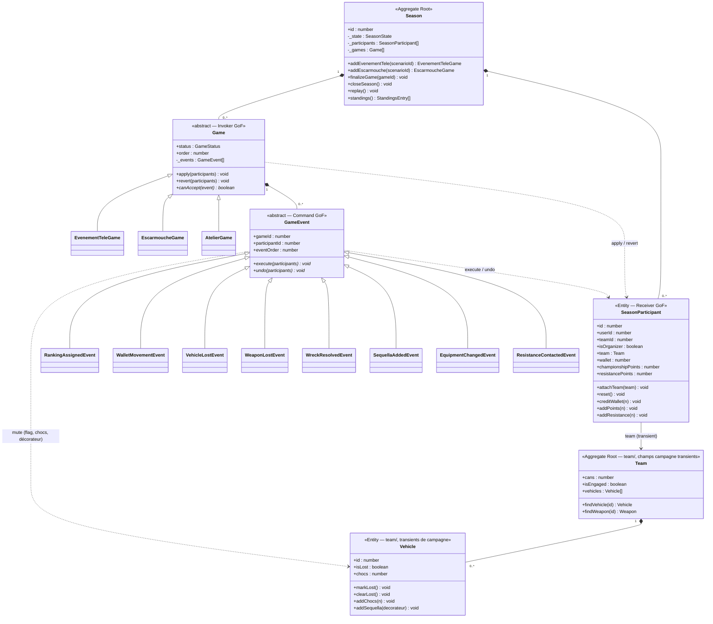

# Mode Campagne — Modélisation DDD du domaine Season (v3)

> Document de conception issu d'une session de brainstorming du 2026-06-28.
> Il documente le **raisonnement complet** : contexte, décisions prises et leur
> justification. Il sert de référence pour implémenter les phases 2-4 du backlog campagne.
>
> **v3** : bascule en **event sourcing strict** — seul le journal de commandes est persisté ;
> tout l'état de campagne (perte, séquelles, chocs, équipement, wallet, points) est
> **transient, reconstruit par replay** sur l'agrégat `Team` chargé.
>
> Documents de rattachement :
> - Backlog : [2026-06-21-mode-campagne-backlog.md](2026-06-21-mode-campagne-backlog.md)
> - Conception initiale : [2026-06-21-mode-campagne-design.md](2026-06-21-mode-campagne-design.md)
> - Spécifications saisons : [../spec/SEASONS.md](../spec/SEASONS.md)
> - Architecture : [../ARCHITECTURE.md](../ARCHITECTURE.md)
> - Pattern décorateur véhicule : [../../apps/backend/src/app/team/vehicle-build.ts](../../apps/backend/src/app/team/vehicle-build.ts)

---

## 1. Contexte

### 1.1 État avant ce document

La Phase 1 du mode campagne est implémentée (US-A1 à B1) :
- `Game` — entité planifiée (scénario, type, ordre, statut `PLANIFIE`/`JOUE`)
- `GameResult` — classement d'une équipe dans une partie (`rank`, `championshipPoints` stockés)
- `ScenarioCatalogService` — catalogue YAML des scénarios

Les modules `season/` et `game/` sont des services NestJS classiques sans couche domaine.

### 1.2 Problème identifié

Les phases 2-4 du backlog (cagnotte, atelier, séquelles, épaves, Résistance) ajoutent des
**mécaniques d'état évolutif par équipe** : wallet qui évolue, véhicules qui se perdent,
séquelles qui s'accumulent. Stocker ces états comme des colonnes mutables sur les entités
existantes crée des risques de désynchronisation et rend l'annulation impossible.

### 1.3 Objectif de ce document

Définir une architecture DDD pour le domaine campagne basée sur :
- Un **agrégat `Season`** (objet de domaine) qui reconstitue tout l'historique de la campagne
- Un **journal de commandes** (GoF Command) — **seule donnée persistée** de la campagne
- Un **état entièrement transient** reconstruit par replay (event sourcing strict)
- Une **séparation stricte domaine / infrastructure**, calquée sur le module `team/`

---

## 2. Décisions de conception

### D-S1 — `Season` est l'agrégat DDD principal, avec séparation stricte domaine/infrastructure

L'agrégat racine est l'objet de **domaine** `Season`. Il contient :
- `SeasonParticipant[]` (domaine) — les équipes engagées + leur projection transiente
- `Game[]` (domaine) — les parties jouées et les périodes d'atelier, chacune avec son
  journal d'événements

Le projet sépare strictement le domaine de l'infrastructure (cf. `team/`, ARCHITECTURE.md
§3.4). On applique **exactement** ce pattern :

| Couche | Contenu | Décorateurs |
|--------|---------|-------------|
| `domain/` | `Season`, `SeasonParticipant`, hiérarchie `Game`, hiérarchie `GameEvent`, Value Objects, interfaces repository | **aucun** |
| `infrastructure/entities/` | Entités ORM anémiques (`@Entity`, `@Column`, STI) | TypeORM uniquement |
| `infrastructure/*.mapper.ts` | Traduction ORM ↔ domaine | — |
| `application/` | Use cases (1 par commande) | — |

Comme dans `team/`, une même notion porte **deux classes homonymes** dans deux couches
(`domain/season.ts` vs `infrastructure/entities/season.entity.ts`), reliées par un mapper.

Le module `season/` actuel (inscriptions, transitions d'état) **conserve ses services
NestJS classiques**. La couche DDD campagne est ajoutée dans le module `game/`, qui devient
le **module campagne** (il possède déjà `Game` et le catalogue de scénarios).

> Justification : appliquer le standard DDD du projet sans exception.

### D-S2 — Héritage de `Game` (GoF + TypeORM `@TableInheritance`)

`Game` (domaine) est une **classe abstraite**. Chaque type de partie est une sous-classe :

| Sous-classe domaine | Discriminant | Rôle |
|---|---|---|
| `EvenementTeleGame` | `EVENEMENT_TELE` | Partie TV — attribue des Points de Championnat au classement |
| `EscarmoucheGame` | `ESCARMOUCHE` | Escarmouche — pas de PC de classement |
| `AtelierGame` | `ATELIER` | Période d'ajustement — achats, reventes, échanges Chocs→Séquelle |

Chaque sous-classe implémente `canAccept(event): boolean` — quel type d'événement peut être
ajouté à quel type de partie.

**Côté infrastructure** : STI sur la table `games`, **la colonne discriminante réutilise la
colonne `type` existante** (`@TableInheritance({ column: { name: 'type' } })`). Entités ORM
enfants `@ChildEntity('EVENEMENT_TELE')`, etc.

> ⚠ Migration : l'entité `Game` concrète actuelle devient une base abstraite STI ; sa
> colonne `type` (déjà présente) sert de discriminant.

### D-S3 — `GameEvent` = GoF Command appliquant un effet **transient**

Chaque événement de la campagne est une **commande persistée** (GoF Command) :

| Rôle GoF | Classe de domaine |
|---|---|
| **Command** (interface) | `GameEvent` (abstract) — `execute` / `undo` |
| **ConcreteCommand** | `RankingAssignedEvent`, `VehicleLostEvent`, etc. |
| **Receiver** | `SeasonParticipant` (compteurs) **et** son `Team` chargé (roster/véhicules) |
| **Invoker** | `Game.apply()` / `Game.revert()` |
| **Client** | Use cases d'enregistrement (`application/`) |

Point essentiel : `execute()` **ne persiste rien**. Il **modifie le modèle en mémoire** —
pose un flag (`weapon.markLost()`), ajoute un décorateur (séquelle), incrémente un compteur
(`participant.creditWallet`) — ce qui change le comportement des règles du modèle pour la
suite du replay. Cet effet est **ré-appliqué à chaque chargement** en rejouant la commande.

```typescript
// domain/events/weapon-lost.event.ts — aucun décorateur, aucun accès base
execute(participants: SeasonParticipant[]): void {
  const p = this.findParticipant(participants);
  p.team.findWeapon(this.weaponId).markLost();   // flag transient sur l'arme en mémoire
}
undo(participants: SeasonParticipant[]): void {
  const p = this.findParticipant(participants);
  p.team.findWeapon(this.weaponId).clearLost();
}
```

**Côté infrastructure** : table `game_events` en STI, discriminant `eventType`. Un mapper
traduit chaque ligne ORM en commande de domaine.

### D-S4 — Event sourcing strict : seul le journal est persisté

**Persisté (entités ORM) :**
- `seasons`, `season_participants` — inscription (existant)
- `games` (STI) — Programme
- `game_events` (STI) — **le journal de commandes**

**Jamais persisté (transient, reconstruit par replay) :**
- compteurs participant : `wallet`, `championshipPoints`, `resistancePoints`
- état par véhicule : **perte** (flag), **chocs** (compteur), **séquelles** (décorateurs)
- **équipement de campagne** : véhicules/armes achetés ou vendus pendant la saison

Le replay charge le `Team` persisté (état de départ figé, cf. D-S6) puis applique la chaîne
de commandes **en mémoire** pour obtenir l'état courant. Rien n'est réécrit en base hormis
les `game_events` nouvellement créés.

> Justification : une seule source de vérité (le journal). Zéro désynchronisation. Annulation
> et correction triviales (retirer/rejouer des commandes). Un changement de règle d'affichage
> ne réécrit pas le passé — `championshipPoints` est figé dans la commande (D-S8).

### D-S5 — Projection : compteurs sur le participant, état par véhicule sur le `Vehicle`

`SeasonParticipant` (domaine) **est** le Receiver GoF des **compteurs de niveau participant**
(modèle riche : champs privés `_x` + getters, mutation par méthode) :

```typescript
// game/domain/season-participant.ts — aucun décorateur
export class SeasonParticipant {
  private _team!: Team;                 // attaché avant le replay (état de départ figé)
  private _wallet = 0;
  private _championshipPoints = 0;
  private _resistancePoints = 0;        // secret — jamais exposé aux adversaires

  constructor(
    readonly id: number, readonly userId: number,
    readonly teamId: number, readonly isOrganizer: boolean,
  ) {}

  get team(): Team { return this._team; }
  get wallet(): number { return this._wallet; }
  get championshipPoints(): number { return this._championshipPoints; }
  get resistancePoints(): number { return this._resistancePoints; }

  attachTeam(team: Team): void { this._team = team; this.reset(); }
  reset(): void {
    this._wallet = this._team.cans;     // cagnotte initiale = budget figé de l'équipe
    this._championshipPoints = 0;
    this._resistancePoints = 0;
  }

  creditWallet(n: number): void { this._wallet += n; }
  addPoints(n: number): void { this._championshipPoints += n; }
  addResistance(n: number): void { this._resistancePoints += n; }
}
```

**Réponse à Q1 — `VehicleCampaignState` est supprimé.** L'état d'évolution d'un véhicule
(perte, chocs, séquelles) appartient au **véhicule lui-même**. On l'attache donc en
**transient sur le `Vehicle` de domaine** (module `team/`), appliqué par les commandes au
replay, jamais persisté :

```typescript
// team/domain/vehicle.ts — champs transients de campagne (ajout)
private _isLost = false;
private _chocs = 0;
// les séquelles entrent dans la chaîne de décorateurs (cf. D-S10)

get isLost(): boolean { return this._isLost; }
get chocs(): number { return this._chocs; }

markLost(): void { this._isLost = true; }
clearLost(): void { this._isLost = false; }
addChocs(n: number): void {
  if (this._chocs + n < 0) throw new DomainException('Chocs ne peut pas être négatif.');
  this._chocs += n;
}
```

Idem `Weapon.markLost()/clearLost()`. Ces champs sont **réinitialisés à chaque replay** (le
mapper reconstruit un `Team` neuf) puis re-remplis par les commandes.

> Le module `team/` gagne donc des **fonctions transientes de campagne** sur ses entités de
> domaine. Couplage assumé : `team/` possède « ce qu'est un véhicule et comment il se
> comporte » ; le module campagne pilote « quand il évolue » via les commandes.

### D-S6 — L'équipe engagée est gelée (état de départ du replay)

Le `Team` persisté est la **base immuable** sur laquelle le journal se rejoue. Tant que
l'équipe est engagée dans une saison (`isEngaged`), le module `team/` **refuse toute
mutation directe** du roster et du budget — sinon la base bougerait sous les commandes.

```typescript
// team/domain/team.ts
private assertNotEngaged(): void {
  if (this.isEngaged) {
    throw new DomainException(
      'L\'équipe est engagée dans une campagne : son budget et ses véhicules ne peuvent ' +
      'plus être modifiés directement. Toute évolution passe par le déroulé de la saison.',
    );
  }
}
// appelé dans update() (sur cans/roster), addVehicle(), removeVehicle(),
// addWeaponToVehicle(), etc.
```

`Team.isEngaged` est déjà calculé via `SeasonParticipant` (cf. ARCHITECTURE.md §3.6) ; à
exposer sur l'agrégat de domaine `Team` (injecté par le mapper).

> Justification : déterminisme du replay. L'état de départ ne doit jamais changer une fois
> la première commande enregistrée.

### D-S7 — `AtelierGame` auto-créé à chaque finalisation, clos à la fin de saison

Quand le use case `FinalizeGame` est exécuté :
1. La partie passe à `JOUE` avec `playedAt = now`.
2. L'`AtelierGame` actuellement `OUVERT` (s'il existe) passe à `CLOTURE`.
3. Un nouvel `AtelierGame` `OUVERT` est créé à la position `displayOrder + 0.5` (l'ordre est
   décimal, cf. §6.1, pour insérer l'atelier entre deux parties).

Tous les `EquipmentChangedEvent` et `SequellaAddedEvent` entre deux parties s'accumulent
dans l'`AtelierGame` `OUVERT` courant.

**Dernier atelier** : celui ouvert après la dernière partie n'a pas de partie suivante pour
le clore — il est **clos à la clôture de la saison** (`EN_COURS → TERMINEE`), qui passe tout
`AtelierGame` `OUVERT` à `CLOTURE`.

### D-S8 — `championshipPoints` figé dans la commande (pas recalculé)

`RankingAssignedEvent.championshipPoints` est calculé et figé au moment de l'enregistrement.
Un changement ultérieur des règles de calcul n'affecte pas les résultats passés.

> Justification (utilisateur) : un changement de règle ne doit pas modifier les classements
> des parties déjà jouées — c'est la nature même d'un fait enregistré en event sourcing.

### D-S9 — Les règles vivent dans le domaine au write-time ; les commandes ne portent que des faits

**Réponse à Q2.** Une commande est un **fait déterministe** : son `execute()` applique un
résultat **déjà figé**, sans règle ni aléa. Les **règles** qui *produisent* ce résultat
vivent dans le **domaine, au moment de l'enregistrement** :

- **Table des Épaves** : un service de domaine `WreckResolver` lance le D6 côté serveur,
  consulte la table (selon le poids du véhicule) et **crée les commandes** correspondantes :
  un `WreckResolvedEvent` (snapshot : `diceRoll`, `wreckResult`, `chocsGained`) et, selon le
  résultat, un `WeaponLostEvent`/`VehicleLostEvent` (la cible étant au choix du joueur,
  capturée par la requête).
- **Décisions de destruction / perte** : évaluées par le use case au write-time, jamais dans
  `execute()`. Les mettre dans `execute()` les ré-évaluerait à chaque replay et briserait le
  déterminisme (D-S8).

```text
POST .../events/wreck
  → WreckResolveUseCase
      → WreckResolver.resolve(vehicle, diceRoll) : WreckOutcome    [règle, write-time]
      → crée WreckResolvedEvent (+ WeaponLostEvent / VehicleLostEvent selon outcome)
      → persiste ces game_events                                   [seule persistance]
  Au replay : execute() applique seulement les faits figés.
```

### D-S10 — Les séquelles sont des **décorateurs**, appliqués au replay (non persistées)

**Réponse à Q3.** Une séquelle est une modification **permanente** du véhicule qui altère ses
stats et/ou porte une règle — exactement la définition d'`ImprovementDecorator`
([vehicle-build.ts](../../apps/backend/src/app/team/vehicle-build.ts)). On réutilise toute
l'infrastructure décorateur (chaîne `VehicleBuild`, Template Method `validate`, `countByType`…).

- Chaque séquelle est une **classe décorateur** (à côté de `improvement-decorators.ts` dans
  `team/`), petite classe-règle autonome comme `ChenillesDecorator`.
- Elle **n'est pas persistée**. `SequellaAddedEvent.execute()` ajoute le décorateur de
  séquelle à la chaîne du véhicule **en mémoire** au replay ; `undo()` le retire. La séquelle
  n'existe que comme conséquence du rejeu de la commande.
- La commande gère aussi la **comptabilité Chocs** : `vehicle.addChocs(-chocsCost)` (dépense)
  à l'`execute`, restitution à l'`undo`.

> Bénéfice pédagogique : les séquelles tombent dans le même patron éprouvé que les
> améliorations, sans nouvelle mécanique de calcul de stats.

### D-S11 — Identité stable des entités créées en campagne

Un véhicule/arme acheté en atelier **n'existe pas en base** (rien n'est persisté hormis le
journal). Pour qu'une commande ultérieure (monter une arme dessus, le perdre…) le référence
de façon stable entre deux replays, une entité créée par une commande est **identifiée par
l'`id` de sa commande de création**, dans un **espace d'`id` distinct** des `id` BDD des
véhicules persistés (ex. négatif, ou préfixé `evt:`).

- `EquipmentChangedEvent(BUY).execute()` crée le véhicule/arme transient avec
  `id = -event.id` (ou tag équivalent) sur le `Team` en mémoire.
- Les commandes suivantes référencent cet `id`.

> Justification : déterminisme du replay sans persistance. C'est le patron classique
> « entité identifiée par son événement de création » en event sourcing.

### D-S12 — `DomainException` partagée (shared kernel)

`DomainException` est extraite dans un noyau partagé :
`apps/backend/src/app/shared/domain/domain-exception.ts`. Le domaine campagne l'importe ;
`team/domain/vehicle.ts` **ré-exporte** depuis ce noyau (compatibilité ascendante).

---

## 3. Modèle de domaine (couche `domain/` — aucun décorateur)

### 3.1 Hiérarchie `Game`

```
Game (abstract — Invoker GoF)
├── EvenementTeleGame (EVENEMENT_TELE)   scenarioId ; PC de classement > 0 autorisé
├── EscarmoucheGame   (ESCARMOUCHE)      scenarioId ; PC de classement = 0
└── AtelierGame       (ATELIER)          scenarioId null ; OUVERT → CLOTURE
```

`canAccept(event)` par sous-type :
- `EvenementTeleGame` / `EscarmoucheGame` : `RankingAssignedEvent`, `WalletMovementEvent`,
  `VehicleLostEvent`, `WeaponLostEvent`, `WreckResolvedEvent`, `SequellaAddedEvent`,
  `ResistanceContactedEvent`
- `AtelierGame` : `EquipmentChangedEvent`, `SequellaAddedEvent` uniquement

**Champs communs (`Game` abstract) :** `id`, `seasonId`, `type` (discriminant), `status`,
`order` (`displayOrder`, **décimal**), `playedAt`, `_events: GameEvent[]`.
**Méthodes :** `apply(participants)`, `revert(participants)`, `canAccept(event)*`,
`addEvent(event)` (vérifie `canAccept`, sinon `DomainException`).

### 3.2 Hiérarchie `GameEvent` (Command GoF) — effets **transients**

```
GameEvent (abstract — execute(participants) / undo(participants), aucun accès base)
├── RankingAssignedEvent  rank, championshipPoints (figé, D-S8)
│     execute → participant.addPoints(championshipPoints) ; undo → addPoints(-…)
├── WalletMovementEvent   amount, reason (RECOMPENSE|ACHAT|REVENTE)
│     execute → participant.creditWallet(amount) ; undo → creditWallet(-amount)
├── VehicleLostEvent      vehicleId
│     execute → team.findVehicle(id).markLost() ; undo → clearLost()
├── WeaponLostEvent       weaponId
│     execute → team.findWeapon(id).markLost() ; undo → clearLost()
├── WreckResolvedEvent    vehicleId, diceRoll, chocsBefore, wreckResult, chocsGained (snapshot)
│     execute → team.findVehicle(id).addChocs(chocsGained) ; undo → addChocs(-…)
├── SequellaAddedEvent    vehicleId, sequellaType, chocsCost
│     execute → vehicle.addChocs(-chocsCost) + vehicle.addSequella(decorateur) ; undo → inverse
├── EquipmentChangedEvent operation (BUY|SELL), entityType, nomInterne, cost, targetRef
│     execute → participant.creditWallet(±cost) + team crée/retire l'entité en mémoire
│               (entité créée identifiée par -event.id, cf. D-S11) ; undo → inverse
└── ResistanceContactedEvent
      execute → participant.addResistance(3) ; undo → addResistance(-3)
```

**Champs communs (`GameEvent` abstract) :** `id`, `gameId`, `participantId`, `eventType`
(discriminant), `eventOrder` (ordre dans la partie, replay stable).

### 3.3 Diagramme UML (couche domaine)



### 3.4 Cycle de vie de `GameStatus`

`GameStatus = PLANIFIE | JOUE | OUVERT | CLOTURE`

| Type de partie | Statuts valides | Transitions |
|---|---|---|
| `EvenementTeleGame`, `EscarmoucheGame` | `PLANIFIE` → `JOUE` | `FinalizeGame` |
| `AtelierGame` | `OUVERT` → `CLOTURE` | finalisation suivante, ou clôture de saison |

### 3.5 Séquelles — décorateurs (rappel D-S10)

Les classes décorateur de séquelles vivent dans `team/` (à côté de
`improvement-decorators.ts`), étendent `ImprovementDecorator`, et sont **instanciées au
replay** par `SequellaAddedEvent` — jamais chargées depuis la base. `Vehicle.addSequella()`
les pousse dans la chaîne `VehicleBuild` transiente du véhicule.

---

## 4. Mécanique de replay

### 4.1 Reconstruction de l'agrégat (repository)

```typescript
// infrastructure/season-campaign.repository.ts (implémente ICampaignRepository)
async findCampaign(seasonId: number): Promise<Season> {
  // 1. Entités ORM : season + participants + games + events
  const ormSeason = await this.seasonOrm.findOne({
    where: { id: seasonId },
    relations: { participants: true, games: { events: true } },
  });

  // 2. Agrégats Team de domaine (état de départ FIGÉ) — chargés via le TeamRepository
  const teamIds = ormSeason.participants.map(p => p.teamId).filter(Boolean);
  const teams = await this.teamRepo.findManyByIds(teamIds); // findBy({ id: In(teamIds) })

  // 3. Mapper ORM → domaine, en attachant chaque Team à son participant
  return this.mapper.toDomain(ormSeason, teams);
}
```

### 4.2 Replay complet (`Season.replay`)

```typescript
// game/domain/season.ts
replay(): void {
  this._participants.forEach(p => p.reset());      // remet les compteurs + Team neuf à l'état figé
  for (const game of [...this._games].sort((a, b) => a.order - b.order)) {
    game.apply(this._participants);                // chaque event mute Team/participant en mémoire
  }
  // ⚠ Aucune persistance ici. Le Team n'est JAMAIS sauvegardé (D-S4).
}
```

`Game.apply` trie `_events` par `eventOrder` et appelle `execute()` ; `Game.revert` itère à
l'envers et appelle `undo()`.

### 4.3 État partiel (`Season.replayUpTo(gameId)`)

Rejoue toutes les parties d'ordre strictement inférieur à celui de `gameId` — utile pour
corriger/annuler. Même mécanique, liste de parties filtrée.

### 4.4 Enregistrement d'un nouvel événement (use case d'écriture)

```typescript
// application/wreck-resolve.usecase.ts
async execute(cmd: WreckResolveCommand): Promise<void> {
  const season = await this.campaignRepo.findCampaign(cmd.seasonId);
  season.replay();                                  // état courant en mémoire

  const participant = season.findParticipant(cmd.participantId);
  const vehicle = participant.team.findVehicle(cmd.vehicleId);

  // Règle au write-time : produit le(s) fait(s) (D-S9)
  const outcome = this.wreckResolver.resolve(vehicle);             // D6 + table des épaves
  const events = outcome.toEvents(cmd.gameId, cmd.participantId, cmd.targetChoice);

  const game = season.findGame(cmd.gameId);
  events.forEach(e => { game.addEvent(e); e.execute(season.participants); });

  await this.campaignRepo.saveEvents(season, events);  // SEULE persistance : les game_events
  // Aucun teamRepo.save() — jamais (D-S4).
}
```

> `DomainException` → `BadRequestException` convertie par le use case (contrat `team/`,
> ARCHITECTURE.md §3.4).

---

## 5. Structure des modules NestJS

### 5.1 Noyau partagé (nouveau)

```
apps/backend/src/app/shared/domain/domain-exception.ts   ← export class DomainException (D-S12)
```

`team/domain/vehicle.ts` ré-exporte `DomainException` depuis ce noyau.

### 5.2 Module `team/` — ajouts

```
team/domain/vehicle.ts        ← champs transients de campagne : _isLost, _chocs, addSequella
team/domain/weapon.ts         ← _isLost (markLost/clearLost)
team/domain/team.ts           ← isEngaged + assertNotEngaged (gel, D-S6)
team/sequella-decorators.ts   ← décorateurs de séquelle (étendent ImprovementDecorator, D-S10)
```

### 5.3 Module `game/` → module campagne (DDD)

```
game/
├── domain/
│   ├── season.ts                      ← agrégat racine (replay, standings, finalizeGame, closeSeason)
│   ├── season-participant.ts          ← Receiver GoF (compteurs participant)
│   ├── games/                         ← game.ts (abstract) + evenement-tele/escarmouche/atelier
│   ├── events/                        ← game-event.ts (abstract) + 8 commandes concrètes
│   ├── wreck/                         ← wreck-outcome.ts (Value Object résultat)
│   ├── campaign.repository.interface.ts
│   └── enums/                         ← game-type, game-status, wallet-reason, wreck-result, sequella-type
├── application/
│   ├── record-ranking.usecase.ts
│   ├── record-wallet-movement.usecase.ts
│   ├── record-vehicle-lost.usecase.ts
│   ├── wreck-resolve.usecase.ts
│   ├── add-sequella.usecase.ts
│   ├── change-equipment.usecase.ts
│   ├── contact-resistance.usecase.ts
│   ├── finalize-game.usecase.ts
│   ├── get-standings.usecase.ts
│   └── campaign-replay.service.ts     ← charge l'agrégat + replay (lecture)
├── infrastructure/
│   ├── entities/
│   │   ├── game.entity.ts             ← @TableInheritance(column 'type') + @ChildEntity
│   │   └── game-event.entity.ts       ← @TableInheritance(column 'eventType') + @ChildEntity
│   ├── season-campaign.mapper.ts
│   ├── season-campaign.repository.ts
│   └── wreck-resolver.service.ts      ← D6 serveur + Table des Épaves (règle, D-S9)
├── dto/                               ← standings-entry, participant-campaign-state, record-*
├── game.tokens.ts                     ← CAMPAIGN_REPOSITORY (réutilise CATALOG_REPOSITORY)
├── game.controller.ts                 ← étendu (endpoints §7)
├── scenario-catalog.service.ts        ← existant
└── game.module.ts                     ← providers useFactory (use cases sans décorateurs)
```

> Conventions confirmées (alignées `team/`) : use cases `*.usecase.ts` dans `application/` ;
> entités ORM dans `infrastructure/entities/` ; classes `XxxUseCase`/`XxxCommand`.

### 5.4 Module `season/` — extension minimale

La transition `EN_COURS → TERMINEE` déclenche la clôture des `AtelierGame` ouverts (use case
campagne `CloseSeason`). Le gel de l'équipe (D-S6) est porté par le module `team/`.

### 5.5 `app.module.ts`

Ajouter les entités ORM **concrètes** (les bases abstraites STI ne s'enregistrent pas) :
`EvenementTeleGame`, `EscarmoucheGame`, `AtelierGame`, et les 8 commandes concrètes. Aucune
nouvelle entité côté `team/` (rien de campagne n'est persisté sur le véhicule).

> **Migration `GameResult`** : conservé temporairement (US-B1). `RankingAssignedEvent` le
> remplace ; suppression hors périmètre.

---

## 6. Schéma de base de données

**Aucun changement sur `vehicles`, `weapons`, `vehicle_improvements`, `season_participants`** :
l'état de campagne n'est jamais persisté (D-S4). Seules deux tables sont créées/migrées.

### 6.1 Table `games` (single-table inheritance)

| Colonne | Type | Note |
|---|---|---|
| `id` | int PK | auto |
| `seasonId` | int FK → seasons | |
| `type` | varchar | **Discriminant STI** (colonne existante réutilisée) |
| `status` | varchar | `PLANIFIE` / `JOUE` / `OUVERT` / `CLOTURE` |
| `displayOrder` | **double precision** | Position — décimal pour insérer l'atelier à `n+0.5` |
| `playedAt` | timestamp nullable | |
| `scenarioId` | varchar nullable | Null pour `AtelierGame` |
| `createdAt` / `updatedAt` | timestamp | |

> `displayOrder` passe d'`int` à `double precision` : renvoyé comme `number`, tri stable,
> insertion fractionnaire triviale. `order` reste réservé SQL → colonne `displayOrder`.

### 6.2 Table `game_events` (single-table inheritance)

| Colonne | Type | Événement(s) |
|---|---|---|
| `id` | int PK | tous |
| `gameId` | int FK → games | tous |
| `participantId` | int FK → season_participants | tous |
| `eventType` | varchar | **Discriminant STI** |
| `eventOrder` | int | tous |
| `rank`, `championshipPoints` | int nullable | `RankingAssignedEvent` |
| `amount`, `walletReason` | int / varchar nullable | `WalletMovementEvent` |
| `vehicleId` | int nullable | `VehicleLostEvent`, `WreckResolvedEvent`, `SequellaAddedEvent` |
| `weaponId` | int nullable | `WeaponLostEvent` |
| `diceRoll`, `chocsBefore`, `wreckResult`, `chocsGained` | int / varchar nullable | `WreckResolvedEvent` |
| `sequellaType`, `chocsCost` | varchar / int nullable | `SequellaAddedEvent` |
| `operation`, `entityType`, `nomInterne`, `cost`, `targetRef` | varchar / int nullable | `EquipmentChangedEvent` |
| `createdAt` | timestamp | |

> Tradeoff STI assumé (~18 colonnes nullable). Alternative class-table écartée : une seule
> requête de chargement, replay simple. `vehicleId`/`weaponId`/`targetRef` peuvent pointer
> vers un `id` BDD **ou** un `id` issu d'une commande de création (D-S11).

---

## 7. API Endpoints

> Gardes d'état : écritures en saison `EN_COURS`. Autorisation déléguée à `SeasonService`
> (`assertOrganizer` / `assertVisibleParticipant`) — 404 si non autorisé.

| Domaine | Méthode | Route | Auth | Description |
|---|---|---|---|---|
| Classement (C1) | GET | `/api/seasons/:id/standings` | JWT | Classement dérivé. **Exclut `resistancePoints`** (secret). |
| Journal | GET | `/api/seasons/:id/games/:gameId/events` | JWT | Journal d'une partie |
| Résultat (B1-3) | POST | `…/games/:gameId/events/ranking` | orga | Rang d'un participant |
| | POST | `…/games/:gameId/events/wallet` | orga | Mouvement de cagnotte |
| | POST | `…/games/:gameId/finalize` | orga | `JOUE` + ouvre `AtelierGame` |
| Atelier (D1-4) | GET | `/api/seasons/:id/workshop` | JWT | État campagne de mon équipe (replay) |
| | POST | `…/games/:gameId/events/equipment` | JWT | Achat/revente (atelier `OUVERT`) |
| Épaves (E1-4) | POST | `…/games/:gameId/events/wreck` | orga | Désigner une Épave + D6 serveur |
| | POST | `…/games/:gameId/events/sequella` | JWT | Échange Chocs → Séquelle (atelier `OUVERT`) |
| Résistance (F1) | POST | `…/games/:gameId/events/resistance` | JWT | Contacter la Résistance (+3 PR, secret) |

---

## 8. Tests

> Le domaine pur se teste **sans base** (instanciation directe), comme `team/domain`.

| Fichier spec | Ce qu'on teste |
|---|---|
| `season.spec.ts` (domaine) | `replay` : wallet, points, perte, chocs, séquelles corrects après N parties ; `replayUpTo` |
| `game.spec.ts` (domaine) | `canAccept` par sous-type ; transitions de statut |
| `*.event.spec.ts` | **`execute` puis `undo` restaurent l'état initial exact** (réversibilité) |
| `wreck-resolver.service.spec.ts` | D6 + poids → chaque ligne de la Table des Épaves → bonnes commandes |
| `sequella-decorators.spec.ts` | Effet stats + règle de pose de chaque séquelle (réutilise le harnais décorateur) |
| `campaign-replay.service.spec.ts` | Reconstruction de l'agrégat (mapper, Team figé) |
| `game.controller.spec.ts` | Câblage endpoints, accès organisateur, 404 |

**Propriété clé (event sourcing)** : pour chaque commande, `execute` puis `undo` doivent
restaurer l'état initial exact — garde-fou contre les bugs de replay.

---

## 9. Vérification end-to-end

1. `npx nx test backend` — specs verts.
2. `npx nx e2e backend-e2e` — scénario complet :
   - Saison `EN_COURS`, 2 `EVENEMENT_TELE` au Programme
   - Finaliser partie 1 → `AtelierGame` `OUVERT` (ordre 1.5)
   - Achat en atelier → wallet décrémenté ; le véhicule acheté apparaît **uniquement après
     replay** (jamais en base hors journal)
   - Finaliser partie 2 (classement + Épave) → PC figés, D6, chocs ; atelier précédent
     `CLOTURE`, nouveau ouvert ; arme perdue → flag transient
   - **Recharger à froid** → état identique (perte, chocs, séquelles, wallet rejoués)
   - `GET standings` → ordre correct, **pas de `resistancePoints`**
   - Clore la saison → dernier `AtelierGame` `CLOTURE`
3. Manuel via `./dev.sh`.

---

## 10. Hors périmètre

- Migration de `GameResult` (Phase 1) vers `RankingAssignedEvent`
- Réordonnancement des parties (US-A4)
- Avantages achetables individuellement (cf. D7 du doc initial)
- Compagnon en direct

---

## 11. Documents à mettre à jour après implémentation

- `docs/DOMAIN_MODEL.md` — agrégat Season, transients de campagne sur `Vehicle`
- `docs/spec/SEASONS.md` — routes API, modèles Game/GameEvent, event sourcing
- `docs/ARCHITECTURE.md` — module `game/` en DDD, replay, `shared/domain/`, gel équipe engagée
- `docs/COMPONENTS.md` — composants Angular (classement, atelier)
